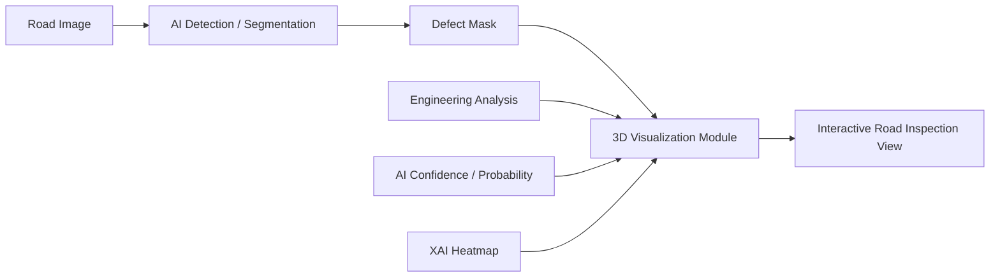
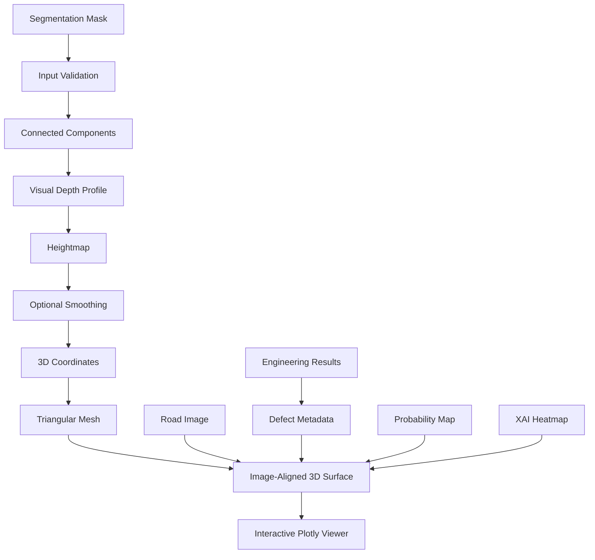
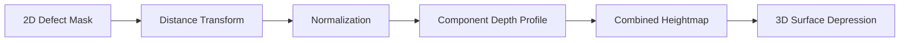
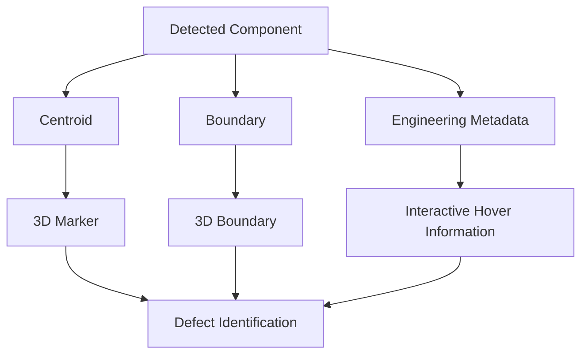
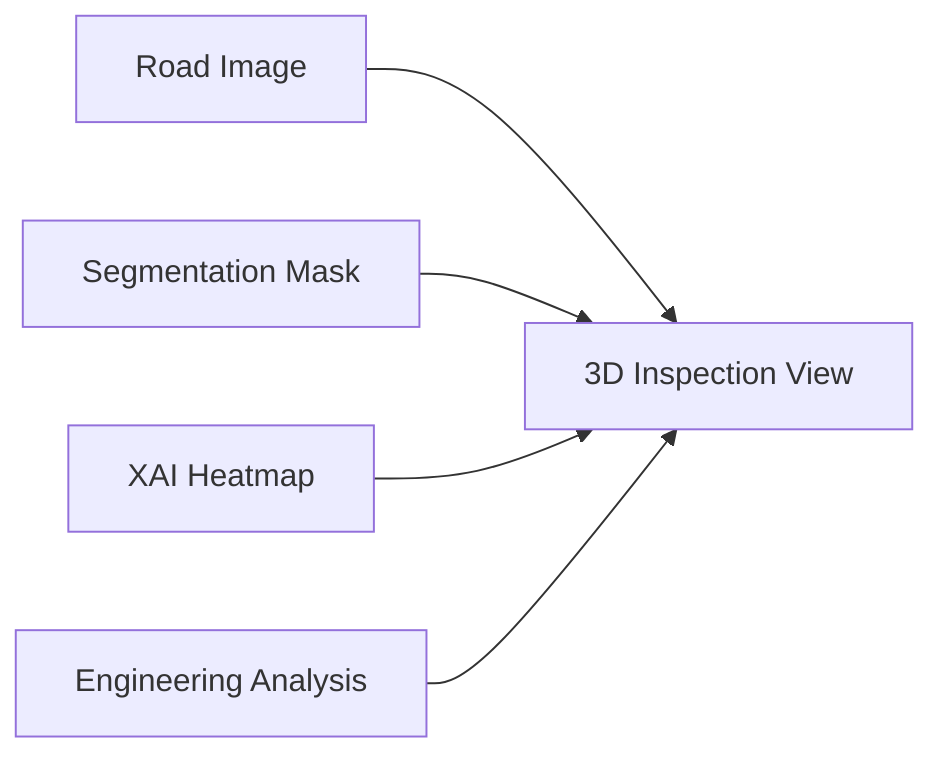
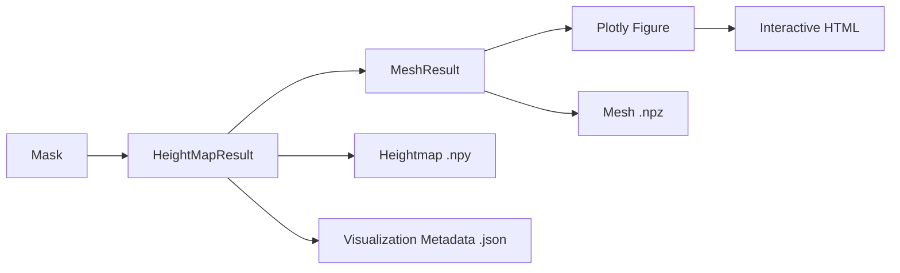
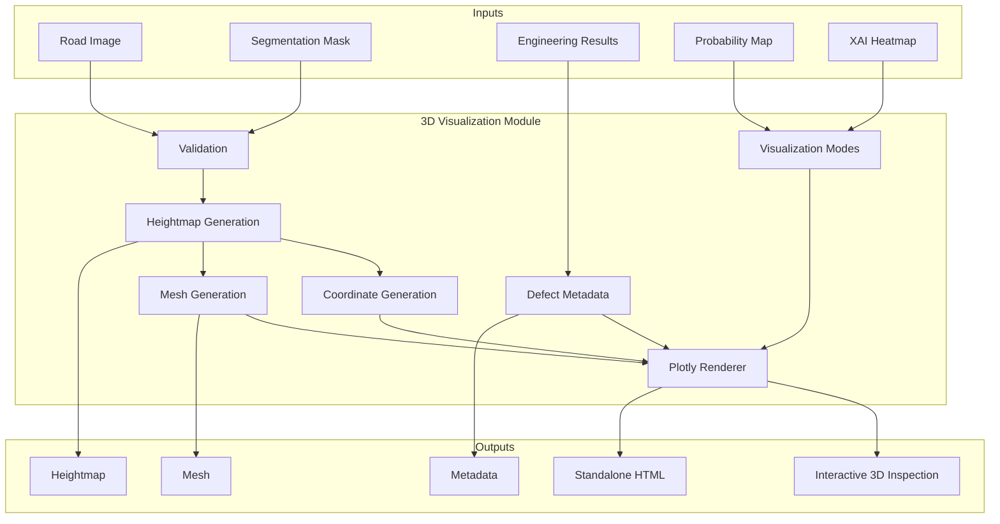

# RoadXAI — 3D Visualization Module

## 1. Purpose

The RoadXAI 3D Visualization Module converts AI-generated road-defect segmentation results into an interactive, image-aligned 3D representation.

Its main purpose is to make detected road damage easier to **understand, inspect, compare, and communicate**. Instead of viewing a segmentation mask only as a flat 2D region, the module represents detected regions as visual surface depressions and overlays relevant inspection information.

The module is primarily a **visualization and decision-support component**. It does not replace the AI detection/segmentation or engineering-analysis modules.

---

## 2. Role in the RoadXAI Pipeline



The visualization module combines the segmentation output with optional engineering and explainability information to produce a single interactive inspection view.

---

## 3. What the Module Does

The module provides the following core capabilities:

- Validates road-defect masks and image inputs.
- Converts a binary segmentation mask into a **normalized visual heightmap**.
- Generates a triangular 3D mesh from the heightmap.
- Aligns the 3D representation with the original road image.
- Highlights detected damage on the road surface.
- Displays individual defect regions using numbered markers.
- Displays defect boundaries.
- Integrates engineering measurements such as area, length, width, centroid, severity, and confidence when supplied.
- Provides multiple visualization modes:
  - Inspection
  - Original
  - Severity
  - Depth
  - Probability / AI confidence
  - XAI / AI attention
- Provides interactive Plotly visualization with hover information and camera controls.
- Supports saving interactive visualizations as standalone HTML.
- Supports exporting heightmaps, meshes, and visualization metadata.

---

## 4. Processing Workflow



### Processing stages

**1. Input validation**

The mask is checked for valid dimensions, non-empty data, and finite values. Image data is converted into a suitable RGB representation.

**2. Defect-region identification**

Connected components are used to separate individual detected regions in the segmentation mask.

**3. Visual depth generation**

Each detected component receives a smooth visual depression. Broader regions can receive stronger visual relief, while thin defects receive a minimum visible depth so that they remain visible.

**4. Heightmap generation**

The resulting values form a 2D heightmap representing visual depth across the road image.

**5. Mesh generation**

The heightmap is converted into 3D coordinates and triangular faces. The Z coordinate is represented as a negative value so detected damage appears visually as a depression.

**6. Visualization**

The mesh is aligned with the road image and displayed through Plotly. Additional markers, boundaries, severity information, probability maps, and XAI heatmaps can be overlaid.

---

## 5. Heightmap Representation

The heightmap is the central intermediate representation of the module.

Conceptually:

```text
Road surface       → approximately 0
Detected damage    → positive visual-depth value
```

The implementation uses normalized values rather than physical depth measurements.

A simplified representation is:



The distance transform makes the center of a broad connected defect visually deeper than its boundary. Gaussian smoothing can then be applied while preserving zero depth outside the detected mask.

---

## 6. Important Scientific Limitation: Depth

**The 3D depth generated from a single RGB image must not be interpreted as measured physical pothole depth.**

The current module explicitly defines the Z-axis as **normalized visual geometry** unless an external calibrated depth source is supplied.

Therefore:

- `0` represents approximately the road-surface level.
- Larger values represent stronger visual relief.
- The 3D depression is useful for visualization and interpretation.
- Values should **not** be reported as centimetres or millimetres.
- Physical depth estimation would require an appropriate calibrated depth source or additional measurement methodology.

This distinction is important when describing the system in a research paper.

---

## 7. Image-Aligned 3D Visualization

The module preserves the spatial relationship between the original road image and the generated 3D surface.

The image coordinates are mapped to the 3D surface as:

```text
X → image horizontal position
Y → image vertical position
Z → normalized visual depth
```

The Y-axis is configured to preserve image-style top-to-bottom orientation.

This alignment allows the user to identify **where a detected defect occurs in the original image while simultaneously viewing its 3D visual representation**.

---

## 8. Defect Information and Engineering Integration

When engineering-analysis results are available, the visualization can attach information to individual detected regions.

Supported information includes:

| Information | Purpose |
|---|---|
| Defect number | Identifies individual regions |
| Severity | Communicates damage category |
| Severity score | Provides the associated severity value |
| Area | Indicates detected region size |
| Length | Indicates estimated longitudinal dimension |
| Width | Indicates estimated transverse dimension |
| Centroid X/Y | Locates the defect in image coordinates |
| Model confidence | Communicates AI confidence |

The visualization therefore acts as a presentation layer for outputs generated by other RoadXAI components rather than independently calculating all engineering measurements.

---

## 9. Visualization Modes

### Inspection

The default inspection-oriented view. The original road image is preserved while detected damage is highlighted.

### Original

Shows the original road appearance with minimal visualization overlays.

### Severity

Uses the engineering severity information to visually distinguish defect regions.

### Depth

Uses the generated visual-depth representation as the basis for the heatmap.

### Probability / AI Confidence

Displays a supplied model probability map when available. If no probability map is supplied, the system falls back to damage highlighting.

### XAI / AI Attention

Displays a supplied XAI heatmap, such as a Grad-CAM/attention representation, when available. If no heatmap is supplied, the system falls back to damage highlighting.

---

## 10. Defect Markers and Boundaries

The viewer can display:

- **Numbered defect markers** at defect centroids.
- **Severity-based marker colors**.
- **Defect boundaries** around connected regions.
- **Interactive hover information** containing engineering and model information.

This makes it possible to connect a visual region in the 3D scene with a specific defect record.



---

## 11. XAI Integration

The visualization module can receive an external XAI heatmap and display it directly on the road surface.

This allows the system to connect three different forms of information:



The resulting view can help a researcher inspect:

- where the defect was detected,
- which regions have high model attention,
- how the detected region relates to the original road image,
- and how the AI output relates to engineering information.

The XAI heatmap is an explainability visualization; it should not automatically be interpreted as proof of causal reasoning by the model.

---

## 12. Interactive Inspection

The Plotly viewer provides an interactive 3D environment rather than a static rendered image.

Key interaction capabilities include:

- 3D camera orbiting.
- Zooming and inspection from different viewpoints.
- Hover-based information.
- Defect marker identification.
- Visualization-mode changes when integrated with the application layer.
- Preservation of the interactive camera state through Plotly `uirevision`.

The interaction is intended to help users inspect individual road-damage regions without losing their relationship to the original image.

---

## 13. Data Flow and Outputs



### Main internal outputs

**HeightMapResult**

Contains the generated heightmap and summary values such as minimum height, maximum height, mean height, and number of defect pixels.

**MeshResult**

Contains:

- 3D vertices
- triangular face indices

**Visualization metadata**

Contains information such as:

- heightmap shape,
- minimum visual height,
- maximum visual height,
- mean visual height,
- defect-pixel count,
- pixel size,
- mesh vertex count,
- mesh face count.

---

## 14. Main Public API

The package exposes the following principal functions:

| Function | Purpose |
|---|---|
| `validate_mask()` | Validate and normalize a segmentation mask |
| `normalize_array()` | Normalize numerical data to `[0, 1]` |
| `create_heightmap()` | Generate normalized visual depth |
| `create_coordinate_grid()` | Generate image-aligned X/Y coordinates |
| `heightmap_to_mesh()` | Convert a heightmap into a triangular mesh |
| `create_plotly_surface()` | Create the main interactive 3D inspection view |
| `create_plotly_mesh()` | Create a standalone mesh visualization |
| `save_plotly_figure()` | Save an interactive figure as HTML |
| `generate_3d_visualization()` | Execute the complete mask-to-3D visualization pipeline |

The package also provides utility functions for validation, statistics, saving/loading heightmaps and meshes, and generating visualization metadata.

---

## 15. Why This Module Matters

A conventional segmentation result answers mainly:

> **Where is the detected damage?**

The 3D visualization adds another layer of interpretation:

> **How does the detected region appear spatially, how large is the affected region, how severe is it, and what does the AI indicate about it?**

Its value is therefore primarily in **interpretability and inspection**.

For a road-inspection research system, the module provides a visual bridge between:

- AI segmentation,
- engineering measurements,
- model confidence,
- explainability,
- and human inspection.

It can make complex model outputs easier to communicate to researchers, evaluators, and non-technical users.

---

## 16. Research-Paper Relevance

For a research paper, the module can be described as an **image-aligned interactive 3D visualization layer for AI-based road-defect inspection**.

The most important technical points to report are:

1. A segmentation mask is converted into a normalized visual heightmap.
2. Connected components are processed independently to generate localized visual relief.
3. The heightmap is converted into a triangular 3D mesh.
4. The mesh remains aligned with the original image coordinate system.
5. Engineering metadata can be attached to individual defect regions.
6. Severity, probability, and XAI heatmaps can be visualized on the same surface.
7. The generated Z-axis represents **visual depth**, not calibrated physical depth, unless an external depth source is supplied.
8. The final representation is interactive and implemented using Plotly.

### Recommended research-paper terminology

Use terms such as:

- **normalized visual depth**
- **visual depth map**
- **image-aligned 3D surface**
- **3D road-defect visualization**
- **interactive inspection representation**
- **decision-support visualization**

Avoid claiming that the module performs physical pothole-depth measurement from RGB images alone.

---

## 17. Module Architecture



---

## 18. Implementation Boundary

The 3D Visualization Module is responsible for **representing and presenting** information.

It is not, by itself, responsible for:

- training the defect-detection model,
- generating the original segmentation prediction,
- determining physical pothole depth from RGB data,
- replacing engineering measurements,
- or proving model correctness through visualization alone.

Its role is to transform available AI and engineering outputs into an interpretable interactive representation.

---

## 19. Summary

The RoadXAI 3D Visualization Module transforms 2D road-defect segmentation into an interactive, image-aligned 3D inspection representation.

Its core pipeline is:

```text
Segmentation Mask
       ↓
Connected Defect Regions
       ↓
Normalized Visual Heightmap
       ↓
3D Triangular Mesh
       ↓
Image-Aligned Surface
       ↓
Interactive Plotly Inspection
```

Additional engineering, confidence, severity, probability, and XAI information can be integrated into the same visualization.

The central scientific constraint is that the generated Z-axis represents **normalized visual geometry rather than physical depth** unless calibrated depth information is explicitly available.
