# RoadXAI — 3D Visualization Module

## 1. Module in One Diagram

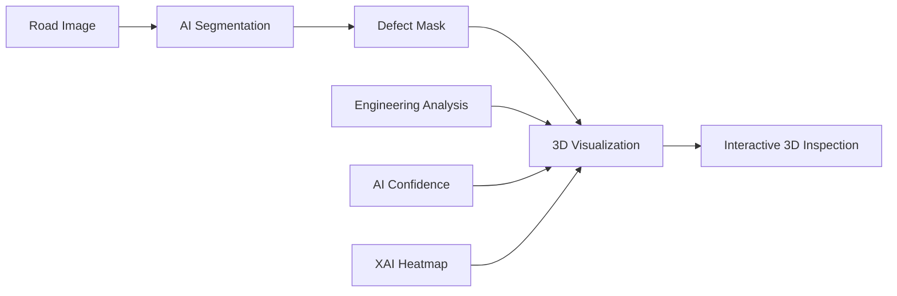

**Goal:** turn 2D AI road-damage results into an easier-to-understand interactive 3D inspection view.

---

## 2. Core Pipeline

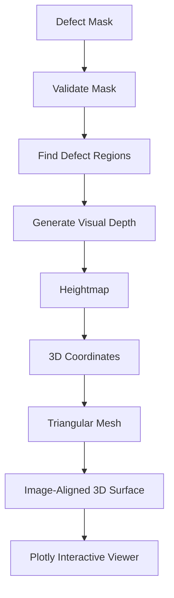

---

## 3. What Happens to the Mask?

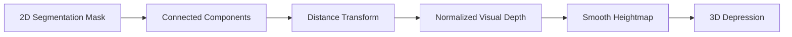

Conceptually:

```text
Road surface       ─────────────────
Defect boundary    ───────╲    ╱────
Defect center       ────────╲__╱─────
                         visual depth
```

---

## 4. Heightmap → 3D Mesh

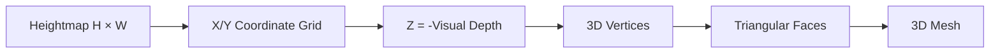

```text
       X →
    ┌───────────────┐
 Y  │ •──•──•──•──• │
 ↓  │ ╱╲ ╱╲ ╱╲ ╱╲  │
    │ •──•──•──•──• │
    │ ╱╲ ╱╲ ╱╲ ╱╲  │
    └───────────────┘
             ↓
        3D surface
```

---

## 5. Image + 3D Surface

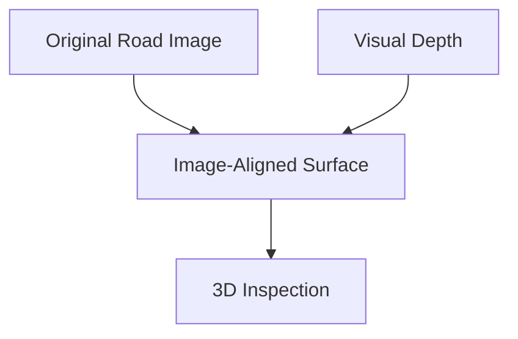

```text
        Original image
    ┌────────────────────┐
    │      ROAD          │
    │   ███ defect       │
    │      ███           │
    └────────────────────┘
             +
       visual geometry
             ↓
    ┌────────────────────┐
    │      ROAD          │
    │       \___/        │
    │          \___      │
    └────────────────────┘
          3D view
```

---

## 6. Additional AI / Engineering Information

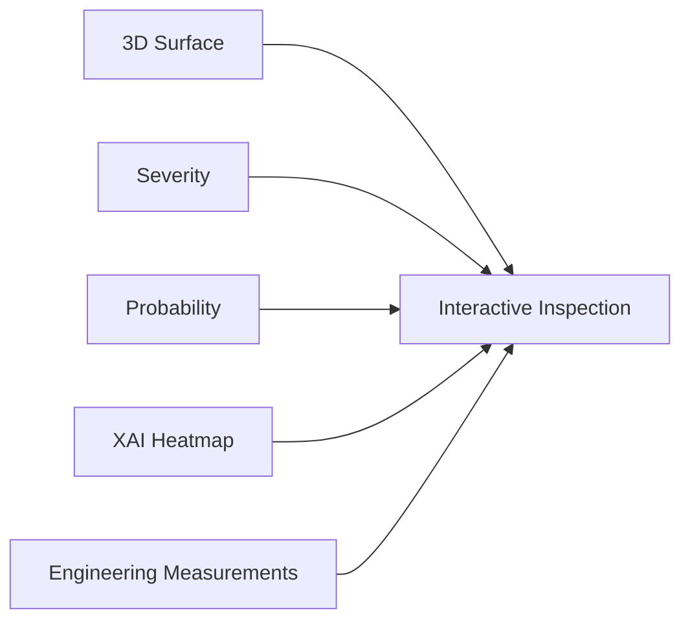

A defect can therefore be connected to:

```text
Defect #1
├── Severity
├── Severity score
├── Area
├── Length
├── Width
├── Centroid
└── AI confidence
```

---

## 7. Visualization Modes

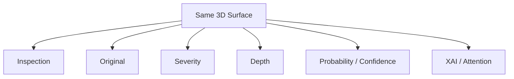

The geometry stays the same; the **visual information displayed on it changes**.

---

## 8. Defect Markers

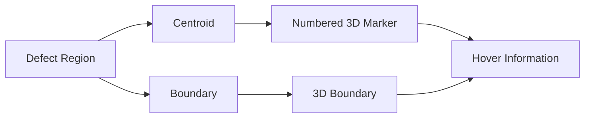

This lets the user connect a 3D location with its corresponding defect information.

---

## 9. XAI Connection

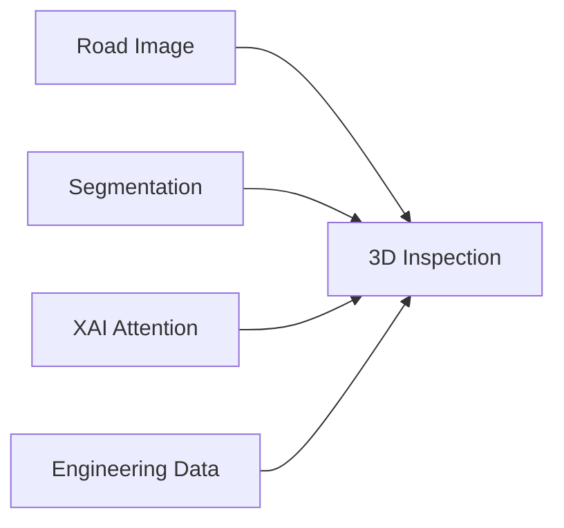

**Interpretation:**

```text
Where is damage?
        ↓
What region did AI detect?
        ↓
Where is model attention concentrated?
        ↓
What engineering information belongs to it?
```

---

## 10. Scientific Limitation

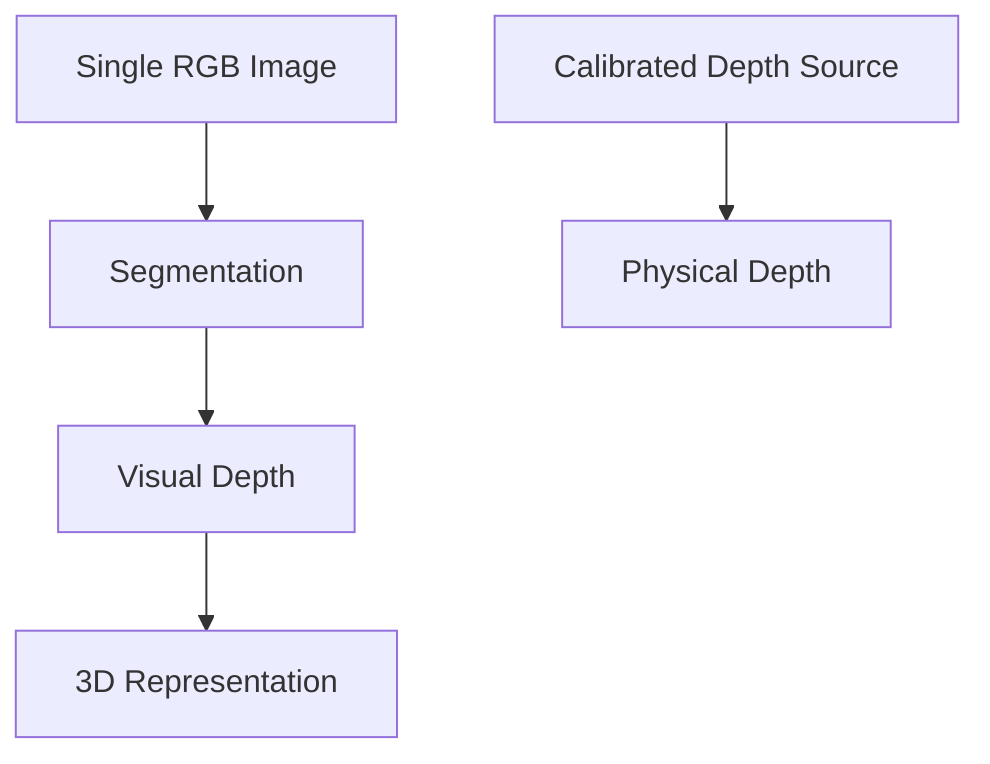

### Important

```text
RGB image
   ↓
Visual depth ≠ Physical depth
```

The current module represents **normalized visual geometry**.

It must **not** be reported as centimetres or millimetres unless a calibrated external depth source is supplied.

---

## 11. Why It Helps

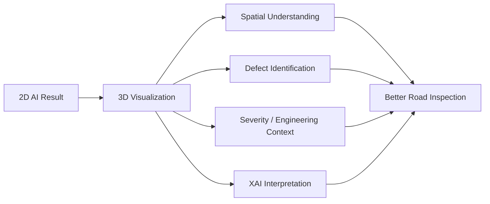

### Core contribution

> **Transforms complex AI road-inspection outputs into an interactive spatial representation that is easier to inspect and communicate.**

---

## 12. Outputs

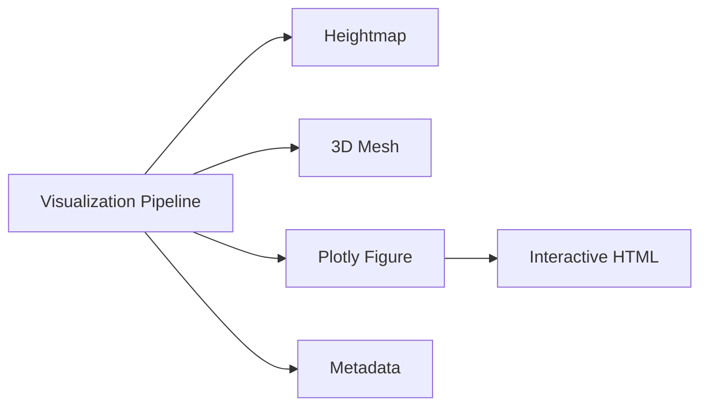

| Output | Purpose |
|---|---|
| Heightmap | Visual depth representation |
| Mesh | 3D geometric representation |
| Plotly figure | Interactive inspection |
| Metadata | Visualization statistics |
| HTML | Standalone interactive visualization |

---

## 13. Research-Paper Description

```text
AI Segmentation
      ↓
Normalized Visual Depth
      ↓
Image-Aligned 3D Surface
      ↓
Engineering + XAI Overlays
      ↓
Interactive Road-Defect Inspection
```

**Key terms:** image-aligned 3D visualization · normalized visual depth · road-defect inspection · interactive visualization · XAI integration
