# RoadXAI

> **Explainable deep learning for automated road-surface damage detection, engineering assessment, and visual inspection.**

RoadXAI is a prototype computer-vision system that takes a road image through a complete analysis pipeline:

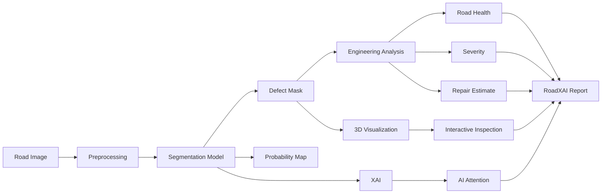

The repository combines **dataset preparation, CNN segmentation, training, evaluation, engineering analysis, explainable AI, interactive 3D visualization, report generation, and a Streamlit inspection interface**.

> **Project status:** prototype / research-oriented implementation. Physical measurements and 3D geometry should not be interpreted as calibrated field measurements unless appropriate calibration/depth data are supplied.

---

## Contents

- [What RoadXAI Does](#what-roadxai-does)
- [Why This Architecture](#why-this-architecture)
- [System Architecture](#system-architecture)
- [Capability Map](#capability-map)
- [End-to-End Pipeline](#end-to-end-pipeline)
- [Segmentation Model](#segmentation-model)
- [Training Pipeline](#training-pipeline)
- [Engineering Analysis](#engineering-analysis)
- [Explainable AI](#explainable-ai)
- [3D Visualization](#3d-visualization)
- [Evaluation](#evaluation)
- [Streamlit Application](#streamlit-application)
- [Report Generation](#report-generation)
- [Repository Structure](#repository-structure)
- [Installation](#installation)
- [Quick Start](#quick-start)
- [Input / Output Contract](#input--output-contract)
- [Configuration](#configuration)
- [Development Map](#development-map)
- [Reproducibility](#reproducibility)
- [Limitations](#limitations)
- [Roadmap](#roadmap)
- [Troubleshooting](#troubleshooting)
- [License](#license)

---

## What RoadXAI Does

RoadXAI is built around one central idea:

**turn a road image into an inspectable, explainable road-damage assessment rather than stopping at a binary segmentation mask.**

The implemented flow is:

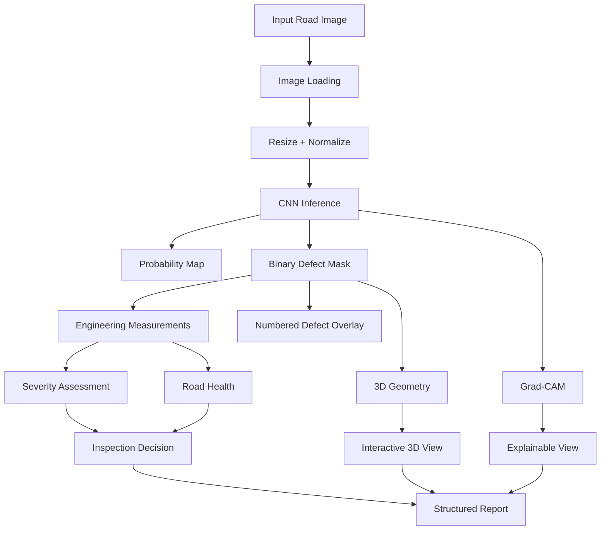

The system is therefore organized as a chain of specialized modules rather than one monolithic application.

---

## Why This Architecture

A segmentation mask answers:

> **Where is the detected damage?**

RoadXAI adds additional layers around that prediction:

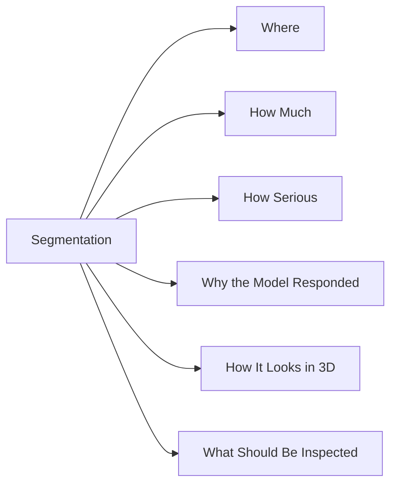

That separation is important.

- **CNN segmentation** produces the learned visual prediction.
- **Engineering analysis** converts the mask into interpretable geometric and severity information.
- **XAI** exposes model attention.
- **3D visualization** turns the segmentation/depth-like representation into an interactive surface view.
- **Reporting** packages the available results.
- **Streamlit** brings the pipeline together for inspection.

---

## Capability Map

| Capability | Purpose | Main repository location |
|---|---|---|
| Dataset pipeline | Load, validate, and prepare segmentation datasets | `dataset_pipeline/` |
| CNN segmentation | Predict road-damage masks | `cnn_model/` |
| Training | Train and validate the segmentation model | `training_pipeline/` |
| Engineering analysis | Measure defects and derive severity/road health | `engineering_analysis/` |
| Evaluation | Calculate segmentation metrics | `evaluation/` |
| Evaluation results | Store/analyze experiment results | `evaluation_results/` |
| Explainable AI | Generate model-attention visualizations | `explainable_ai/` |
| 3D visualization | Convert analysis into interactive surface geometry | `3d_visualization/` |
| Reports | Produce structured TXT/JSON/PDF reports | `report_generation/` |
| UI | Interactive road inspection application | `streamlit_app/` |
| Deployment/model loading | Model loading/deployment support | `deployment/` |

The repository currently centers on **road-surface damage segmentation and severity assessment**. The codebase should be treated as the source of truth for supported capabilities.

---

# System Architecture

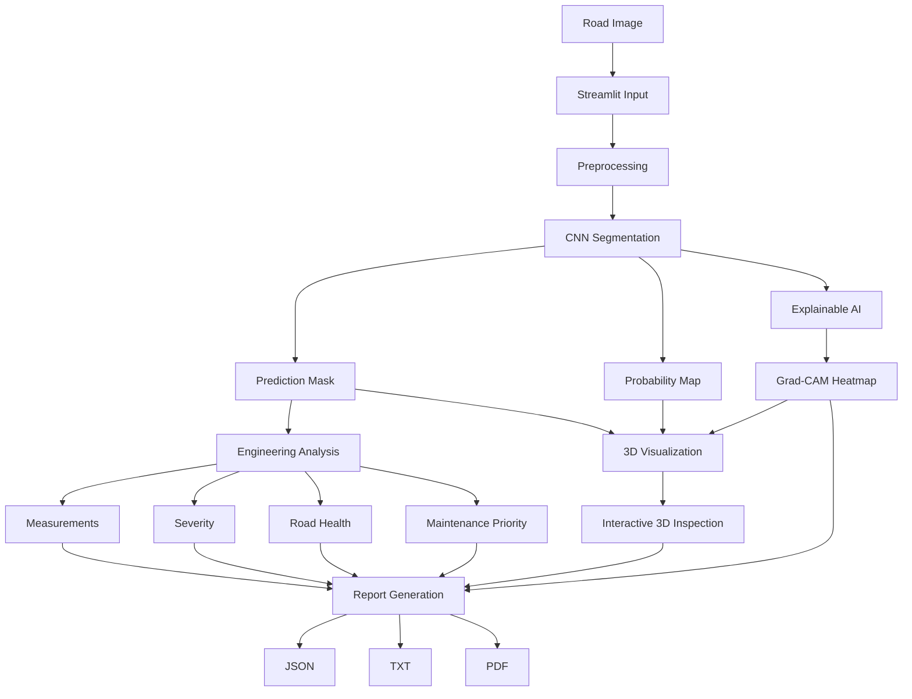

### Architectural principle

Each layer has a different responsibility:

| Layer | Responsibility |
|---|---|
| Input | Acquire the road image |
| Preprocessing | Convert the image into the model's expected tensor representation |
| CNN | Produce segmentation logits |
| Post-processing | Convert logits into probabilities and a binary mask |
| Engineering | Interpret mask geometry |
| XAI | Visualize model activation/attention |
| 3D | Build an interactive visual surface representation |
| Reporting | Aggregate outputs into reusable artifacts |
| UI | Expose the complete workflow to a user |

---

# End-to-End Pipeline

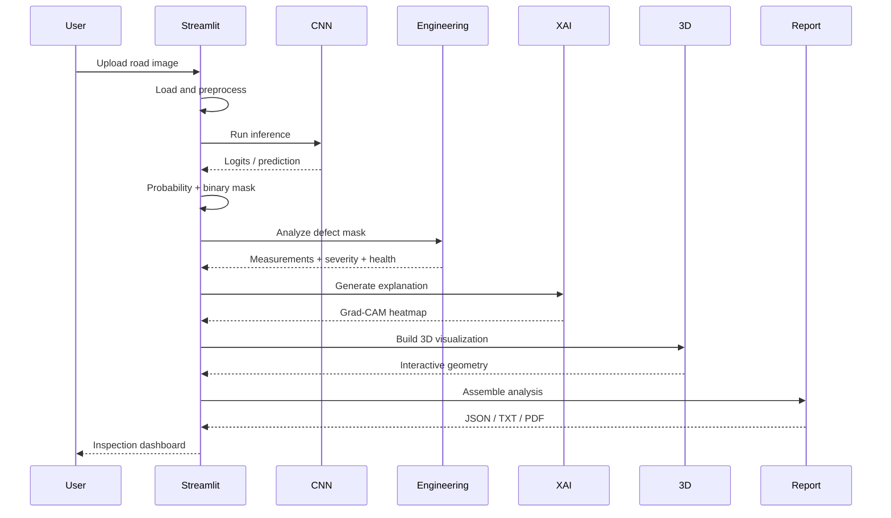

---

# Segmentation Model

RoadXAI's core learned component is a **U-Net-style binary segmentation network** implemented in `cnn_model/`.

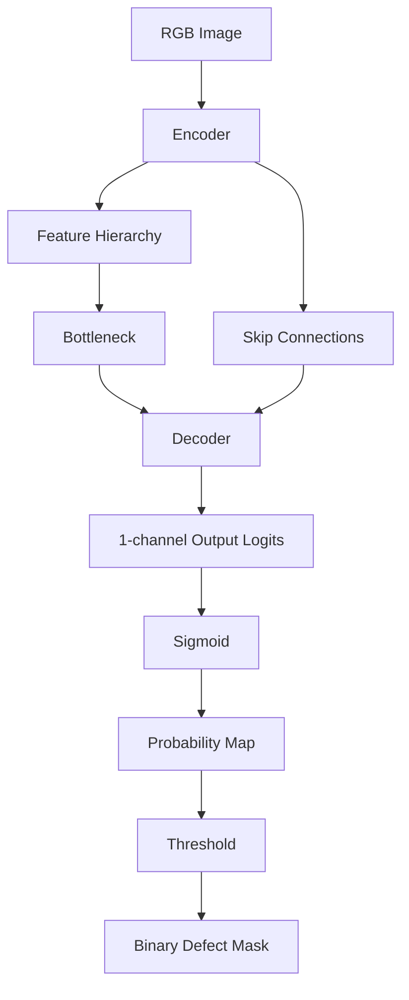

The model implementation uses:

- convolutional blocks
- batch normalization
- ReLU activations
- optional dropout in convolutional blocks
- max-pooling in the encoder
- transposed convolutions in the decoder
- encoder/decoder skip connections
- a final `1 x 1` convolution producing one output channel

The default model configuration in the CNN module uses a base channel width of `32`. The Streamlit application explicitly builds the deployed model with `base_channels=16`.

### Loss

The training setup uses a combined BCE + Dice objective:

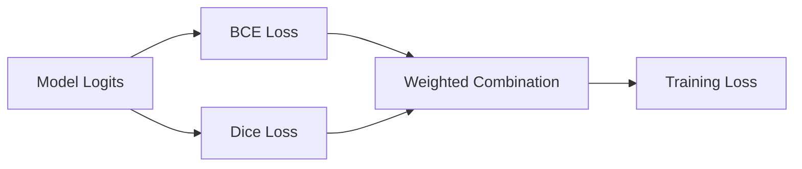

Default loss weights are:

```text
BCE  = 0.5
Dice = 0.5
```

### Inference

The Streamlit inference path:

1. loads an image as RGB
2. resizes it to the selected inference size
3. converts it to `float32`
4. scales values to `[0, 1]`
5. converts HWC → CHW
6. adds a batch dimension
7. runs the model in inference mode
8. applies sigmoid
9. thresholds the probability map
10. returns the prediction mask, probability map, and confidence

---

# Training Pipeline

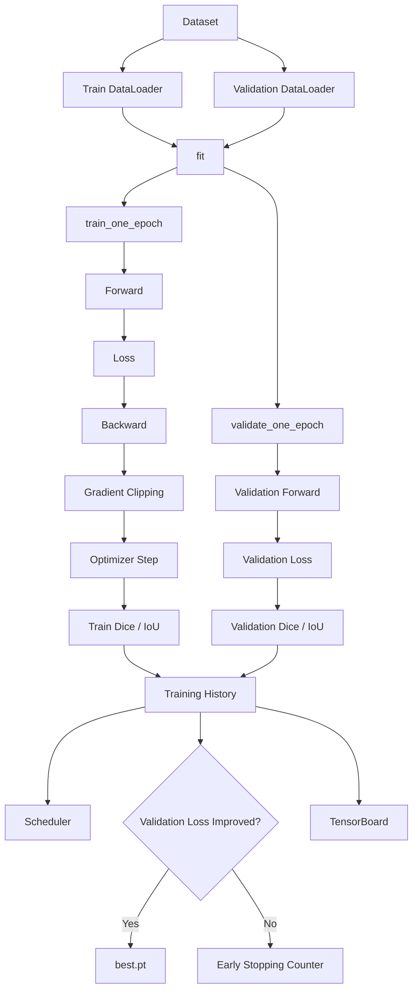

The training package provides:

- `EpochResult`
- `TrainingHistory`
- `train_one_epoch()`
- `validate_one_epoch()`
- `save_training_checkpoint()`
- `load_training_checkpoint()`
- `fit()`

### Training features

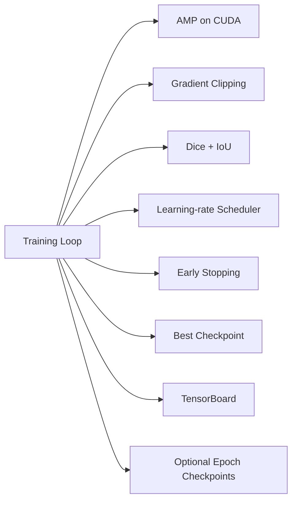

The training utility layer also provides:

- deterministic seeding
- device selection
- parameter counting
- Dice calculation
- IoU calculation
- learning-rate inspection
- JSON/history persistence
- DataLoader validation
- checkpoint existence/size helpers
- time formatting

### Scheduler

The CNN configuration uses `ReduceLROnPlateau`:

```text
factor   = 0.5
patience = 3
min_lr   = 1e-6
```

### Checkpoint selection

`best.pt` is selected using **minimum validation loss**.

That is important: the best checkpoint is not defined as the epoch with the maximum Dice or IoU.

---

# Engineering Analysis

The engineering layer converts a segmentation mask into interpretable road-condition information.

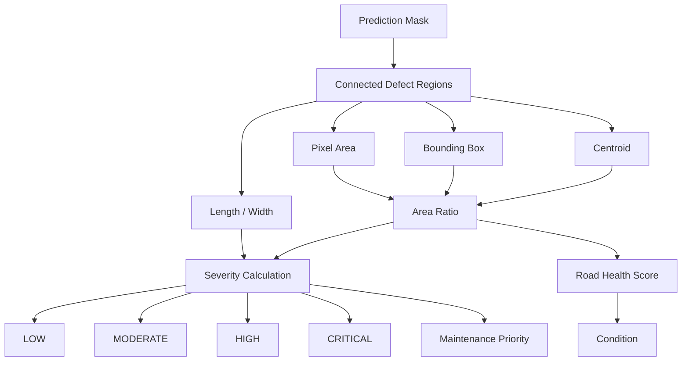

### Defect measurements

The engineering module represents:

- area
- length
- width
- bounding box
- centroid
- optional calibrated physical dimensions

### Severity

The implemented severity score combines defect-area contribution with optional physical length/width contributions.

The resulting levels are:

| Score | Severity |
|---:|---|
| `0–24` | Low |
| `25–49` | Moderate |
| `50–74` | High |
| `75–100` | Critical |

### Road health

The health score is derived from the defect-area ratio:

```text
health score = 100 - defect area ratio × 100
```

The implemented condition bands are:

| Health score | Condition |
|---:|---|
| `>= 90` | Excellent |
| `>= 75` | Good |
| `>= 50` | Fair |
| `>= 25` | Poor |
| `< 25` | Critical |

### Physical measurements

The system supports calibration through pixels-per-meter information. Without calibration, the system cannot establish trustworthy real-world dimensions from an RGB image alone.

Repair-cost estimation similarly requires calibrated physical area and a supplied repair rate.

---

# Explainable AI

RoadXAI treats explainability as a separate layer around the learned prediction.

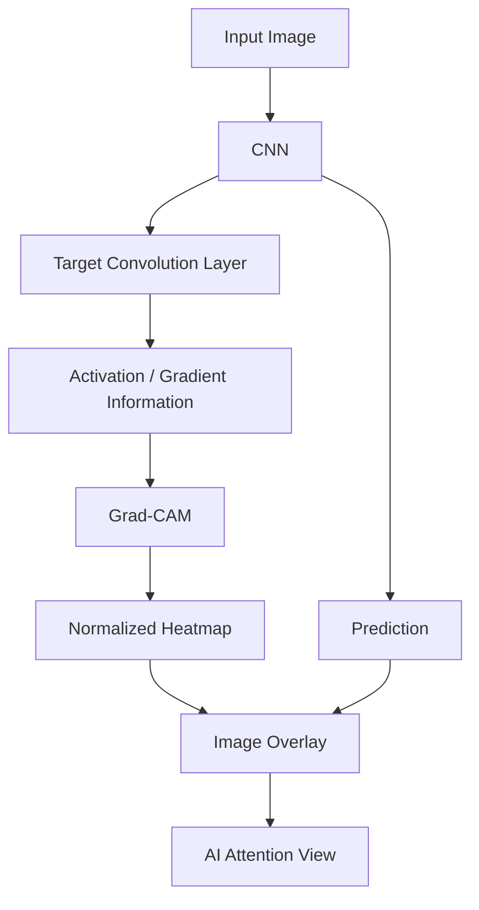

The XAI package implements:

- Grad-CAM
- Grad-CAM++
- Score-CAM
- activation hooks
- heatmap normalization
- image overlays

The Streamlit application currently uses **Grad-CAM** with the default target layer selected from the model's final convolutional layer.

### What the heatmap means

The heatmap visualizes model activation/attention associated with the selected explanation method.

It is **not**:

- ground truth
- a causal proof
- a physical damage map
- a replacement for field inspection

---

# 3D Visualization

RoadXAI includes an interactive 3D visualization layer built around the segmentation result and visual depth representation.

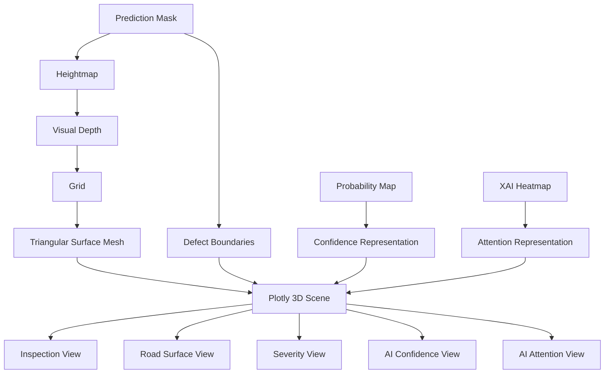

The 3D module provides:

- heightmap generation
- connected-component based geometry
- distance-transform based defect shaping
- visual depth scaling
- mesh generation
- triangular surface geometry
- Plotly visualization
- defect boundaries
- optional markers
- multiple display modes

### Important interpretation

The generated vertical dimension is primarily a **visualization geometry**.

It should not be interpreted as validated physical depth unless a validated depth source/calibration is provided.

---

# Streamlit Application

The Streamlit application is the main interactive entry point.

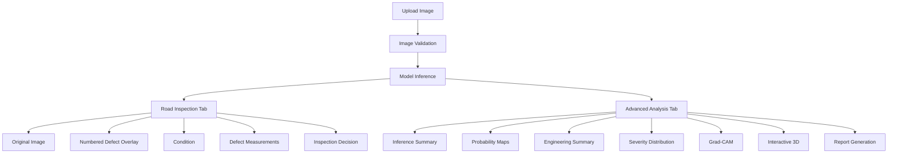

### User controls

The application exposes controls for:

- segmentation threshold
- inference image size
- 3D visual depth
- 3D markers
- 3D boundaries

Supported uploaded image extensions include:

```text
jpg
jpeg
png
bmp
webp
```

### Road Inspection tab

The primary inspection view provides:

- original image
- numbered defect overlay
- defect area
- confidence
- defect pixel count
- road condition
- inspection recommendation
- defect measurements
- explanation details

### Advanced Analysis tab

The advanced view provides:

- inference summary
- probability visualizations
- engineering analysis
- severity distribution
- Grad-CAM
- interactive 3D visualization
- road decision summary
- report generation

---

# Evaluation

RoadXAI includes a dedicated `evaluation/` package for segmentation evaluation and an `evaluation_results/` area for experiment results and model analysis.

The core segmentation metrics include:

| Metric | Meaning |
|---|---|
| Accuracy | Pixel-level classification agreement |
| Precision | Fraction of predicted defect pixels that are correct |
| Recall | Fraction of target defect pixels detected |
| F1 / Dice | Harmonic overlap measure |
| IoU | Intersection-over-Union |
| Inference time | Average model processing time recorded by evaluation |

The repository contains evaluated results for multiple road-damage datasets/configurations.

The important distinction is:

> Evaluation metrics describe segmentation performance; engineering severity and road-health calculations are downstream interpretations of the predicted mask.

---

# Report Generation

RoadXAI converts the available analysis into structured reports.

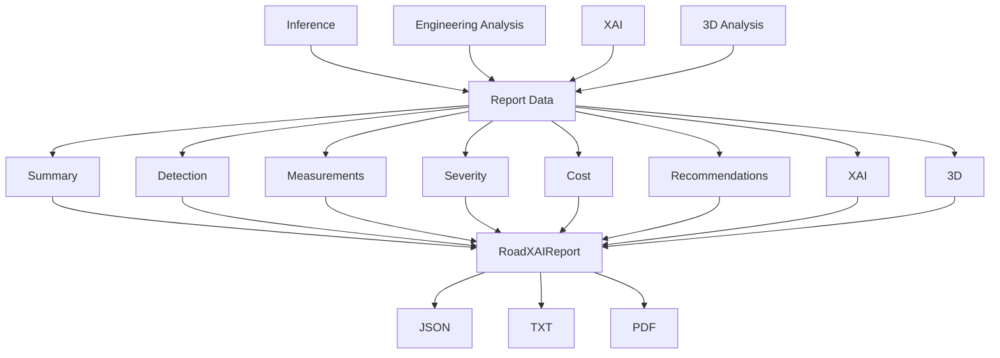

The report package supports:

- structured report objects
- report IDs
- summary sections
- detection information
- measurements
- severity
- cost information when available
- recommendations
- XAI information
- 3D information
- JSON export
- text rendering/export
- PDF generation

PDF output uses ReportLab.

---

# Repository Structure

The current repository is organized as a modular pipeline:

```text
RoadXAI/
├── .devcontainer/
├── 3d_visualization/
├── checkpoints/
├── cnn_model/
├── dataset_pipeline/
├── deployment/
├── engineering_analysis/
├── evaluation/
├── evaluation_results/
├── explainable_ai/
├── github/
├── project_overview/
├── report_generation/
├── streamlit_app/
├── training_pipeline/
├── .gitignore
└── requirements.txt
```

### Module map

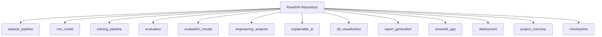

This separation makes the project easier to inspect and extend without coupling training, inference, engineering logic, visualization, and UI code into a single module.

---

# Installation

## Requirements

The repository's `requirements.txt` currently pins compatible version ranges for:

```text
numpy
pandas
scipy
torch
torchvision
opencv-python-headless
Pillow
matplotlib
plotly
streamlit
tensorboard
reportlab
PyYAML
tqdm
pytest
```

The declared ranges are available directly in [`requirements.txt`](requirements.txt).

## Environment

### Windows

```bash
python -m venv .venv
.venv\Scripts\activate
```

### Linux / macOS

```bash
python -m venv .venv
source .venv/bin/activate
```

Then install dependencies:

```bash
pip install -r requirements.txt
```

---

# Quick Start

The repository includes a Streamlit application as the interactive entry point.

```bash
streamlit run streamlit_app/app.py
```

Then open the local Streamlit URL shown by the terminal.

The application loads the configured model checkpoint and provides the road-inspection workflow.

### Model checkpoint

The current application expects the deployed checkpoint at:

```text
checkpoints/crack500/best.pt
```

If the checkpoint is absent, the application reports the missing-model condition rather than silently pretending that inference is available.

---

# Input / Output Contract

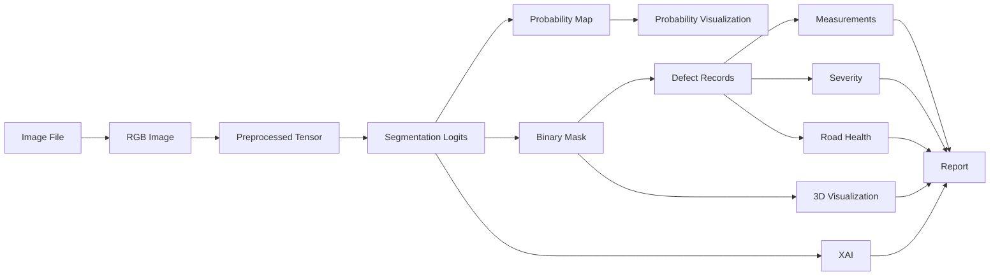

### Input

The Streamlit UI accepts common image formats:

```text
JPG / JPEG / PNG / BMP / WEBP
```

### Core model output

```text
Segmentation logits
        ↓
Probability map
        ↓
Binary prediction mask
```

### Derived outputs

```text
Defect measurements
Severity
Road-health score
Maintenance priority
Inspection decision
XAI heatmap
Interactive 3D visualization
JSON / TXT / PDF report
```

---

# Configuration

The main interactive configuration is exposed through the Streamlit sidebar.

| Setting | Current implementation |
|---|---|
| Segmentation threshold | `0.10–0.90`, default `0.50` |
| Image size | `256`, `384`, `512`, `640`, `768` |
| 3D visual depth | UI-controlled |
| 3D markers | Optional |
| 3D boundaries | Optional |
| Report currency | `INR` in the current application |

The engineering layer accepts optional calibration and repair-rate information. The current Streamlit application invokes engineering analysis without physical calibration and without a repair-rate value.

---

# Development Map

Use this map when modifying RoadXAI:

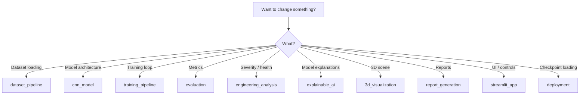

### Typical extension points

**Change the CNN:** `cnn_model/`

**Change training behavior:** `training_pipeline/`

**Change evaluation:** `evaluation/`

**Change engineering rules:** `engineering_analysis/`

**Add/change XAI methods:** `explainable_ai/`

**Change 3D geometry or display modes:** `3d_visualization/`

**Change generated reports:** `report_generation/`

**Change the interactive application:** `streamlit_app/`

---

# Reproducibility

A reproducible run depends on more than the Python package versions.

Keep the following aligned:

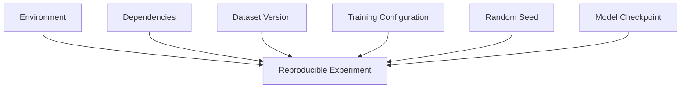

The training utilities provide deterministic seed configuration for Python, NumPy, and PyTorch, including CUDA and cuDNN settings.

The training package records epoch-level:

- loss
- Dice
- IoU
- validation loss
- validation Dice
- validation IoU
- learning rate
- epoch duration

TensorBoard support is also included in the training loop.

---

# Limitations

RoadXAI should be treated as a **prototype inspection and research system**, not as an autonomous civil-engineering authority.

### Model limitations

Segmentation quality depends on the training data, annotations, image characteristics, and learned model parameters.

### Pixel-to-physical conversion

An RGB image does not inherently provide trustworthy physical dimensions.

Physical length, width, area, and repair-cost calculations require suitable calibration information.

### 3D interpretation

The current 3D pipeline creates visualization geometry from the available image/segmentation information. It is not, by itself, evidence of metric-scale depth reconstruction.

### XAI interpretation

Grad-CAM-style maps describe model activation behavior. They do not establish causality or ground truth.

### Inspection decisions

The application can flag cases for inspection using severity, condition, and confidence logic, but those decisions do not replace physical road inspection.

### Benchmark interpretation

Reported evaluation metrics are tied to the evaluated datasets/configurations. They should not be generalized to arbitrary road imagery.

---

# Roadmap

## Implemented

```text
✓ Dataset pipeline
✓ CNN road-damage segmentation
✓ Training + validation pipeline
✓ Checkpointing
✓ Evaluation metrics
✓ Engineering analysis
✓ Severity classification
✓ Road-health scoring
✓ Explainable AI
✓ Interactive 3D visualization
✓ Streamlit inspection UI
✓ JSON / TXT / PDF reporting
```

## Potential next steps

These are **future directions**, not claims about the current implementation:

- broader and more diverse training datasets
- stronger segmentation architectures
- calibrated metric-scale depth
- video-based inspection
- temporal road-damage tracking
- richer engineering calibration workflows
- deployment optimization
- expanded quantitative benchmarking
- additional explanation methods and validation

---

# Troubleshooting

## Streamlit starts but inference fails

Check that the expected checkpoint exists:

```text
checkpoints/crack500/best.pt
```

The application uses a cached model resource and loads the checkpoint for inference.

## GPU is unavailable

The inference path can fall back to CPU.

Training utilities also select CUDA when available and otherwise use CPU.

## Uploaded image is rejected

Use one of the supported formats:

```text
.jpg
.jpeg
.png
.bmp
.webp
```

## Physical dimensions look unavailable

This is expected when calibration is not supplied. Pixel-space measurements can still be derived, but trustworthy real-world dimensions require calibration.

## 3D looks exaggerated

The 3D vertical dimension is a visual representation. Adjust the application's visual-depth control and do not interpret the resulting height as measured physical depth without validated depth information.

---

# Project Flow at a Glance

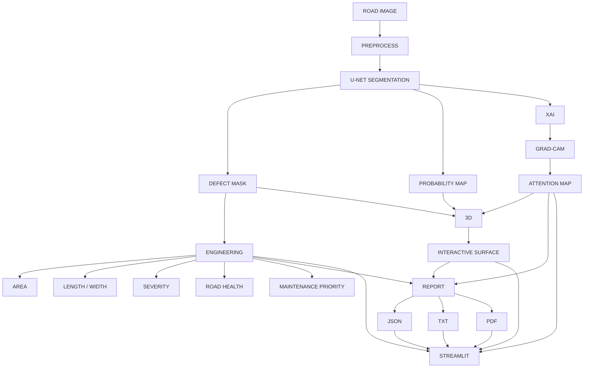

---

# The RoadXAI Mental Model

If you only remember one architecture, remember this:

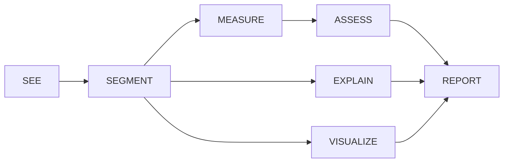

**RoadXAI is not only a segmentation model.**

It is a modular pipeline that connects:

**visual prediction → engineering interpretation → explainability → 3D visualization → inspection reporting.**

---

# License

See the repository for the current licensing information.

---

## Repository

Source code:

[github.com/VasuML07/RoadXAI](https://github.com/VasuML07/RoadXAI)

Interactive application:

[roadxai.streamlit.app](https://roadxai.streamlit.app/)
