# RoadXAI — CNN Segmentation Module

## 1. Module in One Diagram

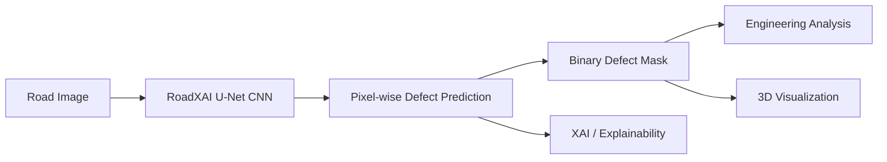

**Goal:** detect and segment road defects at the pixel level.

---

## 2. CNN Architecture

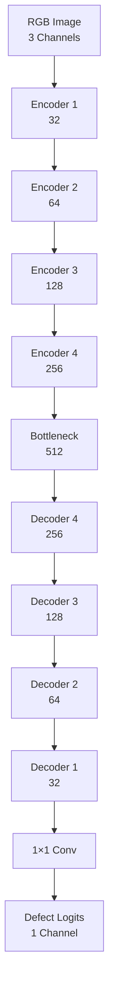

---

## 3. U-Net Structure

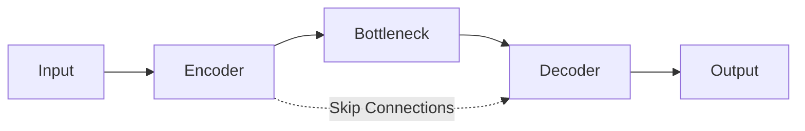

### Why skip connections?

```text
Encoder
  ↓
captures deeper / contextual features

Skip connection
  ↓
preserves fine spatial details

Decoder
  ↓
reconstructs precise defect boundaries
```

This is important because road defects can be small, thin, irregular, or have unclear boundaries.

---

## 4. Encoder

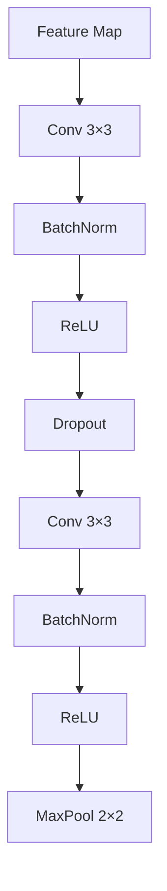

Each encoder stage:

```text
Convolution
     ↓
Feature extraction
     ↓
Max pooling
     ↓
Smaller spatial size
     +
More feature channels
```

Channels progress:

```text
32 → 64 → 128 → 256 → 512
```

---

## 5. Bottleneck

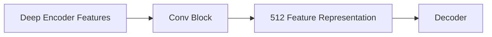

The bottleneck provides the deepest feature representation before reconstruction.

---

## 6. Decoder

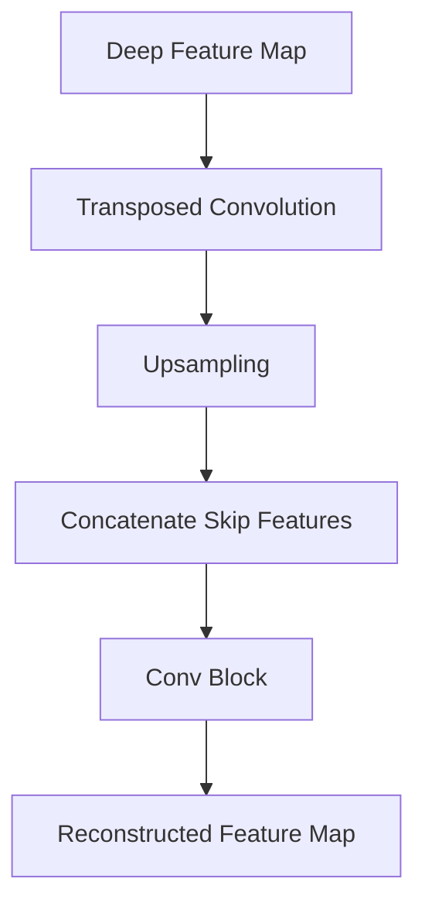

```text
Low resolution
      ↓
Upsample
      ↓
Combine encoder detail
      ↓
Refine
      ↓
Higher resolution
```

---

## 7. Final Prediction

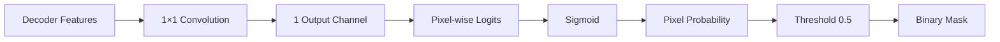

Output:

```text
0 → background / normal road
1 → detected defect
```

The model internally returns **logits**. Sigmoid is applied for probability/inference.

---

## 8. Training Loss

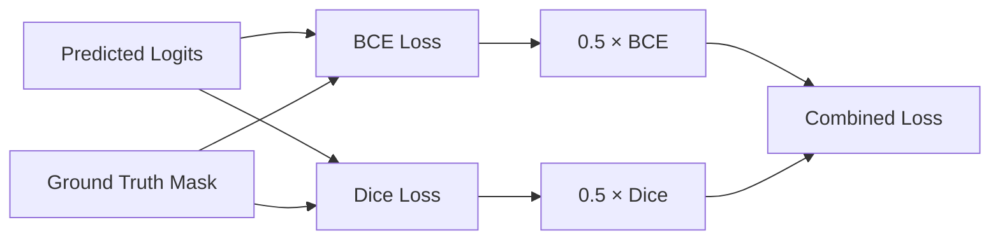

### Why two losses?

```text
BCE
 ↓
pixel-level classification

Dice
 ↓
segmentation overlap

BCE + Dice
 ↓
better segmentation supervision
```

The current implementation uses equal BCE and Dice weights by default.

---

## 9. Training Pipeline

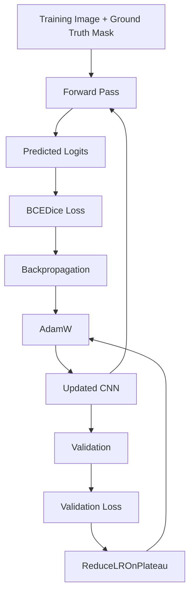

---

## 10. Evaluation

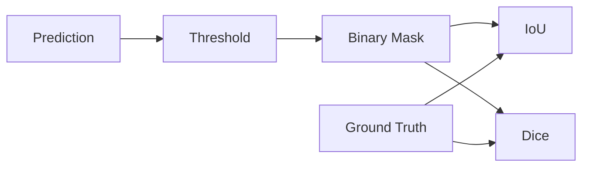

### Metrics

```text
IoU  = Intersection / Union

Dice = 2 × Intersection
       ───────────────────
       Prediction + Target
```

Both measure how closely the predicted defect region overlaps the ground-truth region.

---

## 11. Model → RoadXAI Modules

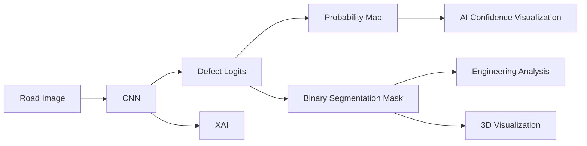

The CNN is therefore the **core defect-segmentation stage** feeding downstream RoadXAI components.

---

## 12. Training Utilities

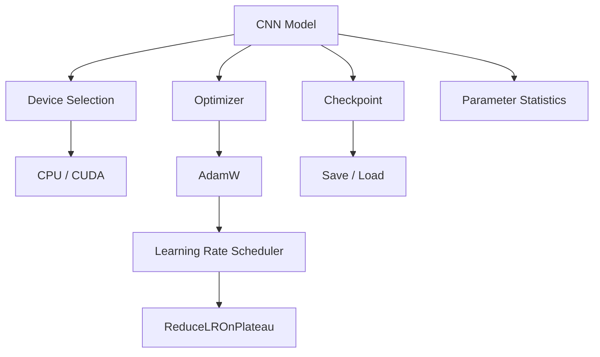

The implementation also validates image/mask tensors and supports checkpointing of model, optimizer, scheduler, epoch, and loss.

---

## 13. Research-Paper View

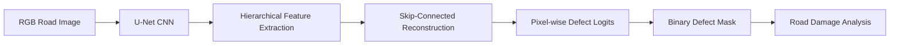

### Core contribution

> **A U-Net-style CNN performs pixel-level road-defect segmentation, producing masks that drive the downstream engineering, explainability, and 3D visualization stages.**

---

## 14. Key Architecture Summary

```text
Input          : 3-channel RGB image
Architecture   : U-Net style CNN
Encoder        : 32 → 64 → 128 → 256
Bottleneck     : 512
Decoder        : 256 → 128 → 64 → 32
Output         : 1-channel defect logits
Activation     : Sigmoid for probability
Loss           : 0.5 BCE + 0.5 Dice
Optimizer      : AdamW
Scheduler      : ReduceLROnPlateau
Metrics        : IoU + Dice
```

## 15. Important Interpretation

```text
RGB Image
   ↓
CNN prediction
   ↓
Probability / Logits
   ↓
Threshold
   ↓
Defect Mask
   ↓
┌──────────────┬──────────────┐
↓              ↓              ↓
Engineering   3D View        XAI
Analysis      Visualization   Analysis
```

The CNN identifies **where the defect is**.  
The downstream RoadXAI modules use that result to determine and visualize **what the defect means**.
