# RoadXAI Dataset Pipeline

## 1. Dataset Pipeline — One View

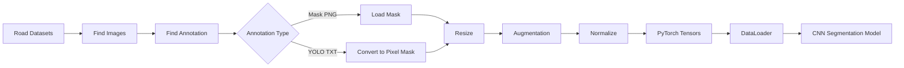

**Purpose:** convert different road-defect dataset formats into a common input format for the CNN.

---

## 2. Dataset → Model Interface

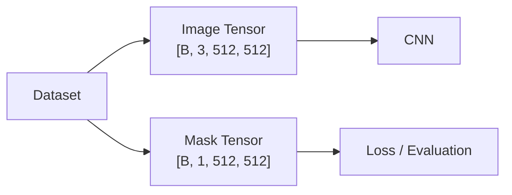

The pipeline standardizes the data to:

- **Image:** `float32`, 3-channel RGB
- **Mask:** `float32`, 1-channel binary
- **Size:** `512 × 512`

---

## 3. Dataset Discovery

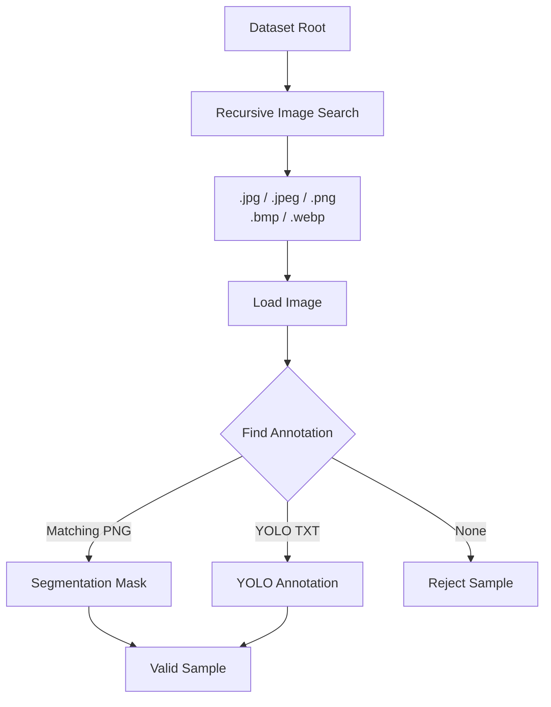

The pipeline searches through folders and keeps only images with a usable annotation.

---

## 4. Annotation Handling

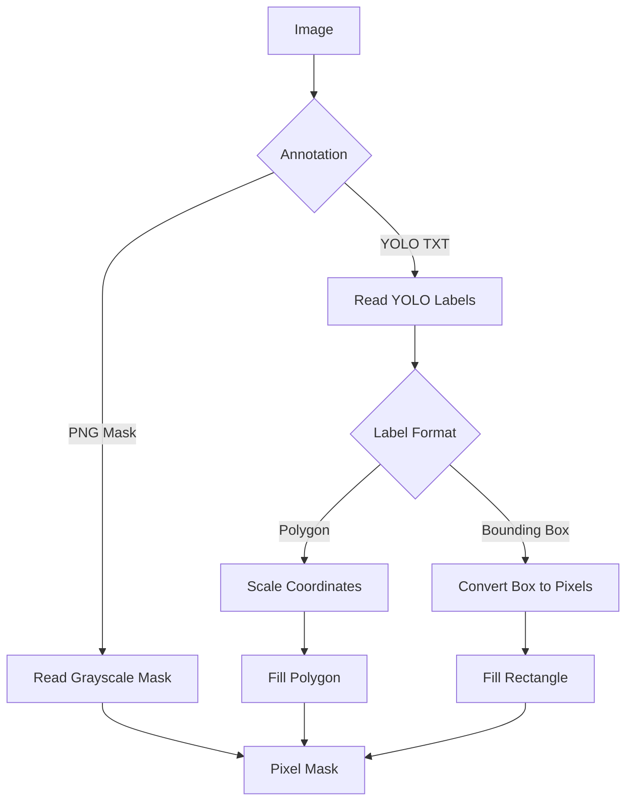

YOLO annotations are converted into the same pixel-mask representation used by the segmentation model.

---

## 5. Train / Validation Split

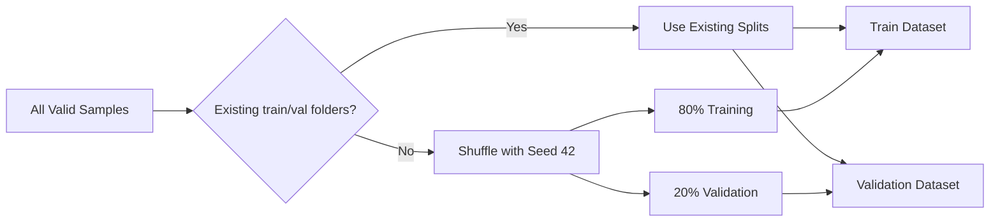

If predefined `train` and `val` folders exist, they are used directly.

Otherwise, the dataset is shuffled with a fixed seed and split using `val_ratio=0.2`.

---

## 6. Image Preprocessing

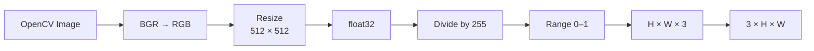

---

## 7. Mask Preprocessing

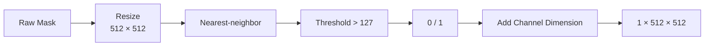

Nearest-neighbor interpolation preserves the discrete mask labels during resizing.

---

## 8. Training Augmentation

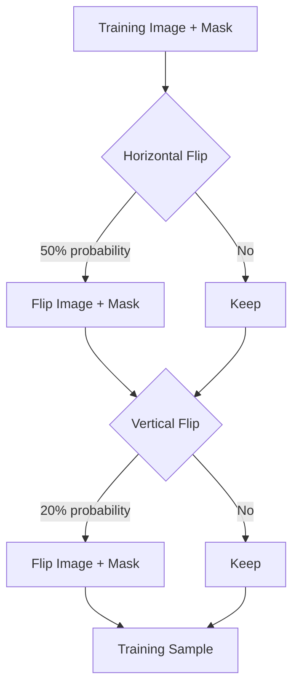

Validation data uses **no augmentation**.

---

## 9. Tensor Conversion

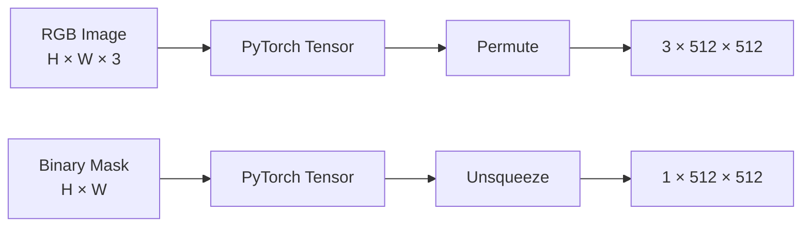

---

## 10. DataLoader

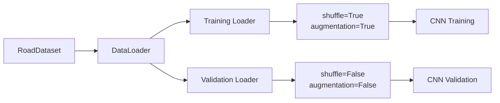

Default configuration:

```text
image_size = 512
batch_size = 8
num_workers = 0
val_ratio = 0.2
seed = 42
```

---

## 11. Complete Internal Workflow

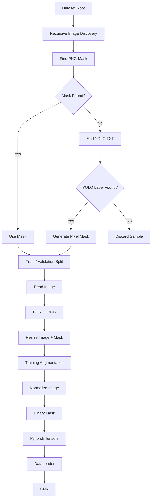

---

## 12. Dataset Pipeline → RoadXAI

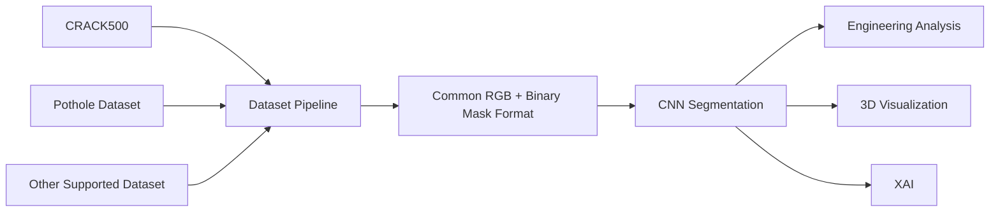

The dataset pipeline is the **data standardization layer** connecting heterogeneous datasets to the rest of RoadXAI.

---

## 13. Dataset Verification

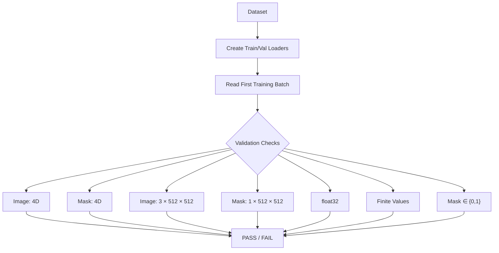

`test_dataset.py` verifies the loader output before model training.

---

## 14. Why This Module Matters

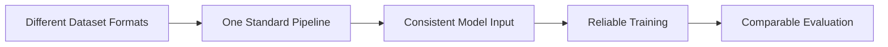

**Main contribution:** it makes different road-defect datasets usable by the same segmentation pipeline.

---

## 15. Research-Paper View

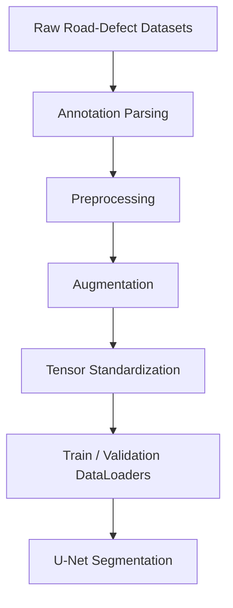

### Key Technical Points

| Component | Current implementation |
|---|---|
| Image formats | JPG, JPEG, PNG, BMP, WEBP |
| Annotation | PNG mask or YOLO TXT |
| YOLO polygons | Converted to pixel masks |
| YOLO boxes | Converted to filled pixel masks |
| Image format | RGB |
| Image range | 0–1 |
| Image size | 512 × 512 |
| Mask | Binary, 1 channel |
| Training augmentation | Horizontal + vertical flips |
| Validation augmentation | None |
| Default validation ratio | 20% |
| Default batch size | 8 |
| Framework | PyTorch |

> **Important:** the pipeline standardizes annotations for segmentation; YOLO bounding boxes become filled rectangular masks, so they do not provide the same boundary precision as true pixel-level segmentation masks.
