# RoadXAI Engineering Analysis Module

## 1. Engineering Analysis — One View

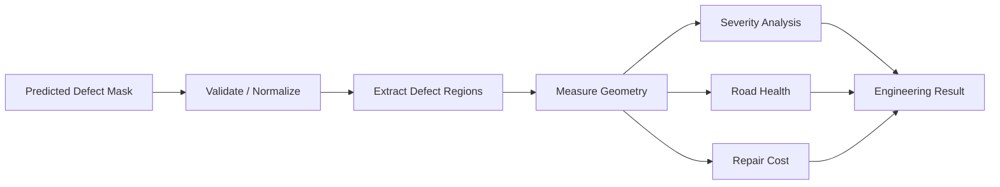

**Purpose:** convert segmentation masks into engineering-oriented measurements and road-condition indicators.

---

## 2. Module → Engineering Outputs

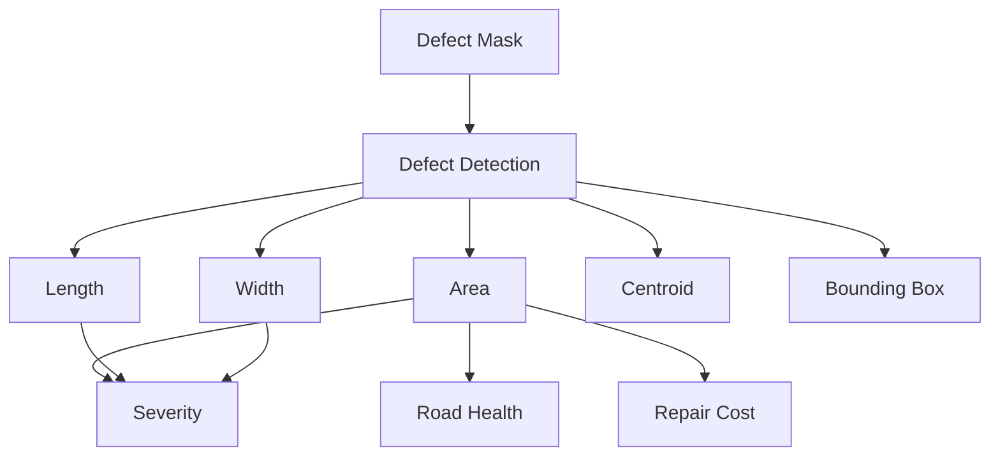

---

## 3. Complete Internal Workflow

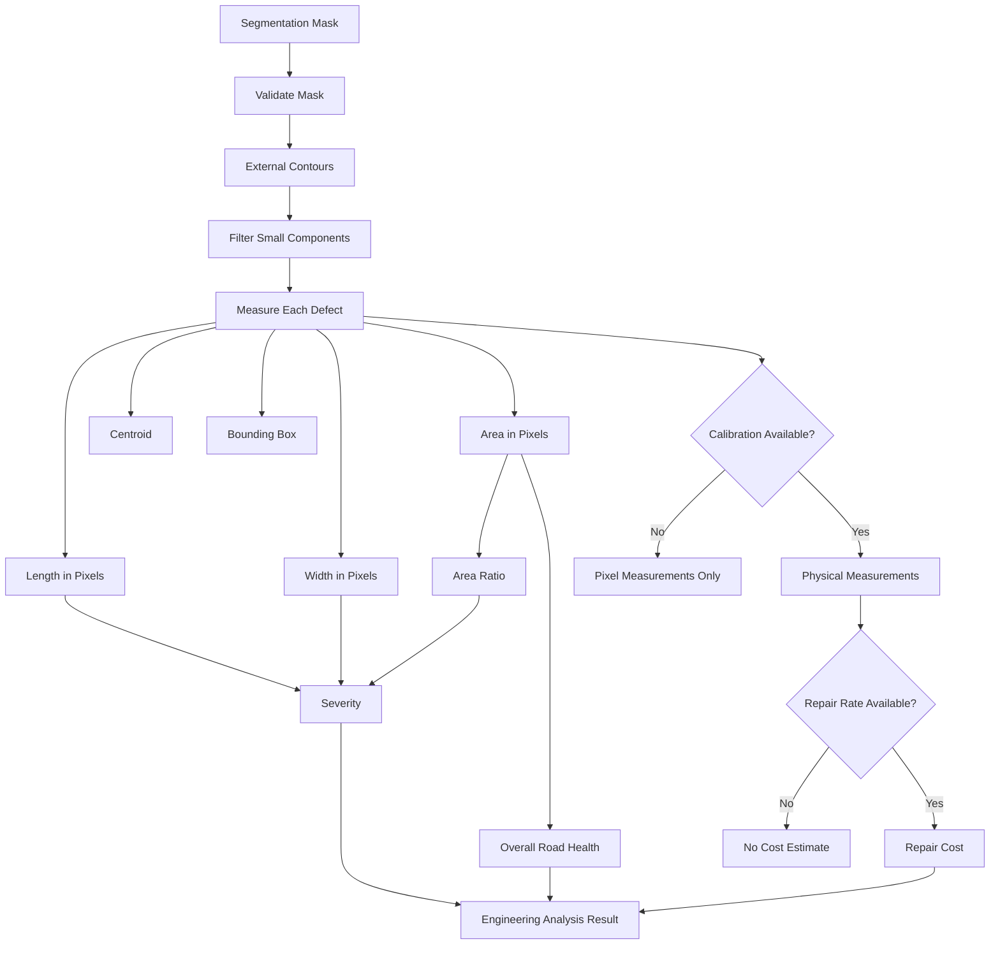

---

## 4. Mask Processing


The module works on a normalized binary representation:

```text
Background → 0
Defect     → 255
```

---

## 5. Defect Region Extraction


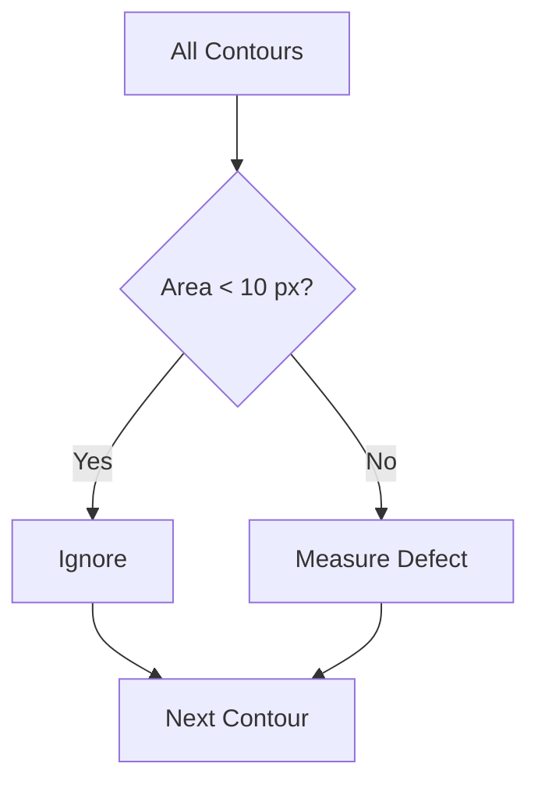

Default minimum defect area:

```text
min_area_pixels = 10
```

---

## 6. Defect Geometry

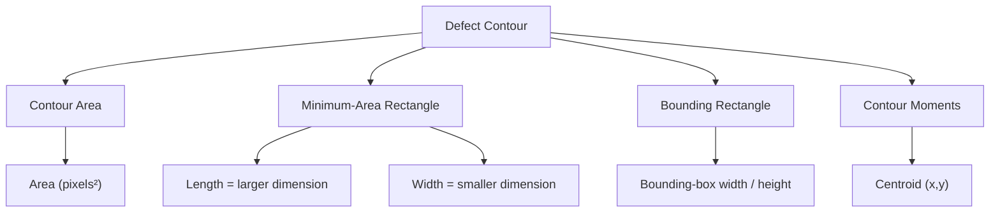

---

## 7. Pixel → Physical Measurements

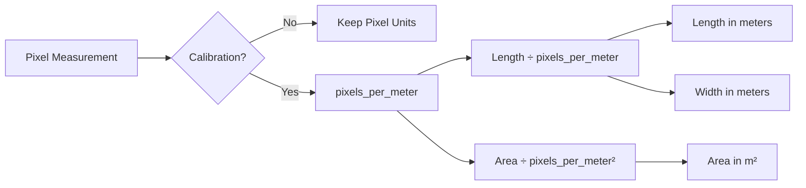

Calibration is explicitly required for physical measurements.

```text
pixels_per_meter > 0
```

---

## 8. Severity Calculation

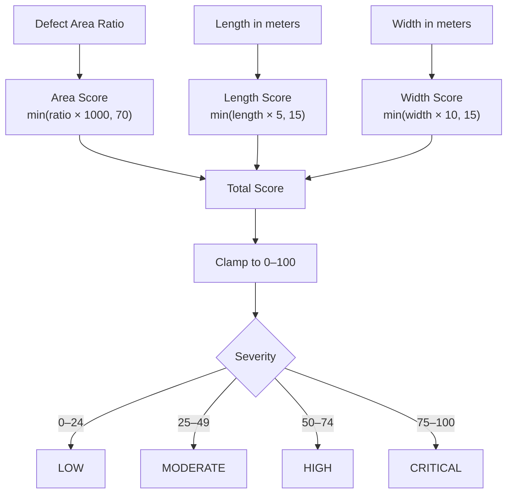

**Important:** physical dimensions contribute to severity only when calibration is available.

---

## 9. Road Health

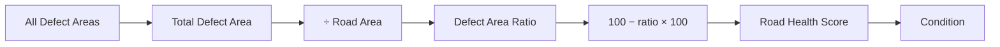

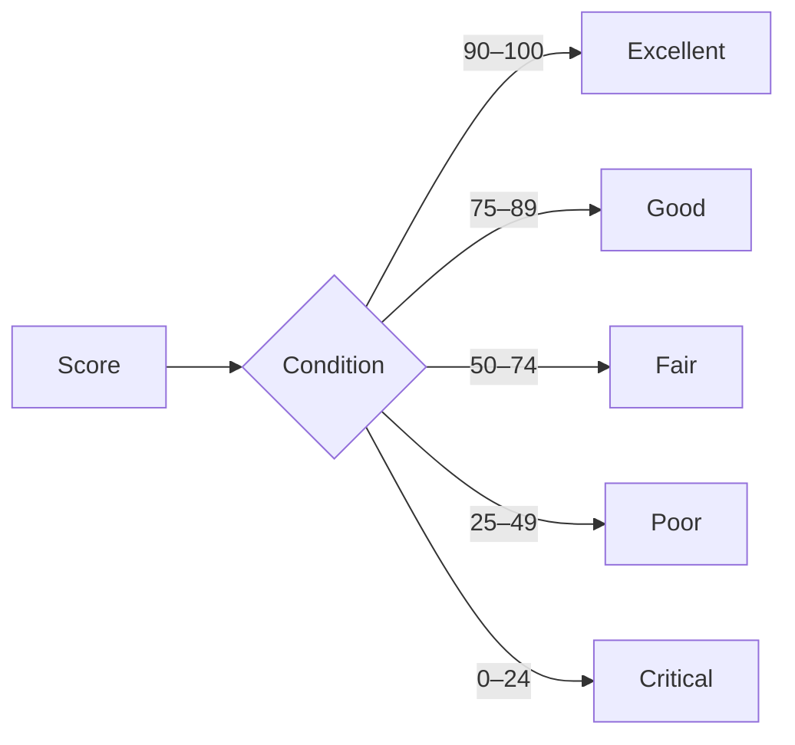

The health score is based on the fraction of road area occupied by detected defects.

---

## 10. Repair Cost

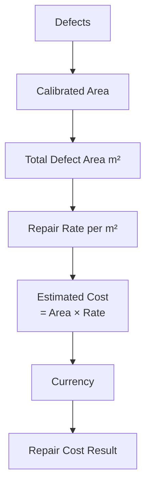

Repair-cost estimation requires:

```text
Calibration
+
Area in m²
+
Repair rate per m²
```

The default currency is `INR`.

---

## 11. Full Engineering Result

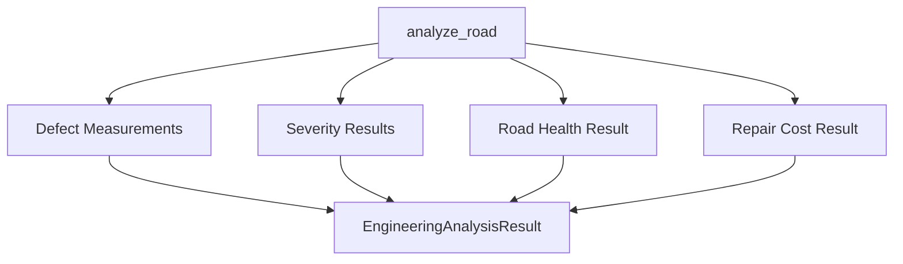

### Result structure

```text
EngineeringAnalysisResult
├── defects
│   ├── area
│   ├── length
│   ├── width
│   ├── centroid
│   └── bounding box
├── severity
├── road_health
└── repair_cost
```

---

## 12. Engineering Analysis → RoadXAI

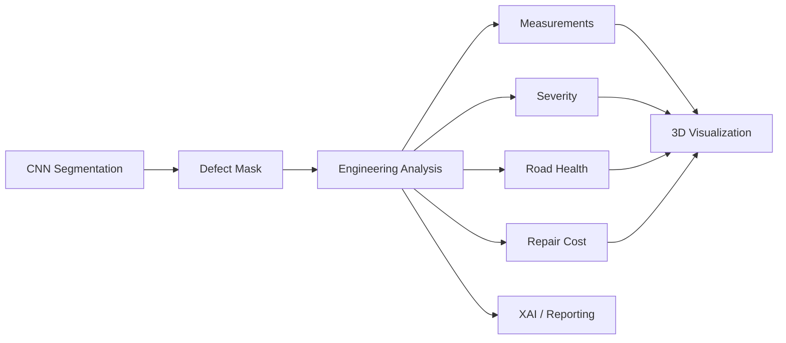

The module is the bridge between **pixel-level segmentation** and **engineering-oriented interpretation**.

---

## 13. Visualization Utilities

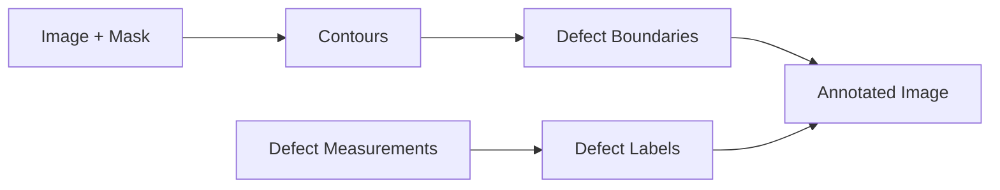

Utility functions also support:

```text
Mask cleaning
Small-component removal
Area / length formatting
Cost formatting
Severity summaries
JSON export
```

---

## 14. Result Export

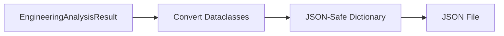

This allows the engineering results to be stored and reused outside the visualization interface.

---

## 15. Why This Module Matters

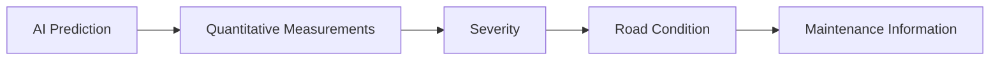

Without engineering analysis:

```text
Image → Defect Mask
```

With engineering analysis:

```text
Image
  ↓
Defect Mask
  ↓
Area / Length / Width
  ↓
Severity
  ↓
Road Health
  ↓
Repair-Cost Estimate
```

---

## 16. Research-Paper View

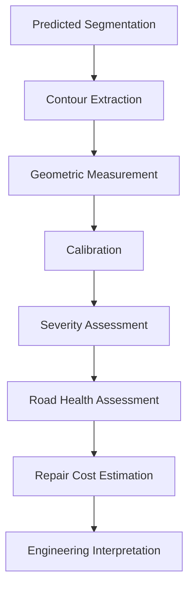

### Key Technical Points

| Component | Current implementation |
|---|---|
| Input | Binary segmentation mask |
| Region extraction | External OpenCV contours |
| Small-region filtering | Default 10 pixels |
| Area | Contour area |
| Length / width | Minimum-area rectangle |
| Centroid | Contour moments |
| Physical calibration | Pixels per meter |
| Severity | Deterministic 0–100 score |
| Severity levels | Low / Moderate / High / Critical |
| Road health | 0–100 score |
| Road conditions | Excellent / Good / Fair / Poor / Critical |
| Repair cost | Area × rate per m² |
| Default currency | INR |
| Output | Structured engineering result + JSON export |

> **Scientific limitation:** pixel measurements become physical measurements only when a valid calibration scale is supplied. The module does not independently infer real-world dimensions from an RGB image.
