# RoadXAI Evaluation Module

## 1. Evaluation — One View

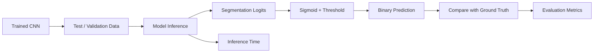

**Purpose:** measure segmentation accuracy and inference performance of the RoadXAI CNN.

---

## 2. Evaluation Outputs

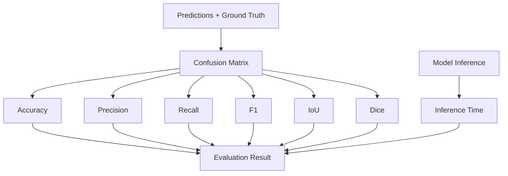

---

## 3. Complete Internal Workflow

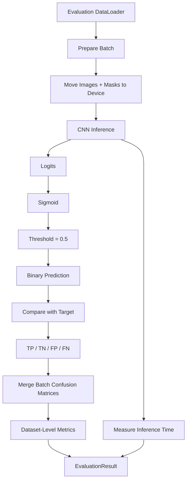

---

## 4. Prediction Conversion


```text
Probability < 0.5 → Background
Probability ≥ 0.5 → Defect
```

The threshold is configurable but defaults to `0.5`.

---

## 5. Pixel-Level Confusion Matrix

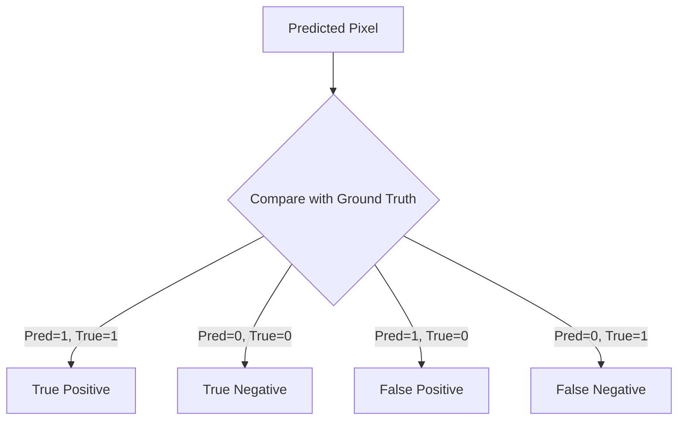

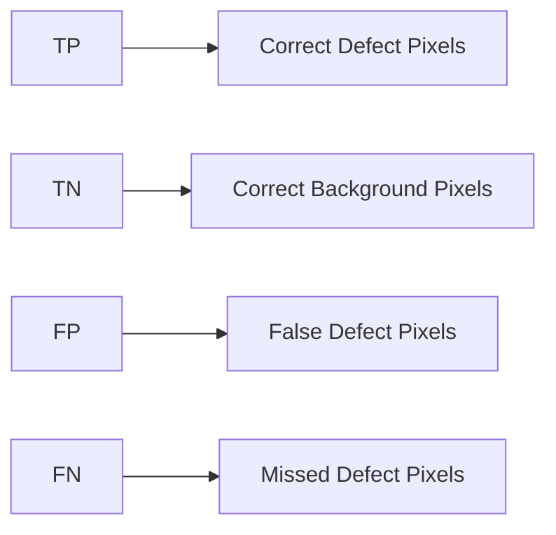

All segmentation metrics are derived from these pixel-level counts.

---

## 6. Accuracy

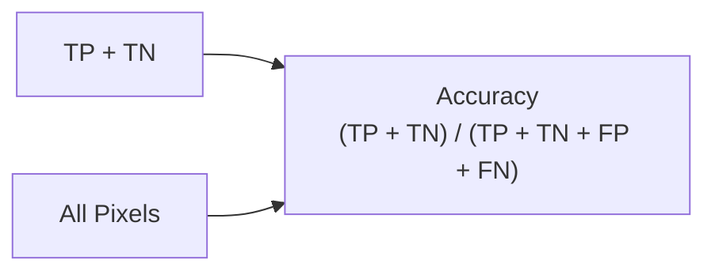

Measures the fraction of correctly classified pixels.

---

## 7. Precision

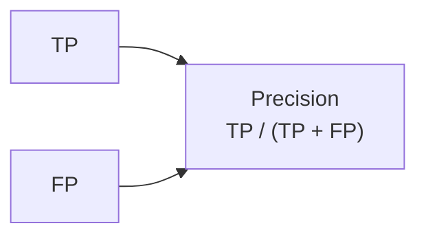

Measures how many predicted defect pixels are actually defects.

---

## 8. Recall

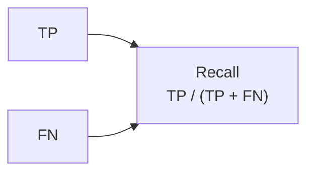

Measures how many actual defect pixels are detected.

---

## 9. F1 Score

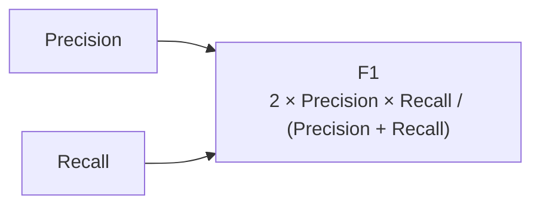

F1 combines precision and recall into one score.

---

## 10. IoU

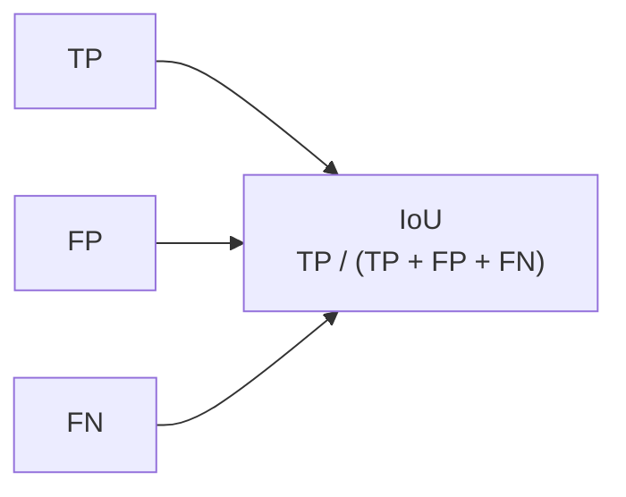

IoU measures overlap between predicted and ground-truth defect regions.

---

## 11. Dice

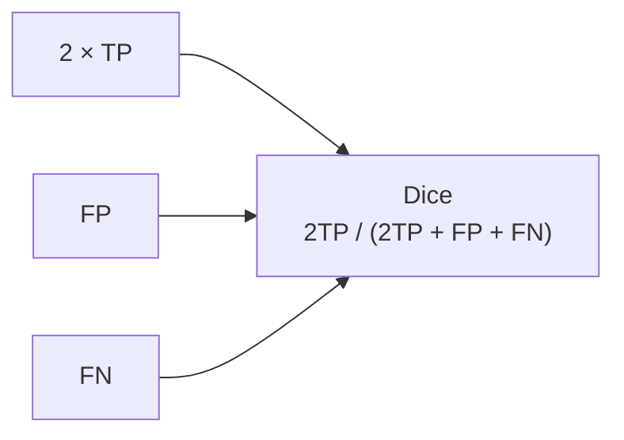

Dice is another overlap measure and is equivalent to F1 for this binary pixel formulation.

---

## 12. Batch → Complete Dataset

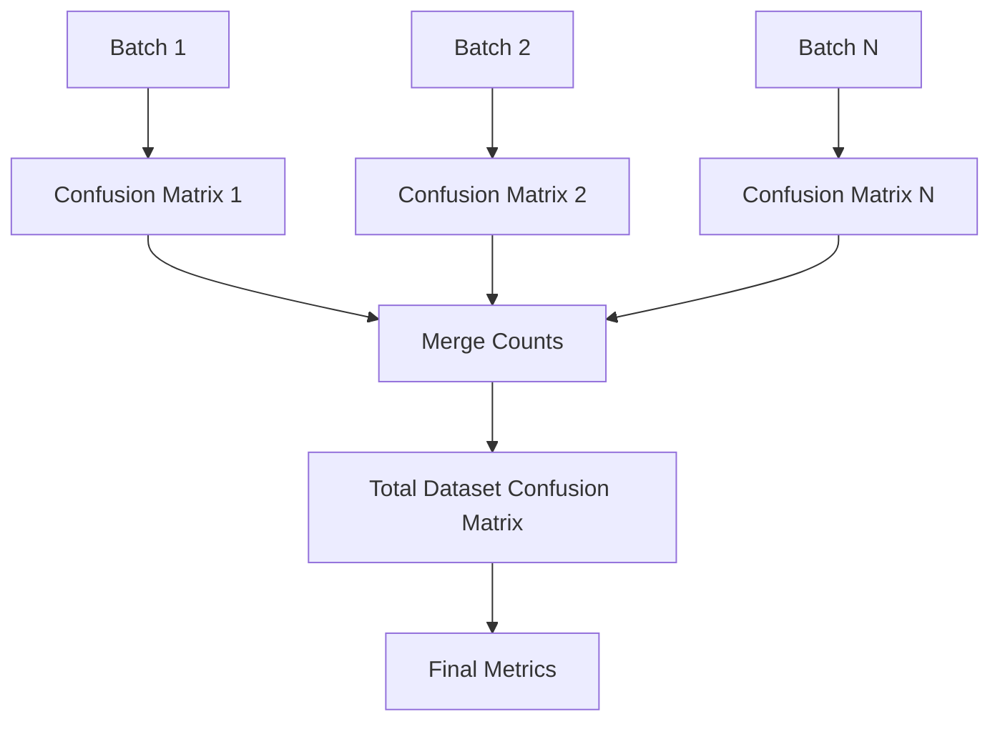

Metrics are calculated from the accumulated confusion-matrix counts over the complete evaluation dataset.

---

## 13. Inference Performance

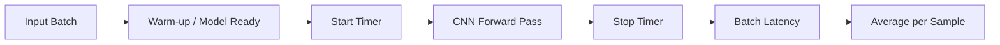

```text
Reported:
Average inference time
Minimum inference time
Maximum inference time
```

The main `evaluate_model()` path reports average inference time per sample and excludes data-loading time.

---

## 14. Evaluation Pipeline

```mermaid
flowchart TD
    A[Trained Model]
    --> B[model.eval()]

    B --> C[Evaluation DataLoader]
    C --> D[Batch Preparation]
    D --> E[Forward Pass]
    E --> F[Logits]

    F --> G[Binary Predictions]
    G --> H[Confusion Matrix]

    H --> I[Accuracy]
    H --> J[Precision]
    H --> K[Recall]
    H --> L[F1]
    H --> M[IoU]
    H --> N[Dice]

    E --> O[Inference Latency]

    I --> P[EvaluationResult]
    J --> P
    K --> P
    L --> P
    M --> P
    N --> P
    O --> P
```

---

## 15. Model Comparison

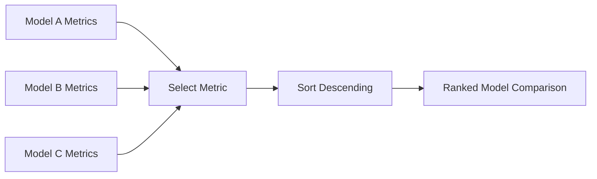

The comparison utility can rank models using a selected metric, with `f1` as the default.

---

## 16. Evaluation Results

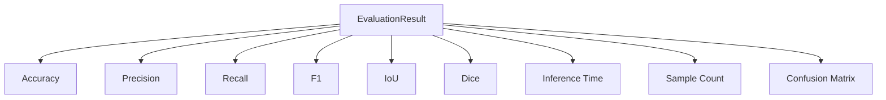

Results can be converted to a dictionary and saved as formatted JSON.

---

## 17. Prediction Storage

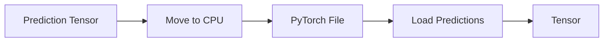

Prediction tensors can be saved and loaded independently for later analysis.

---

## 18. RoadXAI Pipeline Connection

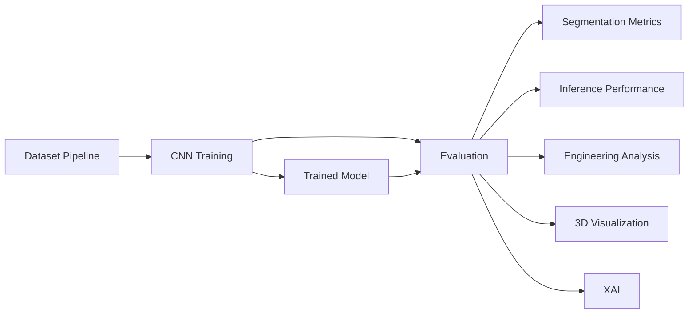

Evaluation provides the quantitative evidence that the segmentation model is performing correctly before its predictions are used by downstream modules.

---

## 19. Why This Module Matters

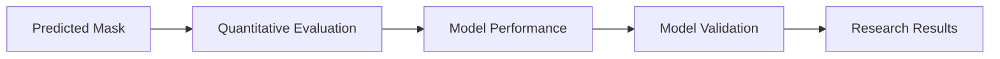

Without evaluation:

```text
CNN → Prediction
```

With evaluation:

```text
CNN
 ↓
Prediction
 ↓
Ground Truth Comparison
 ↓
Confusion Matrix
 ↓
Accuracy / Precision / Recall
F1 / IoU / Dice
 ↓
Inference Performance
```

---

## 20. Research-Paper View

```mermaid
flowchart TD
    A[Trained Segmentation Model]
    --> B[Evaluation Dataset]
    --> C[Pixel-Level Prediction]
    --> D[Confusion Matrix]
    --> E[Segmentation Metrics]
    --> F[Inference-Time Analysis]
    --> G[Model Performance Assessment]
```

### Key Technical Points

| Component | Current implementation |
|---|---|
| Task | Binary road-defect segmentation |
| Evaluation level | Pixel level |
| Prediction conversion | Sigmoid + threshold |
| Default threshold | 0.5 |
| Confusion matrix | TP / TN / FP / FN |
| Metrics | Accuracy, Precision, Recall, F1, IoU, Dice |
| Inference metric | Average time per sample |
| Timing | Excludes data-loading time |
| Model mode | `eval()` |
| Gradient calculation | Disabled |
| Model comparison | Sort by selected metric |
| Result storage | JSON |
| Prediction storage | PyTorch tensor file |

> **Interpretation:** IoU and Dice are especially useful for evaluating segmentation overlap, while precision and recall show false-positive and missed-defect behavior.
