# RoadXAI Evaluation Results — Model Analysis

## 1. Evaluation Results — One View

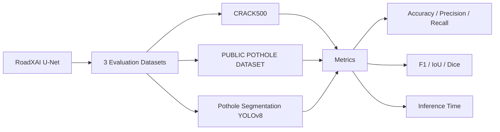

The uploaded JSON files contain evaluation results for **928 samples total** across the three datasets.


## 2. What the Metrics Mean

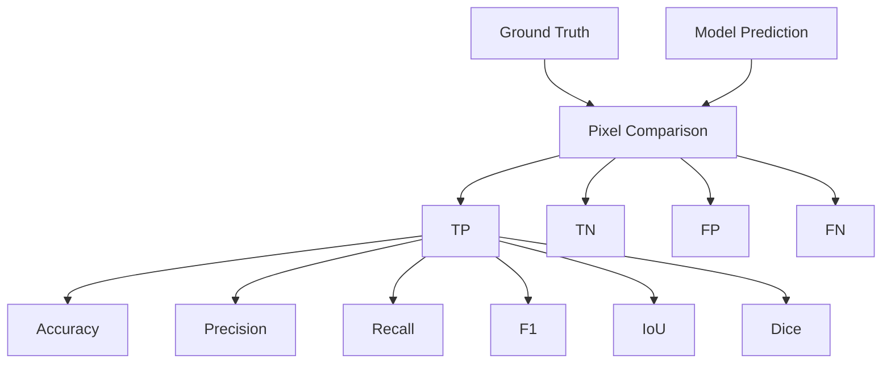

- **Accuracy:** fraction of all pixels classified correctly.
- **Precision:** when the model predicts a defect pixel, how often it is correct.
- **Recall:** fraction of actual defect pixels detected.
- **F1:** balance between precision and recall.
- **IoU:** overlap between predicted and ground-truth defect regions.
- **Dice:** overlap score; for this binary formulation it is numerically equal to F1.
- **Inference time:** average forward-pass time per sample reported by the evaluator.

## 3. CRACK500 — Strongest Result

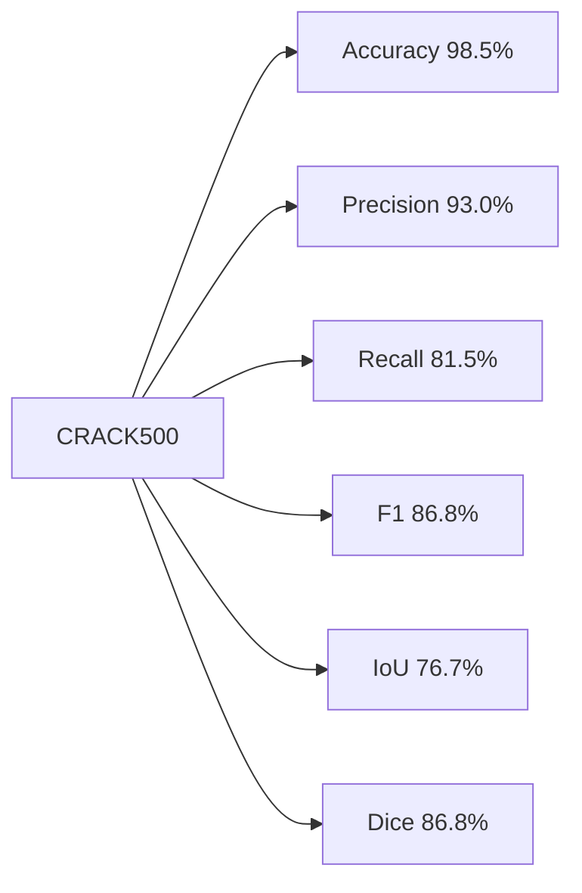

This is the **best-performing dataset** in the uploaded results.

- Accuracy is very high.
- Precision is high: false-positive defect pixels are relatively limited.
- Recall is also strong: the model detects most defect pixels.
- F1 and Dice are strong.
- IoU is the highest of the three datasets.

Overall, the model is performing substantially better on **CRACK500 crack segmentation** than on the two pothole datasets.

## 4. PUBLIC POTHOLE DATASET — Moderate/Good Result

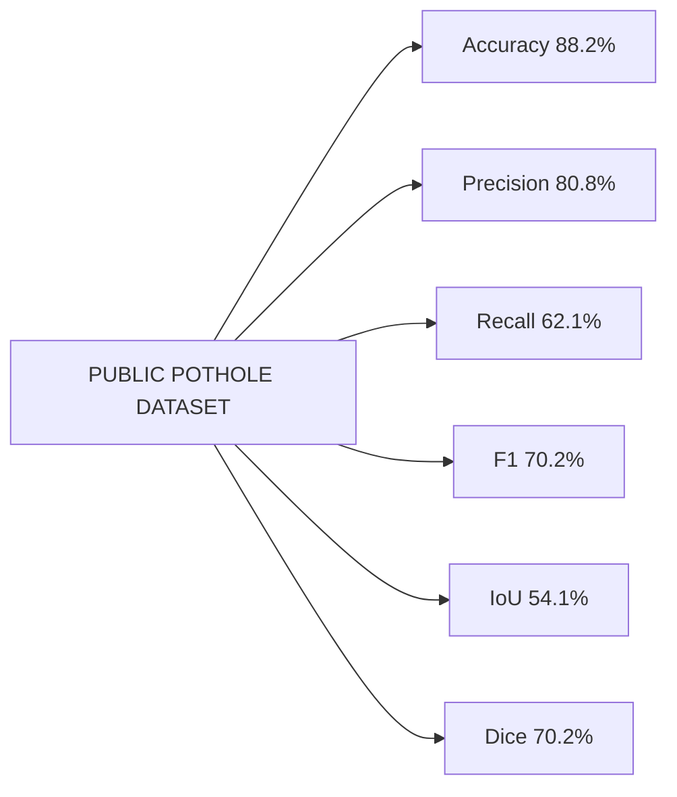

This is the **middle result**.

- Precision is reasonably strong.
- Recall is lower than precision, meaning the model misses a meaningful portion of actual pothole pixels.
- F1/Dice show a moderate overlap quality.
- IoU is substantially lower than the CRACK500 result.

The main weakness here is **recall**, rather than excessive false positives.

## 5. Pothole_Segmentation_YOLOv8 — Weakest Result

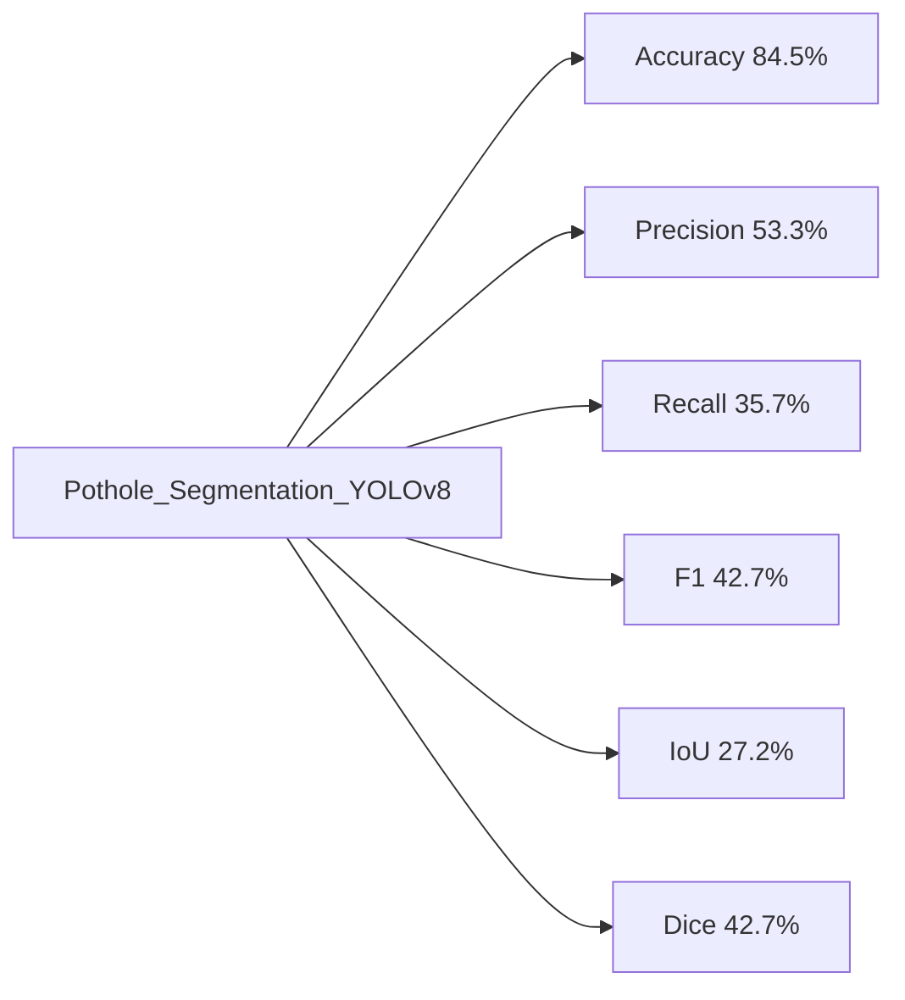

This is the **weakest result**.

The important numbers are:

- Precision ≈ 53.3%
- Recall ≈ 35.7%
- F1 ≈ 42.7%
- IoU ≈ 27.2%

The particularly low recall means the model is **missing many actual pothole pixels**.

Precision is also only moderate, so the model has both:
1. missed pothole regions, and
2. incorrect predicted defect pixels.

Therefore, the model's pothole segmentation generalization is currently much weaker on this dataset than on CRACK500.

## 6. Dataset Comparison

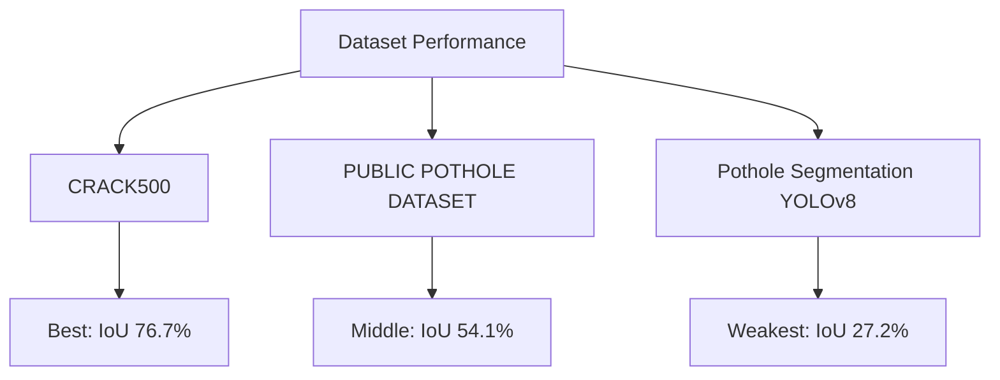

### Ranking by IoU

| Rank | Dataset | IoU | F1 / Dice |
|---:|---|---:|---:|
| 1 | CRACK500 | 76.74% | 86.84% |
| 2 | PUBLIC POTHOLE DATASET | 54.12% | 70.23% |
| 3 | Pothole_Segmentation_YOLOv8 | 27.17% | 42.73% |

**IoU is the most useful headline metric here for segmentation quality because it directly measures region overlap.**

## 7. Precision vs Recall — What Your Model Is Doing

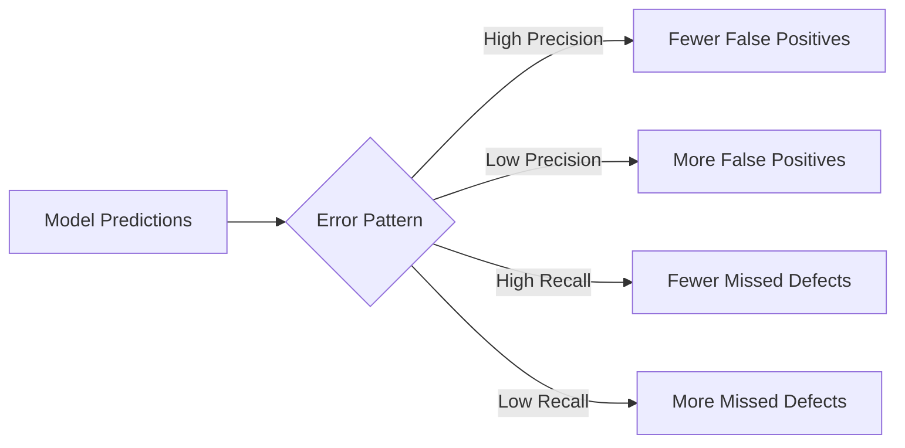

### CRACK500
**Precision 93.0% / Recall 81.5%**

Good balance. The model is relatively accurate when predicting cracks and detects a large fraction of them.

### PUBLIC POTHOLE DATASET
**Precision 80.8% / Recall 62.1%**

The model is fairly conservative. When it predicts pothole pixels, it is usually correct, but it misses a noticeable amount of pothole area.

### Pothole_Segmentation_YOLOv8
**Precision 53.3% / Recall 35.7%**

This is the main problem area. The model both predicts imperfect regions and misses substantial portions of the actual potholes.

## 8. Why Accuracy Looks Better Than IoU

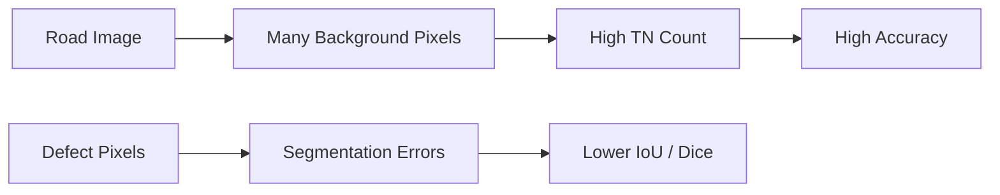

Your accuracy should **not** be used alone to judge segmentation quality.

Road images contain many background pixels. A model can classify background correctly and obtain high accuracy while still producing poor defect-region overlap.

This is visible in the pothole results:

- Pothole_Segmentation_YOLOv8: **84.53% accuracy vs 27.17% IoU**
- PUBLIC POTHOLE DATASET: **88.23% accuracy vs 54.12% IoU**
- CRACK500: **98.50% accuracy vs 76.74% IoU**

For your research paper, emphasize **IoU, Dice/F1, precision, and recall**, not accuracy alone.

## 9. Inference Speed

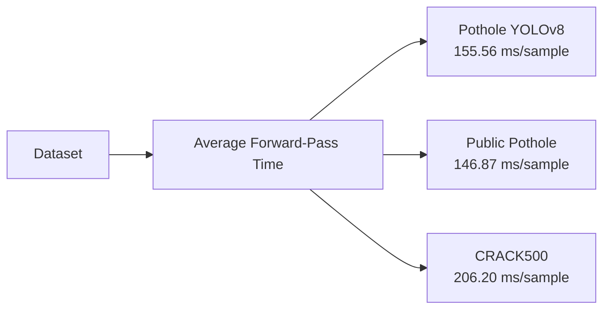

The reported average inference time is:

| Dataset | Inference time |
|---|---:|
| PUBLIC POTHOLE DATASET | 146.87 ms/sample |
| Pothole_Segmentation_YOLOv8 | 155.56 ms/sample |
| CRACK500 | 206.20 ms/sample |

The evaluator explicitly measures **model forward-pass time and excludes data-loading time**.

Approximate inverse throughput, if interpreted simply as one sample per reported average time:

- 146.87 ms → ~6.81 samples/s
- 155.56 ms → ~6.43 samples/s
- 206.20 ms → ~4.85 samples/s

These are derived from the reported timings; they are not an independently benchmarked FPS measurement.

## 10. What This Says About Your Model

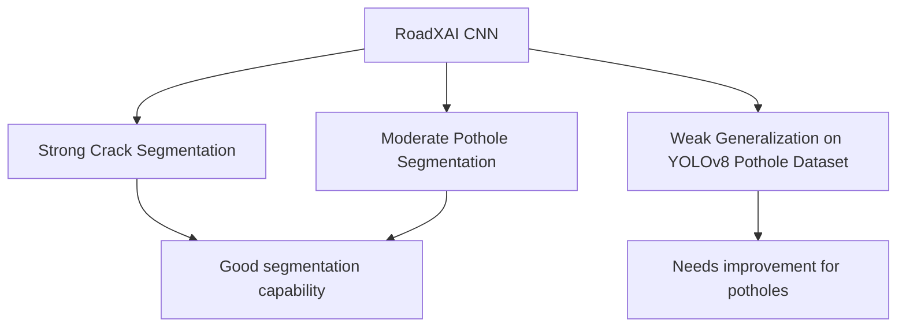

### Overall assessment

Your model is **not uniformly strong across defect types**.

**Strong point**
- Crack segmentation on CRACK500 is clearly good: **IoU 76.74%, Dice/F1 86.84%, precision 92.99%, recall 81.45%**.

**Middle**
- PUBLIC POTHOLE DATASET is usable but leaves room for improvement: **IoU 54.12%, Dice/F1 70.23%**.

**Weak point**
- Pothole_Segmentation_YOLOv8 is currently weak: **IoU 27.17%, Dice/F1 42.73%, recall 35.65%**.

The pattern strongly suggests that the model has difficulty with **pothole appearance/annotation characteristics and/or dataset distribution**, rather than having a general inability to perform segmentation. This is an interpretation of the cross-dataset results, not something the JSON files can prove by themselves.

## 11. Important Limitation of These Results

The uploaded evaluation JSON files contain:

```text
accuracy
precision
recall
f1
iou
dice
inference_time_ms
samples
```

They do **not** contain:

```text
training loss history
validation loss history
per-class metrics
per-image metrics
confusion matrix counts
confidence distributions
precision-recall curves
IoU distribution
Dice distribution
GPU/CPU information
batch size used for timing
```

Therefore, these results are sufficient to describe **overall pixel-level segmentation performance**, but not to diagnose the exact cause of the weaker pothole performance.

## 12. Research-Paper Summary

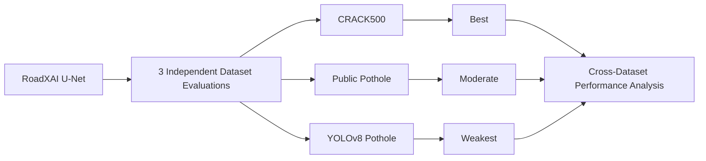

A concise interpretation for the project:

> **The RoadXAI segmentation model demonstrates strong performance on CRACK500, moderate performance on the Public Pothole Dataset, and substantially weaker performance on the Pothole Segmentation YOLOv8 dataset. The cross-dataset results indicate that segmentation performance is strongly dependent on the visual and annotation characteristics of the target dataset.**

## 13. Final Scorecard

| Aspect | Assessment | Evidence |
|---|---|---|
| Crack segmentation | **Strong** | IoU 76.74%, Dice 86.84% |
| Public pothole segmentation | **Moderate** | IoU 54.12%, Dice 70.23% |
| YOLOv8 pothole segmentation | **Weak** | IoU 27.17%, Dice 42.73% |
| Precision on cracks | **Strong** | 92.99% |
| Recall on cracks | **Strong** | 81.45% |
| Recall on potholes | **Needs improvement** | 35.65% / 62.10% |
| Inference performance | **Moderate** | 146.87–206.20 ms/sample |
| Cross-dataset robustness | **Mixed** | Large IoU variation: 27.17–76.74% |
