# RoadXAI Explainable AI Module

## 1. Explainable AI — One View

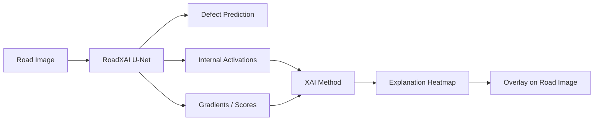

**Purpose:** show which image regions contribute to the CNN's defect prediction.

---

## 2. XAI Pipeline

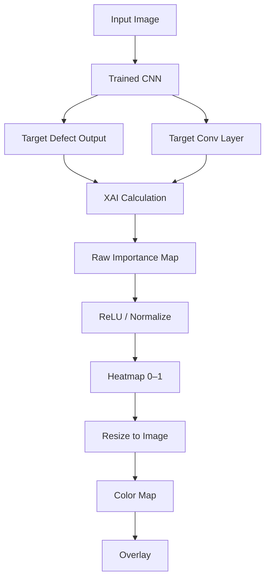

---

## 3. Three Explanation Methods

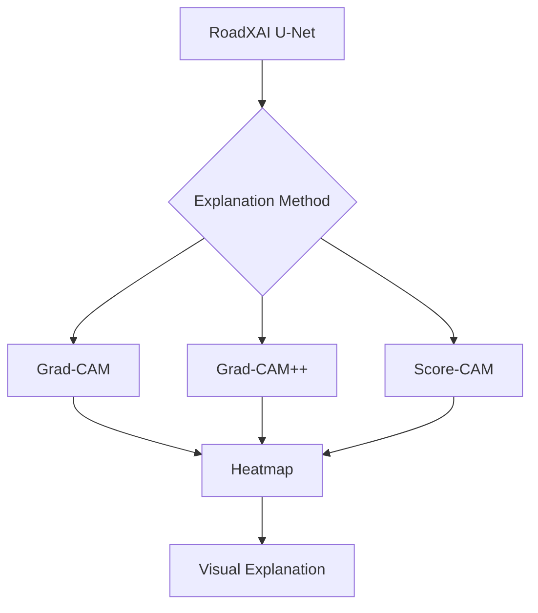

| Method | Main information used |
|---|---|
| Grad-CAM | Activations + gradients |
| Grad-CAM++ | Higher-order gradient information |
| Score-CAM | Activation maps + model score changes |

---

## 4. Grad-CAM

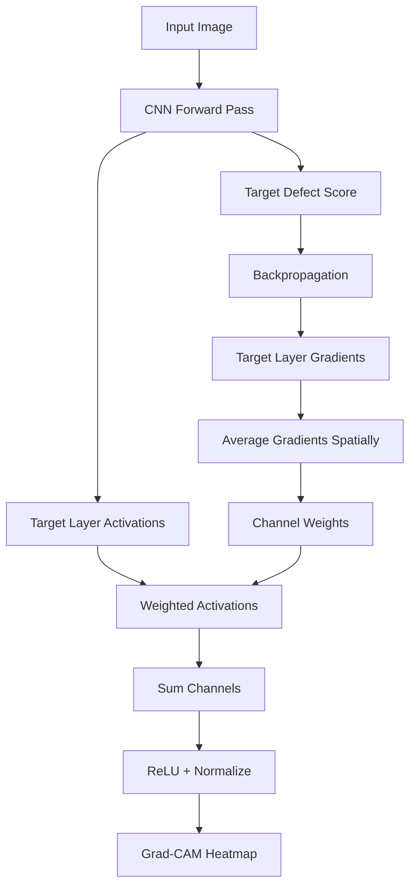

Core idea:

```text
Gradients → channel importance
Activations × importance → explanation
```

The target score is the **spatial mean of the selected output channel**.

---

## 5. Grad-CAM++ 

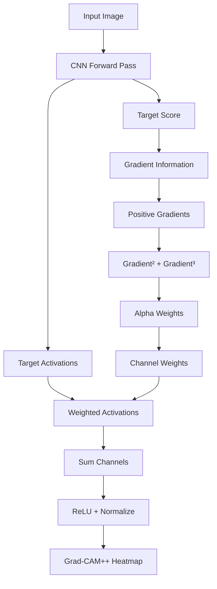

Grad-CAM++ uses additional gradient information to calculate more detailed activation importance weights.

---

## 6. Score-CAM

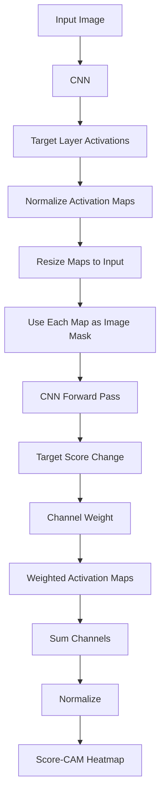

Score-CAM uses the model's score response to activation-based masked inputs instead of backpropagated gradients.

---

## 7. Target Class

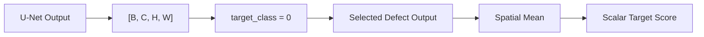

For the binary RoadXAI segmentation model, `target_class=0` selects the single defect output channel.

---

## 8. Target Layer

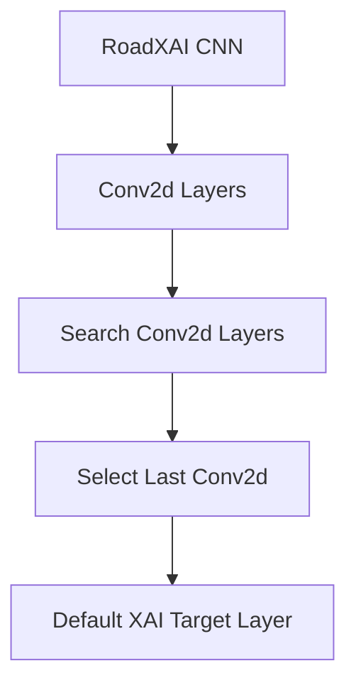

The implementation can also accept a specific convolutional layer.

Layer utilities support:

```text
Get layer by dotted name
List all Conv2d layers
Select final Conv2d layer
```

---

## 9. Activation + Gradient Capture

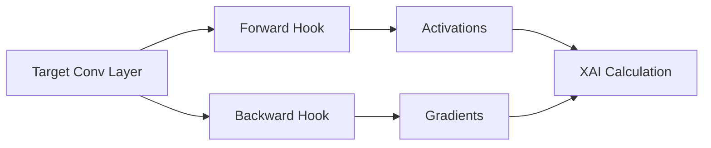

Hooks are removed after explanation generation.

---

## 10. Heatmap Processing

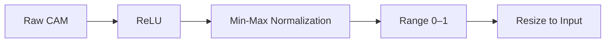

The generated explanation is represented as a normalized spatial heatmap.

---

## 11. Heatmap → Visualization

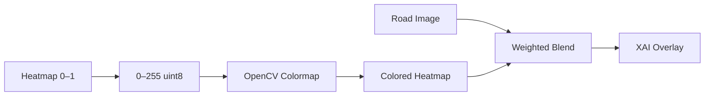

Default overlay contribution:

```text
alpha = 0.45
```

---

## 12. What the Heatmap Means

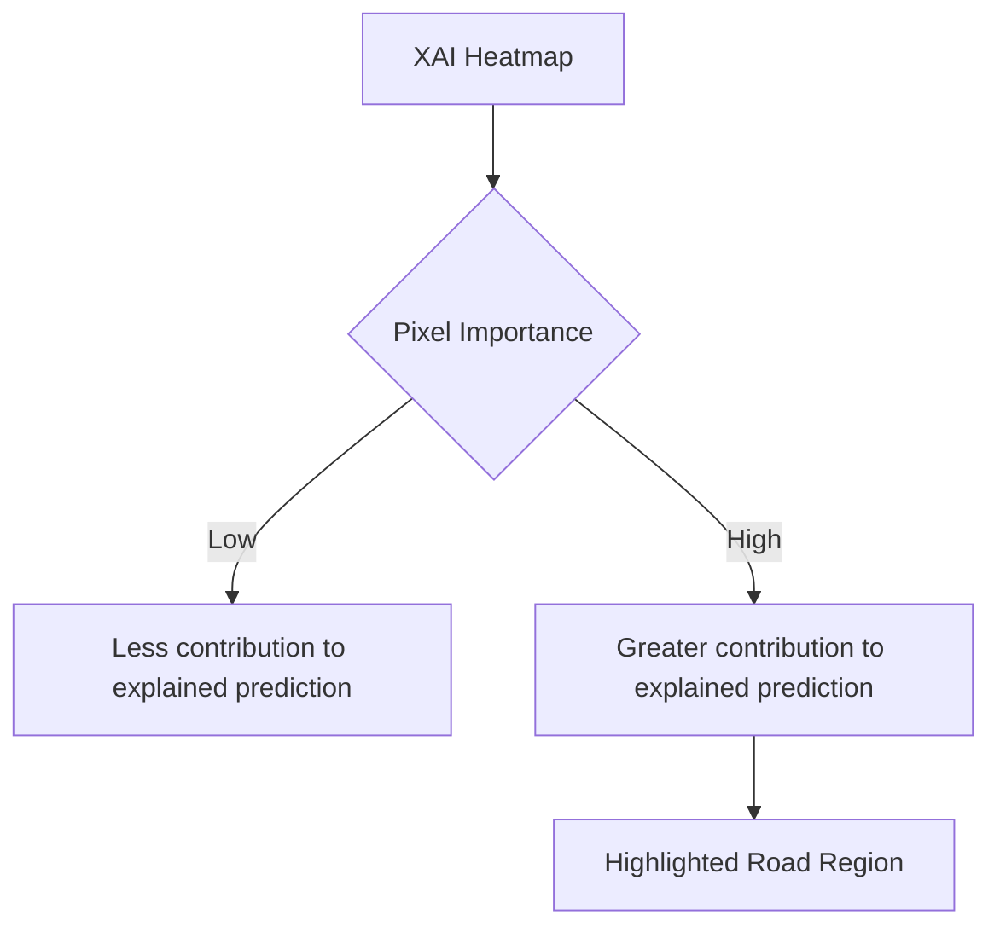

The heatmap is an **explanation of model activation/score sensitivity**, not a ground-truth defect mask.

```text
Segmentation Mask → What the model predicts
XAI Heatmap       → Where the model's decision is supported
```

---

## 13. XAI vs Segmentation

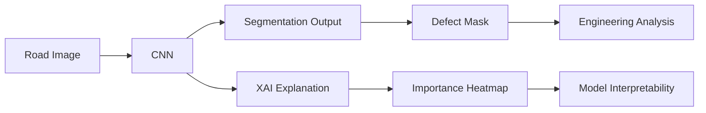

Both use the same CNN prediction, but they answer different questions.

---

## 14. Utility Pipeline

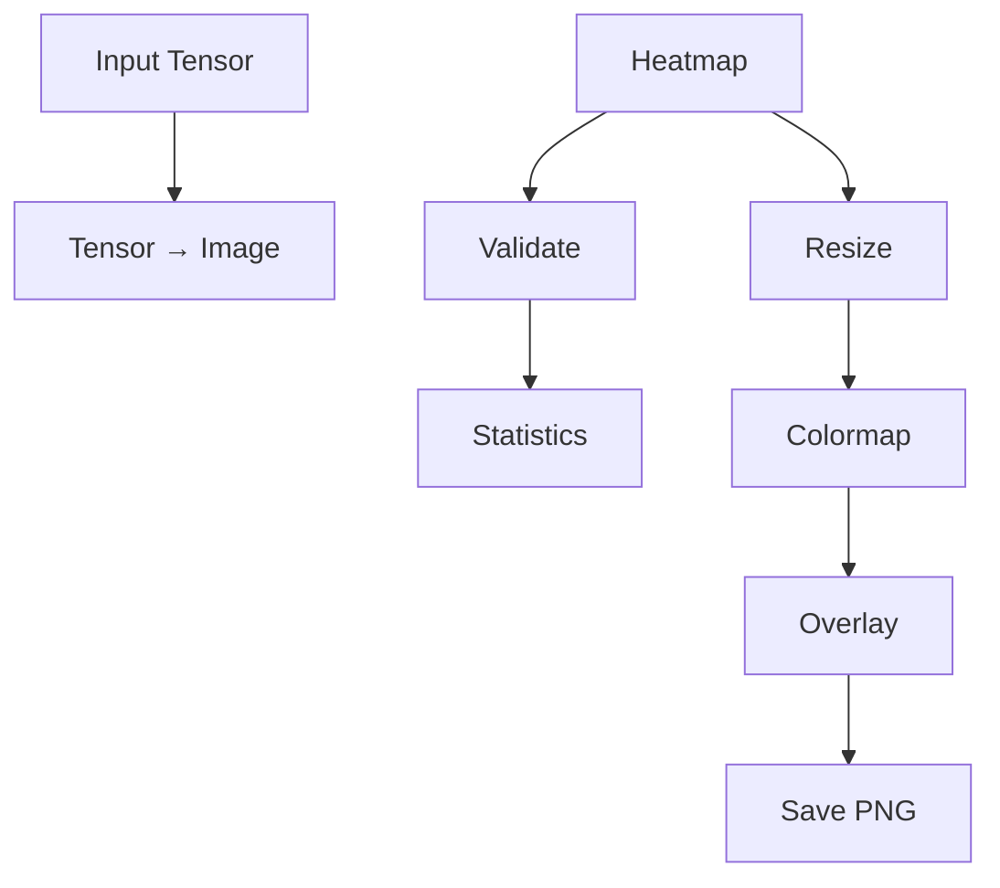

Available utilities include:

```text
Image normalization
Tensor → image conversion
Tensor min-max normalization
Heatmap resizing
Colormap generation
Heatmap blending
Heatmap validation
Heatmap statistics
Explanation metadata
Heatmap / overlay saving
```

---

## 15. Explanation Metadata

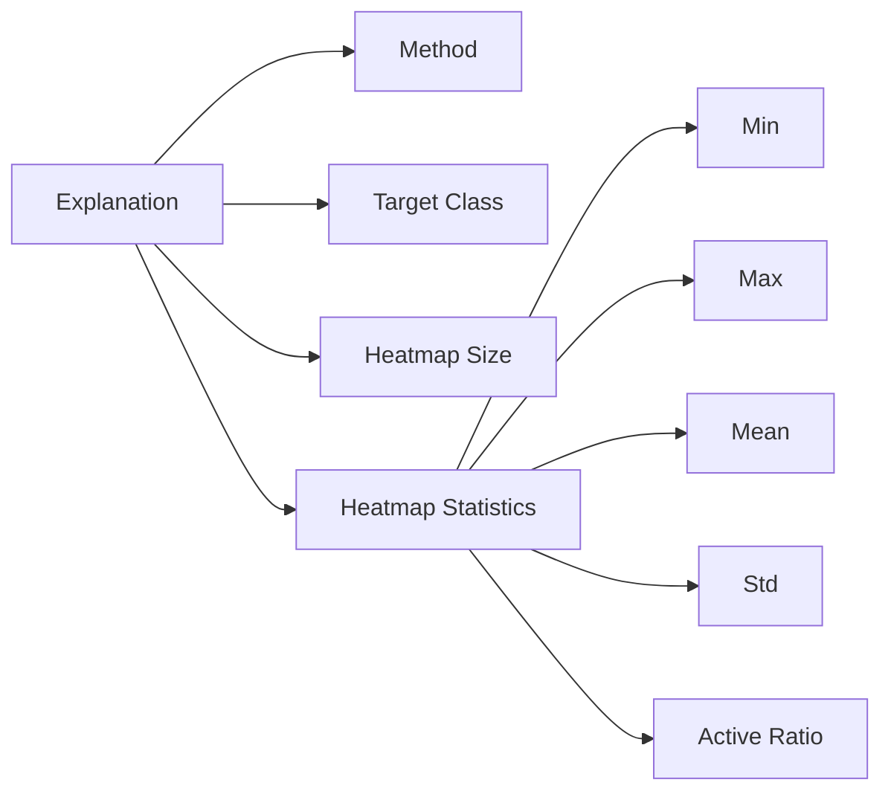

The active ratio represents the fraction of heatmap pixels with value `>= 0.5`.

---

## 16. Complete RoadXAI Connection

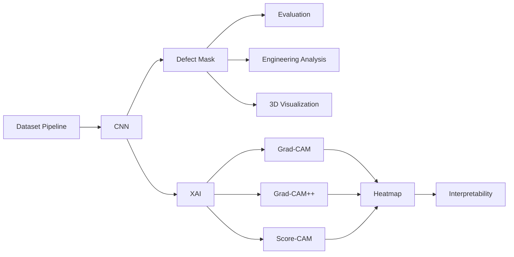

---

## 17. Why XAI Matters

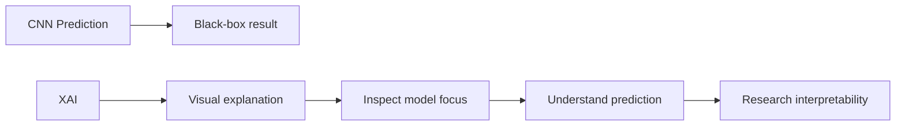

XAI adds an explanation layer to RoadXAI rather than changing the segmentation prediction itself.

---

## 18. Research-Paper View

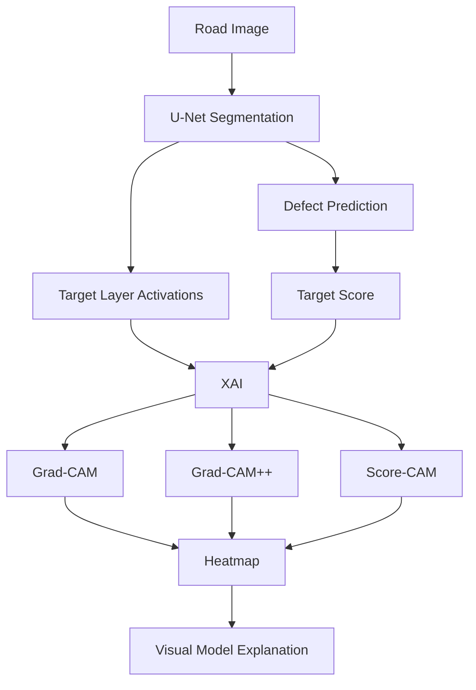

### Key Technical Points

| Component | Current implementation |
|---|---|
| Model | RoadXAI U-Net segmentation model |
| XAI methods | Grad-CAM, Grad-CAM++, Score-CAM |
| Input | `[B, 3, H, W]` floating-point RGB tensor |
| Target output | Selected segmentation output channel |
| Default target class | `0` |
| Default target layer | Last `Conv2d` layer |
| Grad-CAM | Activation-weighted by spatially averaged gradients |
| Grad-CAM++ | Higher-order gradient-based weighting |
| Score-CAM | Activation masking + score change |
| Heatmap range | 0–1 |
| Heatmap resize | Bilinear interpolation |
| Visualization | OpenCV colormap + weighted overlay |
| Default overlay alpha | 0.45 |
| Output | Heatmap / colored heatmap / overlay |
| Metadata | Method, target class, dimensions, statistics |

> **Scientific limitation:** the generated heatmaps explain the model's internal activation/score behavior for the selected target and layer. They should not be interpreted as ground-truth defect boundaries or as proof that highlighted pixels are causally responsible for the physical defect.
