# RoadXAI — Project Overview

RoadXAI is an explainable AI-based road infrastructure intelligence system for detecting, segmenting, analyzing, and reporting road damage from images.

The project overview module provides **static project-level metadata and configuration**. It does not perform training, inference, dataset loading, segmentation, explainability, or engineering calculations.

---

## 1. Project Overview — One View

```mermaid
flowchart TB
    A["RoadXAI"] --> B["Project Metadata"]
    A --> C["Supported Damage Classes"]
    A --> D["Project Objectives"]
    A --> E["Project Configuration"]
    A --> F["Project Paths"]
    A --> G["Validation Utilities"]

    B --> B1["Name: RoadXAI"]
    B --> B2["Version: 0.1.0"]
    B --> B3["Description"]

    C --> C1["crack"]
    C --> C2["pothole"]

    D --> D1["Detection"]
    D --> D2["Classification"]
    D --> D3["Segmentation"]
    D --> D4["Severity"]
    D --> D5["Explainability"]
    D --> D6["Structured Inspection"]
    D --> D7["Engineering Assessment"]
    D --> D8["Inspection Reports"]

    E --> E1["512 × 512"]
    E --> E2["3 Image Channels"]
    E --> E3["1 Mask Channel"]
    E --> E4["80% Train / 20% Validation"]
    E --> E5["Random Seed 42"]

    F --> F1["Project Root"]
    F --> F2["datasets/"]
    F --> F3["CRACK500"]
    F --> F4["Pothole_Segmentation_YOLOv8"]
    F --> F5["PUBLIC POTHOLE DATASET"]
```

---

## 2. Project Identity

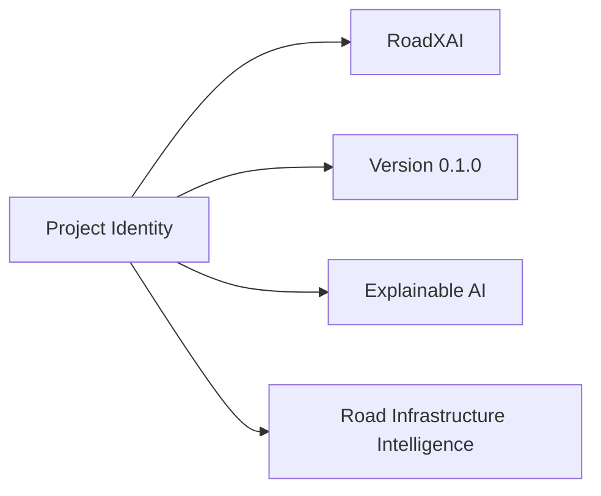

---

## 3. Supported Damage Classes

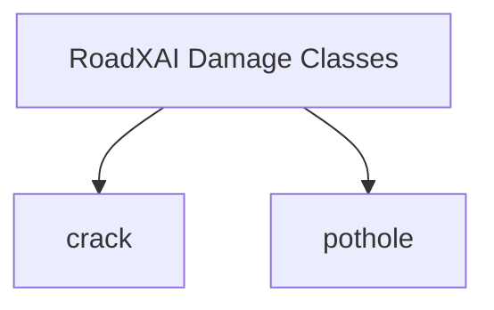

The current project-level metadata defines exactly two supported damage classes:

| Class | Meaning |
|---|---|
| `crack` | Road crack |
| `pothole` | Road pothole |

---

## 4. Project Objectives

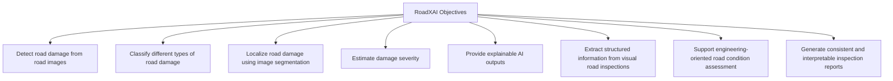

---

## 5. Project-Level Workflow

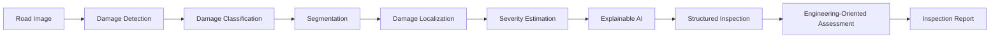

This represents the intended project-level intelligence flow described by the project metadata. The project overview module itself only stores and exposes this information.

---

## 6. Relationship With RoadXAI Modules

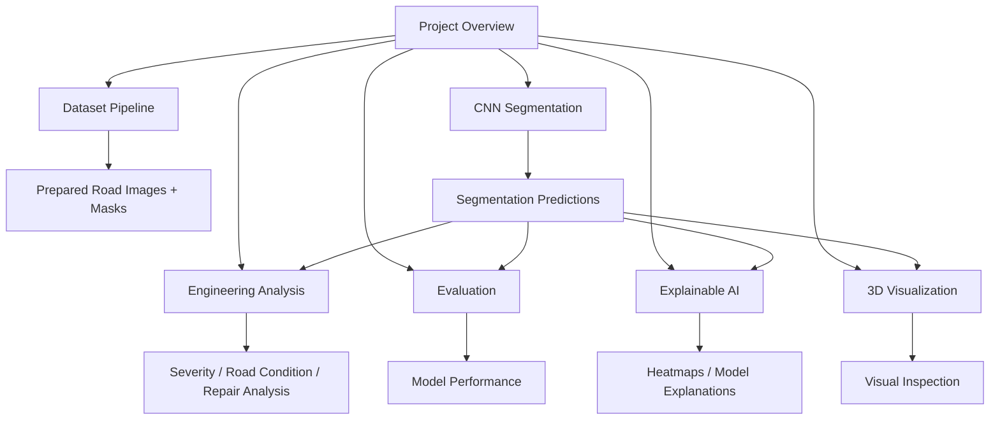

The overview package does not execute these modules; it provides the project-level identity, objectives, classes, configuration, and paths used to organize the system.

---

## 7. Project Configuration

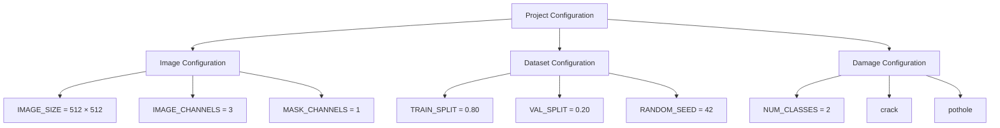

---

## 8. Dataset Structure

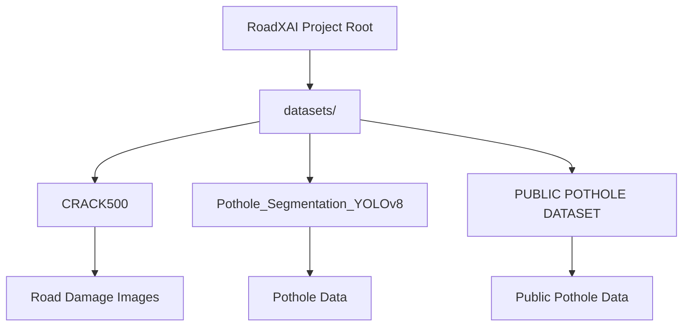

The project paths module centralizes these dataset locations rather than scattering filesystem paths throughout the project.

---

## 9. Metadata API

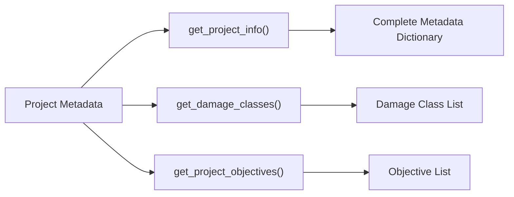

The public project-overview interface exports:

```text
PROJECT_NAME
PROJECT_VERSION
PROJECT_DESCRIPTION
PROJECT_OBJECTIVES
DAMAGE_CLASSES
```

---

## 10. Project Schema

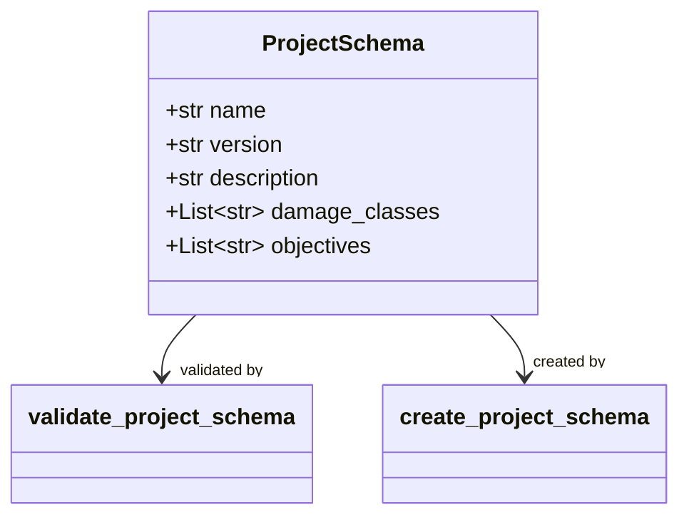

The schema is an immutable (`frozen=True`) dataclass representing structured RoadXAI project information.

---

## 11. Validation Architecture

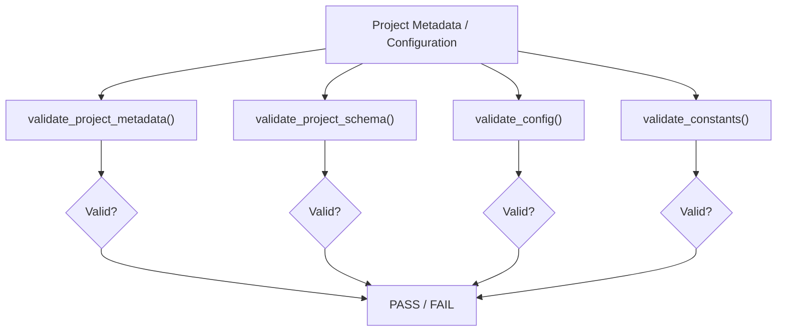

Validation checks include:

- Non-empty project name
- Non-empty version
- Non-empty description
- At least one objective
- At least one damage class
- No empty objective/class entries
- Valid image dimensions and channels
- Consistent class count
- Train/validation proportions
- Valid random seed
- Consistent centralized configuration

---

## 12. Project Constants

| Parameter | Current Value |
|---|---:|
| Project | RoadXAI |
| Version | 0.1.0 |
| Image width | 512 |
| Image height | 512 |
| Image channels | 3 |
| Mask channels | 1 |
| Training split | 0.80 |
| Validation split | 0.20 |
| Random seed | 42 |
| Number of classes | 2 |
| Classes | crack, pothole |

---

## 13. Project Overview Package Boundary

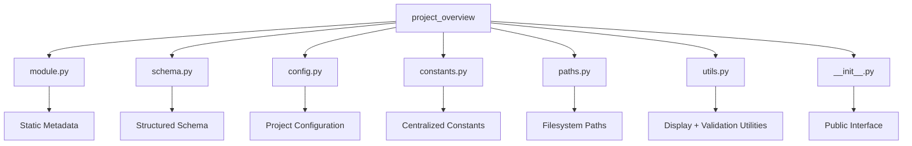

---

## 14. Separation of Responsibilities

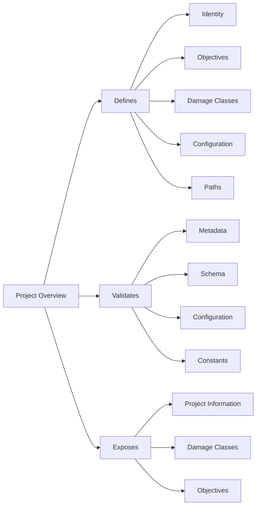

### Explicitly outside this module

```text
Training
Inference
Dataset loading
Image segmentation
Model evaluation
Grad-CAM / XAI computation
Engineering calculations
3D mesh generation
```

---

## 15. Research-Paper View

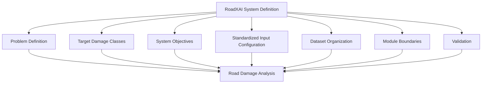

### System-level role

The project overview establishes the **formal specification of RoadXAI**:

1. Defines what the project is.
2. Defines which road-damage classes are currently supported.
3. Defines the project's intended objectives.
4. Establishes common image, mask, split, and class configuration.
5. Centralizes dataset paths.
6. Provides validation for project-level information.
7. Exposes a consistent public interface to other project components.

---

## 16. Complete RoadXAI Architecture

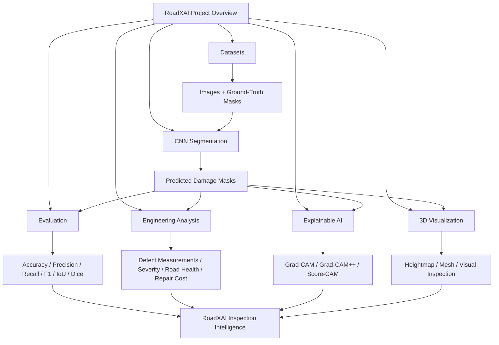

---

## 17. Key Technical Summary

| Component | Role |
|---|---|
| `module.py` | Project identity, description, objectives, damage classes |
| `schema.py` | Structured immutable project schema |
| `config.py` | Central project configuration |
| `constants.py` | Shared project constants |
| `paths.py` | Centralized project and dataset paths |
| `utils.py` | Project overview display and metadata validation |
| `__init__.py` | Public project-overview interface |

---

## 18. Final Architecture

```mermaid
flowchart TB
    A["RoadXAI"]

    A --> B["Project Definition"]
    A --> C["Data"]
    A --> D["Learning"]
    A --> E["Evaluation"]
    A --> F["Engineering"]
    A --> G["Explainability"]
    A --> H["Visualization"]

    B --> B1["Metadata"]
    B --> B2["Configuration"]
    B --> B3["Constants"]
    B --> B4["Paths"]
    B --> B5["Validation"]

    C --> C1["CRACK500"]
    C --> C2["Pothole_Segmentation_YOLOv8"]
    C --> C3["PUBLIC POTHOLE DATASET"]

    D --> D1["U-Net Segmentation"]

    E --> E1["Pixel Metrics"]
    E --> E2["Inference Timing"]

    F --> F1["Defect Geometry"]
    F --> F2["Severity"]
    F --> F3["Road Health"]
    F --> F4["Repair Cost"]

    G --> G1["Grad-CAM"]
    G --> G2["Grad-CAM++"]
    G --> G3["Score-CAM"]

    H --> H1["Heightmap"]
    H --> H2["3D Mesh"]
    H --> H3["Inspection Views"]
```

> **Scope note:** The project overview is a metadata/configuration layer. It defines and validates the system specification but does not itself execute the machine-learning, segmentation, evaluation, XAI, engineering-analysis, or visualization pipelines.
