# RoadXAI — Report Generation

The Report Generation module converts outputs from RoadXAI inference, engineering analysis, explainable AI, and 3D visualization into a structured inspection report and exports it in machine-readable and human-readable formats.

---

## 1. Report Generation — One View

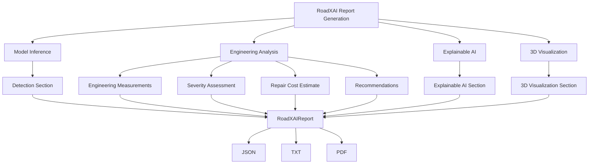

---

## 2. Complete Report Pipeline

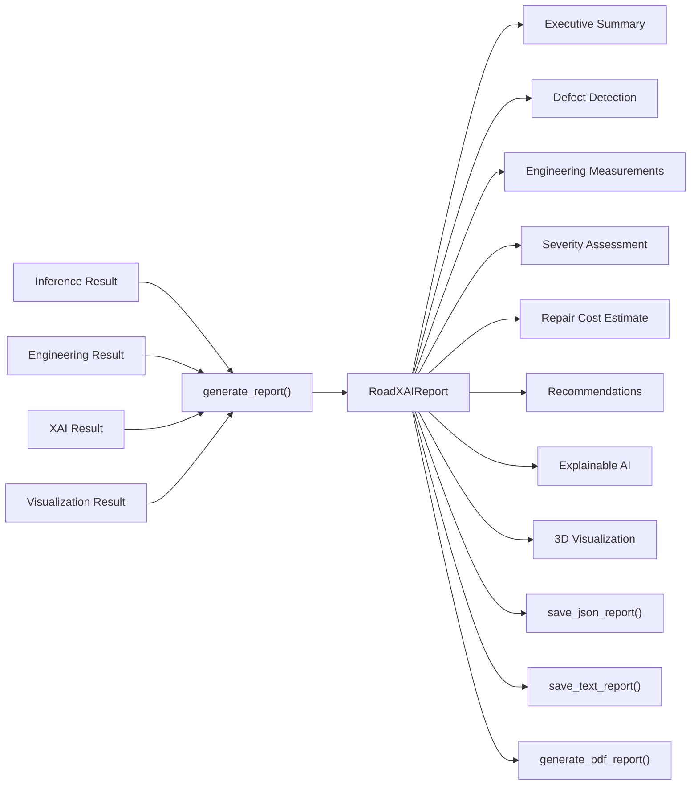

---

## 3. Report Data Model

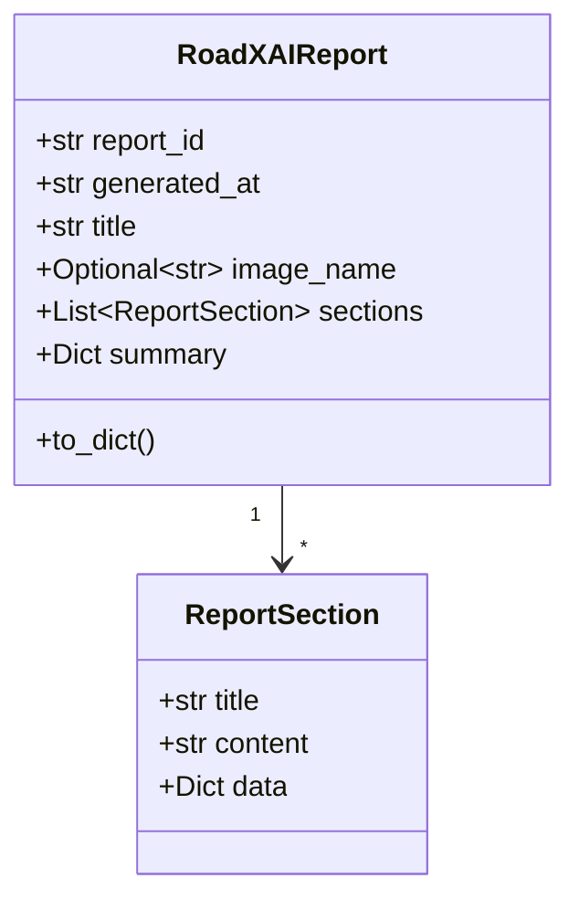

### Design rule

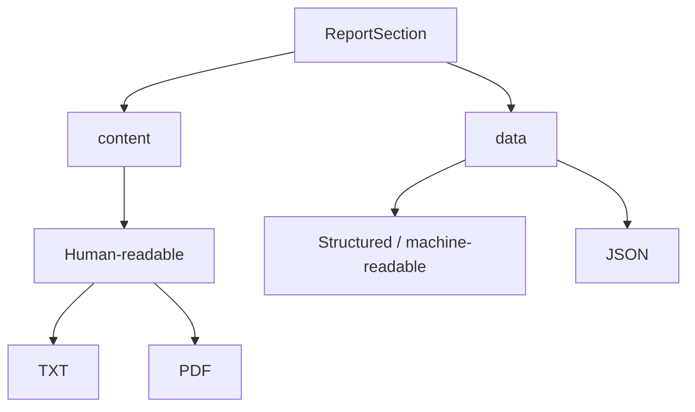

`ReportSection.data` stores structured information for JSON/API use, while the human-readable report formats are designed to avoid dumping internal Python dictionaries or raw JSON.

---

## 4. Report ID Generation

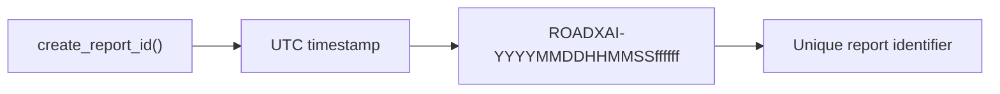

The default prefix is `ROADXAI`.

---

## 5. Executive Summary

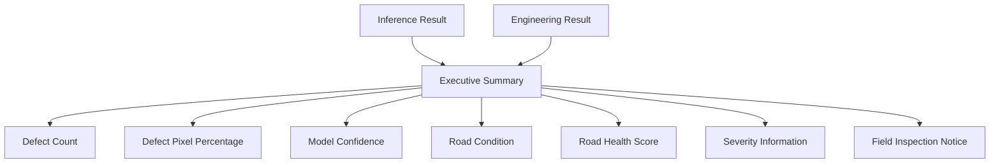

The summary extracts available information from inference and engineering results and produces both readable text and structured summary data.

---

## 6. Defect Detection Section

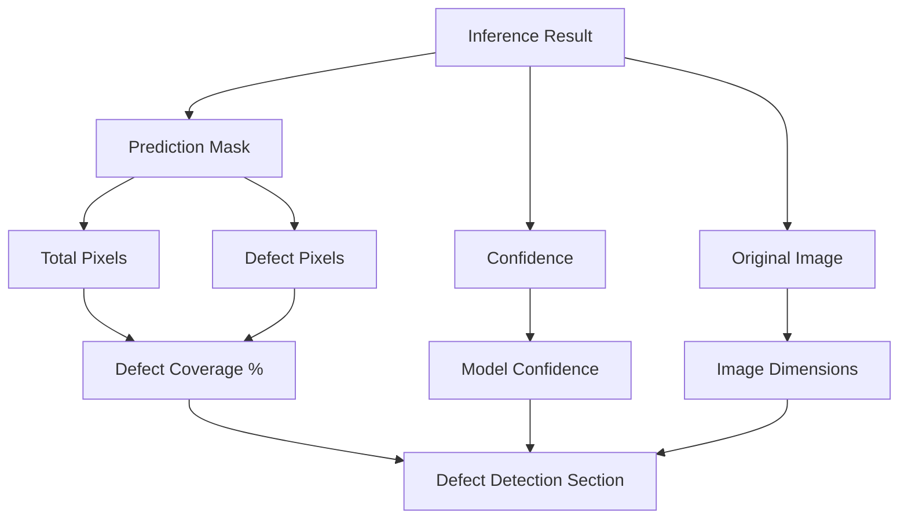

The section reports the image dimensions, analyzed pixel count, defect pixels, defect coverage, and model confidence when available.

---

## 7. Engineering Measurements

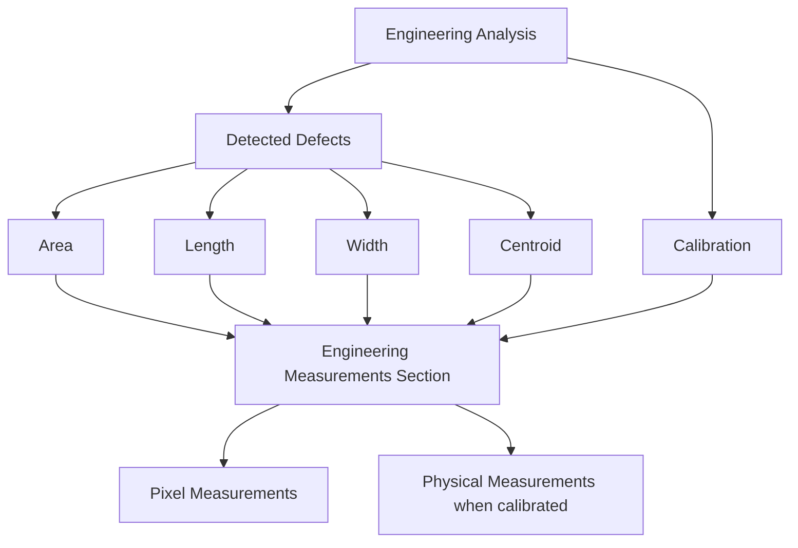

If no validated calibration is supplied, the report explicitly keeps measurements in pixels and does not interpret them as metres or square metres.

---

## 8. Severity Assessment

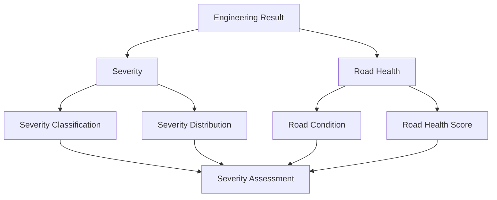

---

## 9. Repair Cost Estimate

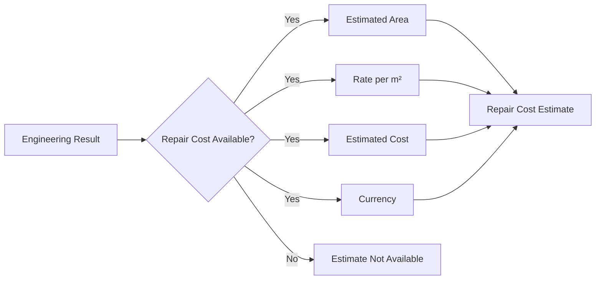

The report only presents a repair-cost estimate when the engineering result contains the required repair-cost information.

---

## 10. Deterministic Recommendations

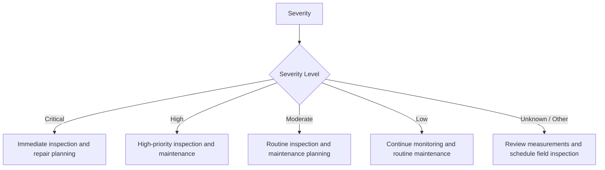

Recommendations are generated deterministically from the reported severity information.

---

## 11. Explainable AI Section

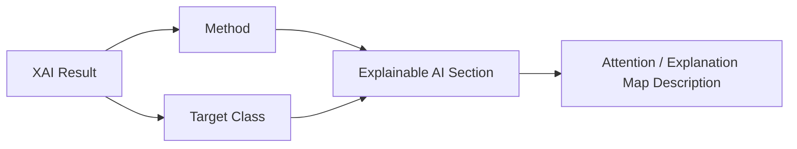

The report records the selected explainable-AI method and target class when provided.

The module describes the XAI output as showing image regions that contributed to the model prediction. It does not treat the explanation map as ground truth or causal proof.

---

## 12. 3D Visualization Section

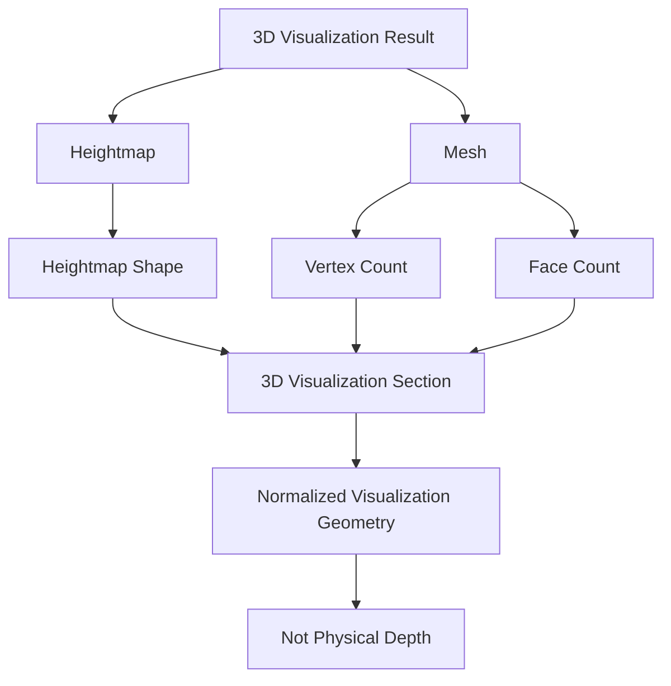

The report explicitly marks the vertical dimension as visualization geometry unless validated physical depth information is available.

---

## 13. Complete Section Assembly

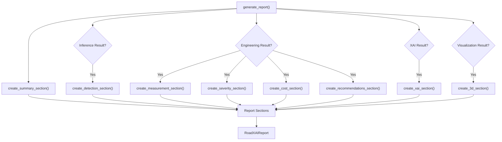

The executive summary is always created. Other sections are included when their corresponding input result is supplied.

---

## 14. Export Architecture

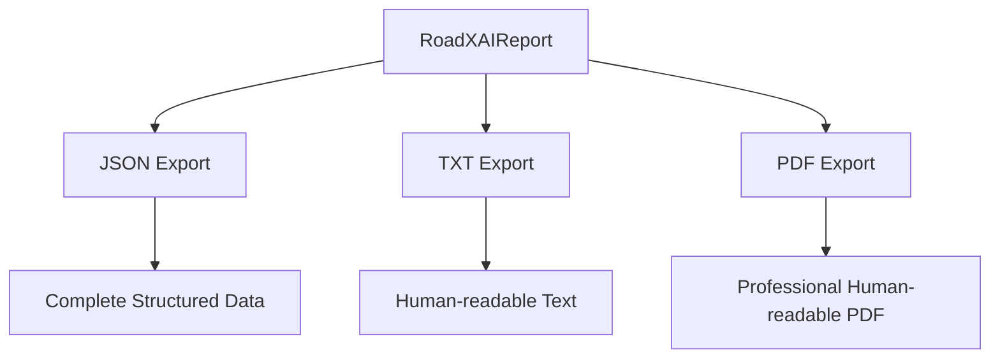

### JSON

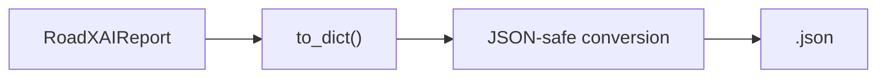

JSON preserves the complete structured report, including section data.

### TXT

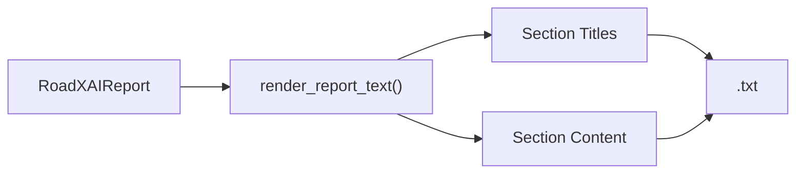

### PDF

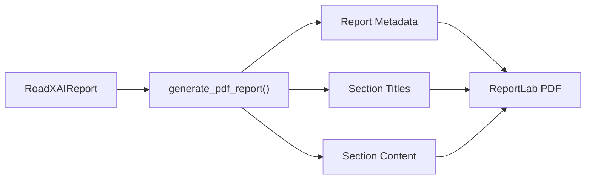

---

## 15. Human-readable vs Structured Data

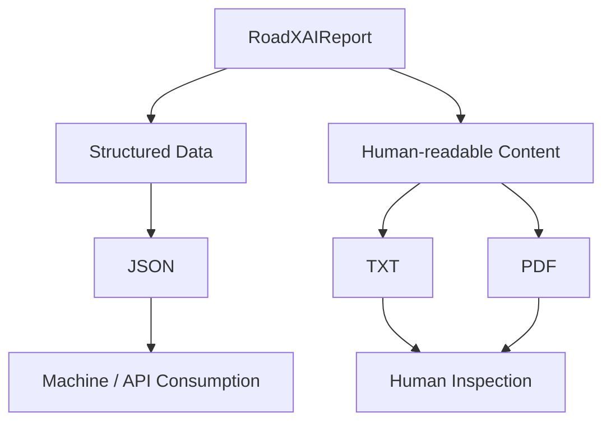

| Format | Purpose | Structured `data` |
|---|---|---|
| JSON | Machine/API use | Preserved |
| TXT | Human-readable report | Not dumped |
| PDF | Professional report | Not dumped |

---

## 16. PDF Generation Architecture

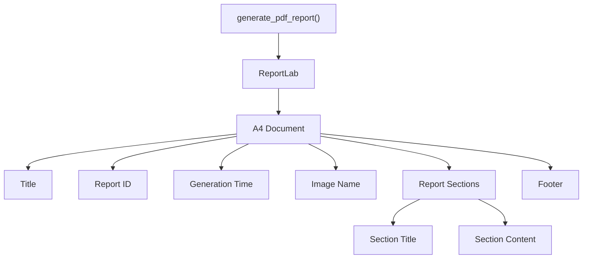

The PDF includes report metadata, human-readable sections, and a page footer. The current implementation uses ReportLab and A4 page formatting.

---

## 17. Utility Layer

```mermaid
flowchart TB
    A["Report Utilities"]

    A --> B["_get_value()"]
    A --> C["_json_safe()"]
    A --> D["_format_number()"]
    A --> E["_format_percent()"]
    A --> F["_format_optional()"]

    B --> G["Safe object/dictionary access"]
    C --> H["JSON-compatible conversion"]
    D --> I["Numeric formatting"]
    E --> J["Percentage formatting"]
    F --> K["Optional value formatting"]
```

These helpers allow report generation to work with both object-style and dictionary-style inputs and convert common NumPy, Enum, and dataclass values into safe representations.

---

## 18. Public API

```mermaid
flowchart TB
    A["Report Generation Public API"]

    A --> B["ReportSection"]
    A --> C["RoadXAIReport"]
    A --> D["create_report_id()"]
    A --> E["create_summary_section()"]
    A --> F["create_detection_section()"]
    A --> G["create_measurement_section()"]
    A --> H["create_severity_section()"]
    A --> I["create_cost_section()"]
    A --> J["create_xai_section()"]
    A --> K["create_3d_section()"]
    A --> L["create_recommendations_section()"]
    A --> M["generate_report()"]
    A --> N["save_json_report()"]
    A --> O["render_report_text()"]
    A --> P["save_text_report()"]
    A --> Q["generate_pdf_report()"]
```

---

## 19. Package Structure

```mermaid
flowchart TB
    A["report_generation"]

    A --> B["module.py"]
    A --> C["utils.py"]
    A --> D["__init__.py"]

    B --> E["Report Models"]
    B --> F["Report Section Builders"]
    B --> G["Complete Report Generator"]

    C --> H["JSON Export"]
    C --> I["TXT Rendering"]
    C --> J["PDF Generation"]
    C --> K["Formatting Helpers"]

    D --> L["Package Metadata"]
```

The package declares version `1.0.0` and author metadata in `__init__.py`.

---

## 20. End-to-End RoadXAI Reporting Flow

```mermaid
flowchart TB
    A["Road Image"]

    A --> B["CNN Segmentation"]
    B --> C["Prediction Mask"]

    C --> D["Engineering Analysis"]
    C --> E["Evaluation"]
    C --> F["Explainable AI"]
    C --> G["3D Visualization"]

    D --> H["Measurements"]
    D --> I["Severity"]
    D --> J["Road Health"]
    D --> K["Repair Cost"]

    H --> L["Report Generation"]
    I --> L
    J --> L
    K --> L
    C --> L
    F --> L
    G --> L

    L --> M["Executive Summary"]
    L --> N["Detection"]
    L --> O["Engineering"]
    L --> P["Severity"]
    L --> Q["Cost"]
    L --> R["Recommendations"]
    L --> S["XAI"]
    L --> T["3D"]

    M --> U["JSON"]
    N --> U
    O --> U
    P --> U
    Q --> U
    R --> U
    S --> U
    T --> U

    M --> V["TXT / PDF"]
    N --> V
    O --> V
    P --> V
    Q --> V
    R --> V
    S --> V
    T --> V
```

---

## 21. Research-Paper View

```mermaid
flowchart TB
    A["RoadXAI Report Generation"]

    A --> B["Multimodal Result Aggregation"]
    B --> C["Inference"]
    B --> D["Engineering Analysis"]
    B --> E["XAI"]
    B --> F["3D Visualization"]

    B --> G["Structured Inspection Representation"]

    G --> H["Executive Summary"]
    G --> I["Defect Information"]
    G --> J["Engineering Measurements"]
    G --> K["Severity / Road Health"]
    G --> L["Repair Cost"]
    G --> M["Recommendations"]
    G --> N["Interpretability"]
    G --> O["Visualization Summary"]

    G --> P["Machine-readable JSON"]
    G --> Q["Human-readable TXT"]
    G --> R["Professional PDF"]
```

### System role

The report generation layer acts as the **presentation and consolidation layer** of RoadXAI. It does not independently perform the underlying detection, segmentation, engineering calculations, XAI computation, or 3D generation. Instead, it consumes their results and produces a consistent inspection artifact.

---

## 22. Scientific / Engineering Limitations

```mermaid
flowchart TB
    A["Report Interpretation"]

    A --> B["AI-assisted result"]
    A --> C["Pixel measurements"]
    A --> D["3D visualization"]

    B --> E["Requires field confirmation"]
    C --> F["Physical dimensions require calibration"]
    D --> G["Physical depth requires validated depth data"]
```

Important limitations implemented in the reporting logic:

- AI-generated inspection results should be confirmed by appropriate field inspection before repair decisions.
- Pixel measurements are not physical measurements without validated calibration.
- The 3D vertical dimension is visualization geometry unless external physical depth information is available.
- A report is an aggregation of upstream outputs; it does not independently validate the correctness of those upstream outputs.

---

## 23. Final Architecture

```mermaid
flowchart TB
    A["RoadXAI"]

    A --> B["Inference"]
    A --> C["Engineering Analysis"]
    A --> D["Explainable AI"]
    A --> E["3D Visualization"]

    B --> F["Report Generation"]
    C --> F
    D --> F
    E --> F

    F --> G["RoadXAIReport"]

    G --> H["Executive Summary"]
    G --> I["Detection"]
    G --> J["Engineering Measurements"]
    G --> K["Severity Assessment"]
    G --> L["Repair Cost"]
    G --> M["Recommendations"]
    G --> N["Explainable AI"]
    G --> O["3D Visualization"]

    G --> P["JSON"]
    G --> Q["TXT"]
    G --> R["PDF"]
```

> **Scope note:** The Report Generation module consolidates existing RoadXAI outputs into structured and human-readable inspection reports. It does not perform model inference, segmentation, engineering analysis, XAI computation, or physical depth measurement.
