# RoadXAI — Streamlit Application

The Streamlit application is the user-facing interface of RoadXAI. It connects image upload, model inference, engineering analysis, explainable AI, interactive 3D visualization, and report generation into one interactive workflow.

---

## 1. Streamlit Application — One View

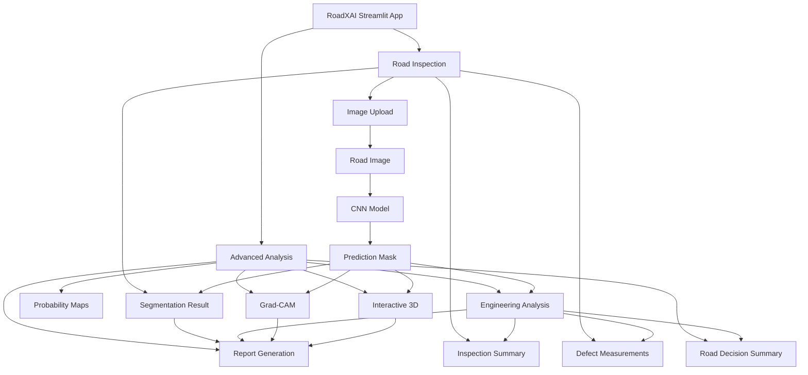

---

## 2. End-to-End Application Workflow

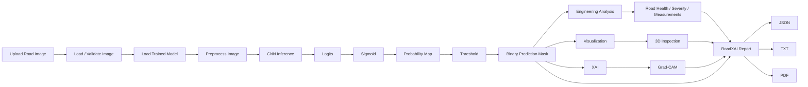

---

## 3. User Interface Structure

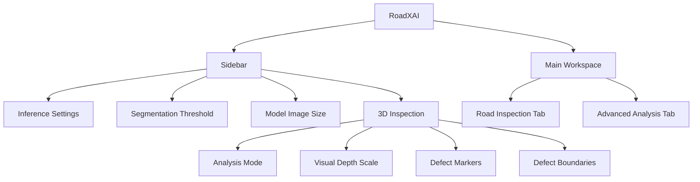

---

## 4. Road Inspection View

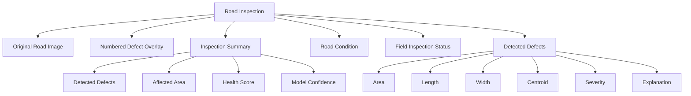

The main inspection view is designed as the primary screening interface.

---

## 5. Advanced Analysis View

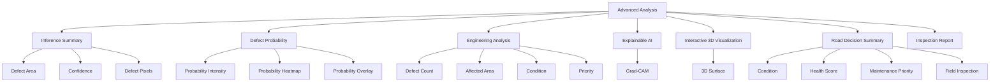

---

## 6. Image Upload and Preprocessing

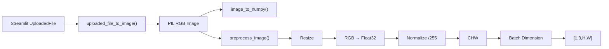

Supported upload formats:

```text
JPG
JPEG
PNG
BMP
WEBP
```

---

## 7. Model Loading

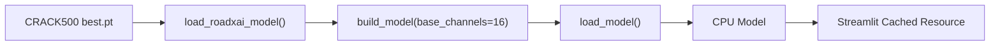

The trained checkpoint is expected at:

```text
checkpoints/crack500/best.pt
```

The application caches the loaded model using Streamlit's resource cache so it is not repeatedly loaded for every interaction.

---

## 8. Inference Pipeline

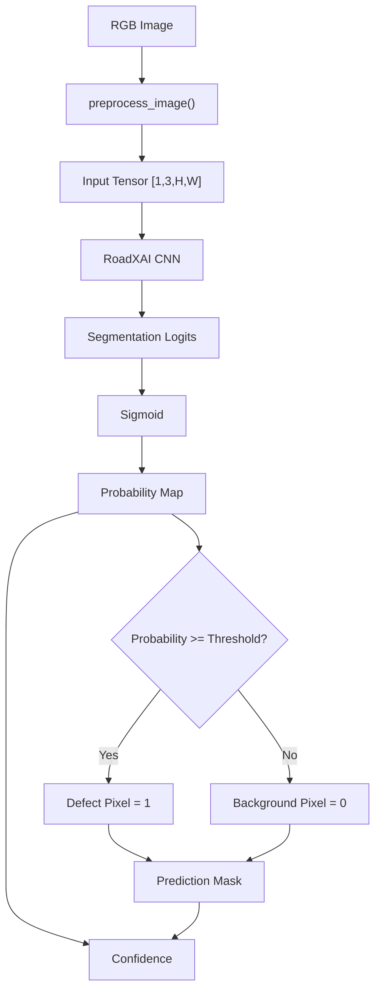

The application currently performs batch-size-one inference for an uploaded image.

---

## 9. Prediction Outputs

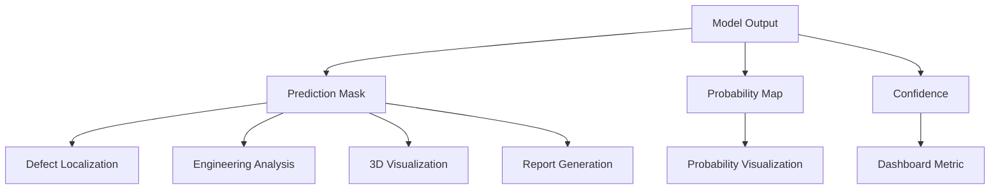

Confidence is calculated from the predicted probabilities. When defect pixels exist, it is the mean probability over predicted defect pixels; otherwise it is based on the inverse mean probability.

---

## 10. Segmentation Visualization

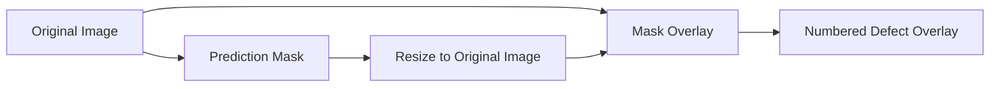

Detected connected defect regions are assigned numbers. These numbers correspond to the defect measurements displayed in the Road Inspection view.

---

## 11. Dashboard Metrics

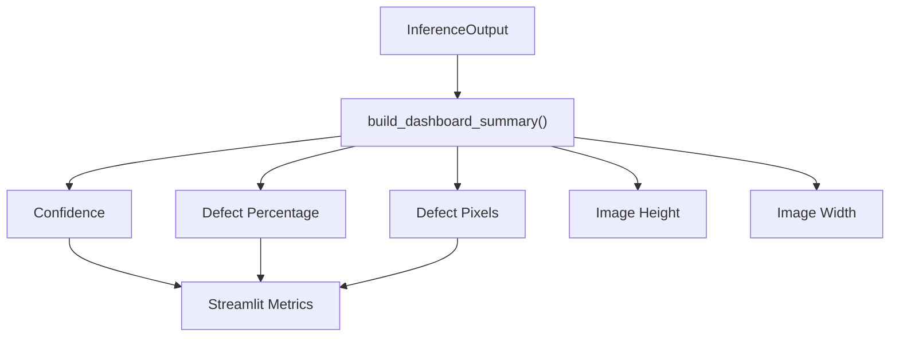

The main inspection dashboard additionally displays:

| Metric | Meaning |
|---|---|
| Detected Defects | Number of detected defect regions |
| Affected Area | Percentage of analyzed road pixels affected |
| Health Score | Image-based road-health indicator |
| Model Confidence | Model confidence indicator |

---

## 12. Engineering Analysis Integration

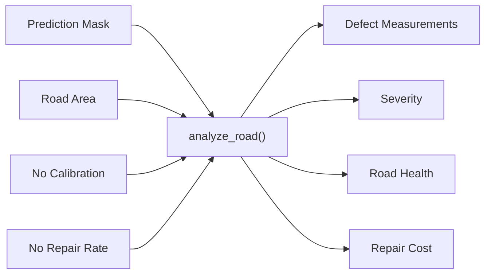

The application calls engineering analysis with:

```text
calibration = None
repair_rate_per_m2 = None
currency = INR
min_area_pixels = 10.0
```

Therefore, the current application reports image/pixel measurements and does not produce physically calibrated dimensions or a repair-cost estimate from the default Streamlit workflow.

---

## 13. Defect Records and Maintenance Priority

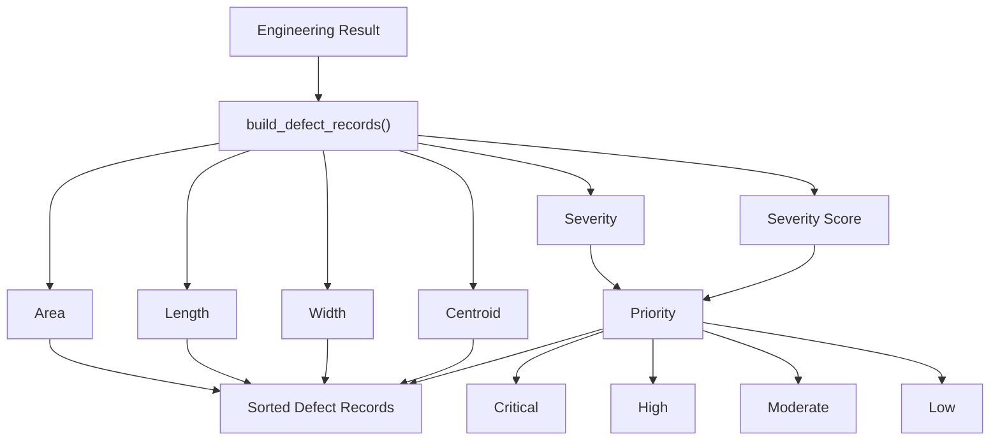

Defect records are sorted by severity score and then defect area.

---

## 14. Maintenance Priority Logic

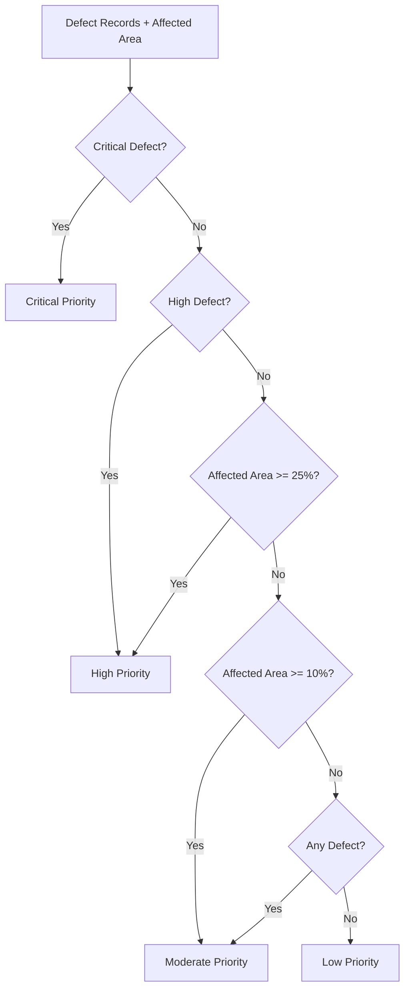

---

## 15. Field Inspection Trigger

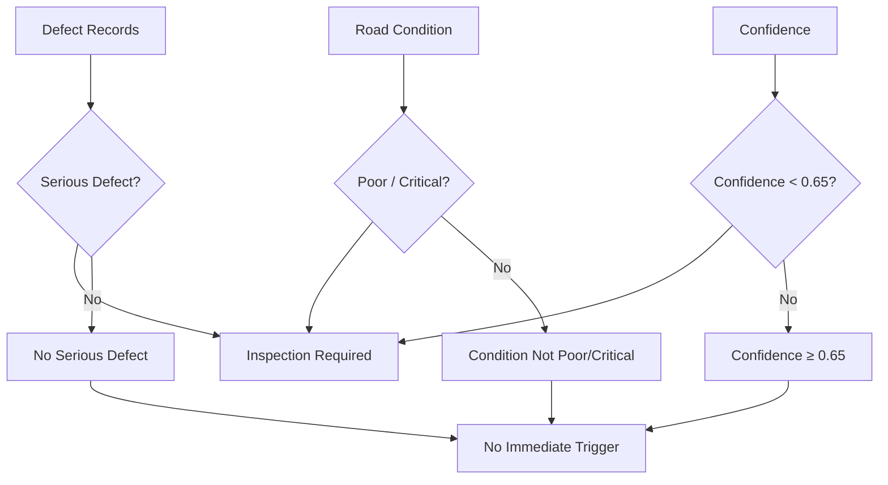

Field inspection is prioritized when there is a high/critical defect, poor/critical road condition, or model confidence below `0.65`.

---

## 16. Probability Visualization

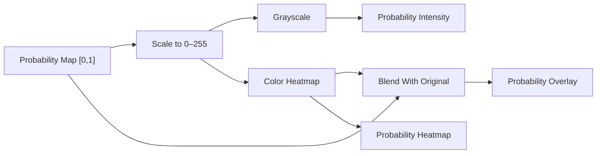

The Advanced Analysis view displays three probability representations:

1. Probability intensity
2. Probability heatmap
3. Probability over the original image

---

## 17. Grad-CAM Workflow

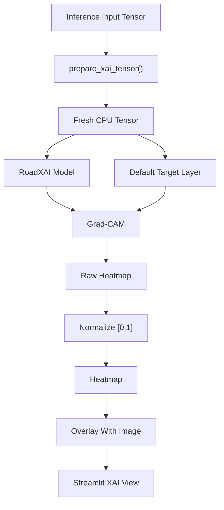

The current application generates **Grad-CAM** using the default target layer and target class `0`.

---

## 18. XAI Display

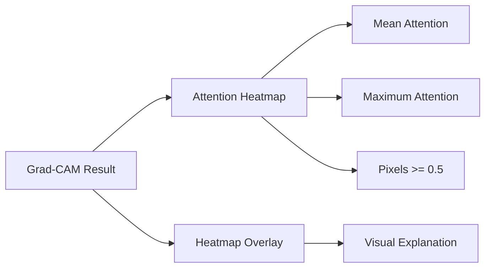

The UI also displays the selected target layer.

The explanation represents model attention/contribution behavior; it is not a physical measurement of damage.

---

## 19. Interactive 3D Visualization

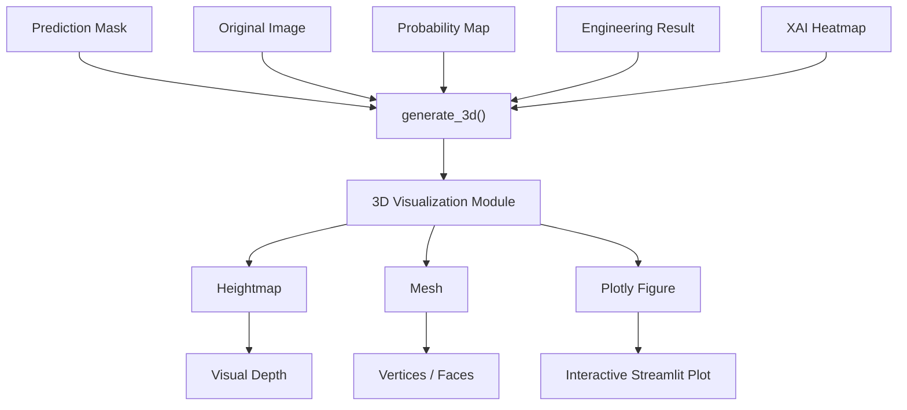

The application supports:

```text
Inspection
Road Surface
Severity
AI Confidence
AI Attention
```

The visual depth control changes visualization exaggeration only.

---

## 20. 3D Controls

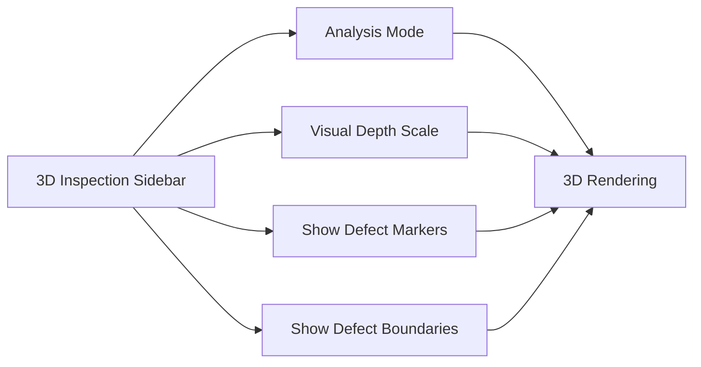

The visualization uses:

```text
max_depth = visual_depth
pixel_size = 1.0
vertical_exaggeration = visual_depth
```

Physical depth is not inferred from the RGB image.

---

## 21. Session-State Architecture

```mermaid
flowchart TB
    A["Uploaded Image"] --> B["Image Key"]

    B --> C["analysis_image_key"]

    C --> D["xai_result"]
    C --> E["visualization_result"]
    C --> F["report"]

    D --> G["xai_image_key"]
    E --> H["visualization_key"]
    F --> I["report_image_key"]

    B --> J["Clear stale results when image changes"]
```

The image key combines the uploaded filename, a SHA-256 digest of the RGB image data, and image shape.

This prevents previous XAI, 3D, and report results from being reused for a different uploaded image.

---

## 22. Streamlit Resource Caching

```mermaid
flowchart LR
    A["Application Rerun"] --> B["load_roadxai_model()"]
    B --> C{"Cached?"}

    C -->|Yes| D["Reuse Model"]
    C -->|No| E["Build + Load Checkpoint"]
    E --> F["Cache Resource"]
    F --> D
```

The model-loading function is decorated with Streamlit's resource cache.

---

## 23. Report Generation Integration

```mermaid
flowchart TB
    A["Current Image"] --> E["generate_report()"]
    B["Inference"] --> E
    C["Engineering Result"] --> E
    D["XAI / 3D Results"] --> E

    E --> F["RoadXAIReport"]

    F --> G["save_json_report()"]
    F --> H["save_text_report()"]
    F --> I["generate_pdf_report()"]

    G --> J["Download JSON"]
    H --> K["Download TXT"]
    I --> L["Download PDF"]

    F --> M["Report Preview"]
```

The report is generated only when the user selects **Generate RoadXAI Report**.

The report files are written to:

```text
reports/
```

using the uploaded image filename as the report base name.

---

## 24. Download Architecture

```mermaid
flowchart LR
    A["Generated Report"]

    A --> B["JSON"]
    A --> C["TXT"]
    A --> D["PDF"]

    B --> E["Download JSON"]
    C --> F["Download TXT"]
    D --> G["Download PDF"]
```

All three report formats are exposed through Streamlit download buttons.

---

## 25. Utility Layer

```mermaid
flowchart TB
    A["Streamlit Utilities"]

    A --> B["Image Conversion"]
    A --> C["Mask Conversion"]
    A --> D["Visualization Helpers"]
    A --> E["Formatting"]
    A --> F["Session State"]
    A --> G["Uploaded File Handling"]
    A --> H["Streamlit Messages"]

    B --> B1["numpy_to_pil"]
    B --> B2["pil_to_numpy"]

    C --> C1["mask_to_uint8"]
    C --> C2["probability_to_uint8"]

    D --> D1["create_side_by_side"]
    D --> D2["normalize_display_image"]

    E --> E1["format_percentage"]
    E --> E2["format_confidence"]
    E --> E3["format_area"]
    E --> E4["format_length"]

    F --> F1["initialize_streamlit_state"]
    F --> F2["reset_streamlit_state"]

    G --> G1["save_uploaded_file"]
    G --> G2["create_download_bytes"]

    H --> H1["display_error"]
    H --> H2["display_success"]
    H --> H3["display_info"]
```

---

## 26. Application Module Responsibilities

| Component | Responsibility |
|---|---|
| `app.py` | Main Streamlit application and end-to-end UI workflow |
| `module.py` | Image handling, preprocessing, inference, UI components, XAI/3D helpers |
| `utils.py` | Display conversion, formatting, state, upload and Streamlit utility functions |
| `__init__.py` | Package metadata |

---

## 27. Public Application Components

```mermaid
flowchart TB
    A["streamlit_app.module"]

    A --> B["InferenceOutput"]
    A --> C["load_image()"]
    A --> D["image_to_numpy()"]
    A --> E["preprocess_image()"]
    A --> F["postprocess_prediction()"]
    A --> G["run_inference()"]
    A --> H["resize_mask_to_image()"]
    A --> I["create_mask_overlay()"]
    A --> J["calculate_defect_percentage()"]
    A --> K["build_dashboard_summary()"]
    A --> L["display_image()"]
    A --> M["display_inference_summary()"]
    A --> N["create_upload_section()"]
    A --> O["create_app_header()"]
    A --> P["create_settings_sidebar()"]
    A --> Q["get_device()"]
    A --> R["load_model_checkpoint()"]
```

---

## 28. Main Application Dependencies

```mermaid
flowchart TB
    A["Streamlit App"]

    A --> B["CNN Model"]
    A --> C["Deployment"]
    A --> D["Engineering Analysis"]
    A --> E["Explainable AI"]
    A --> F["3D Visualization"]
    A --> G["Report Generation"]

    B --> H["Segmentation Model"]
    C --> I["Checkpoint Loading"]
    D --> J["Measurements / Severity / Health"]
    E --> K["Grad-CAM"]
    F --> L["Interactive Plotly Visualization"]
    G --> M["JSON / TXT / PDF"]
```

---

## 29. Application-Level Architecture

```mermaid
flowchart TB
    A["User"]

    A --> B["Streamlit UI"]

    B --> C["Upload Image"]
    B --> D["Inference Settings"]
    B --> E["3D Settings"]

    C --> F["Image Preprocessing"]
    D --> F
    F --> G["RoadXAI Model"]
    G --> H["Prediction"]

    H --> I["Road Inspection"]
    H --> J["Engineering Analysis"]
    H --> K["Probability Visualization"]
    H --> L["Grad-CAM"]
    H --> M["3D Visualization"]

    J --> N["Road Decision"]
    I --> N
    K --> N
    L --> N
    M --> N

    N --> O["Report Generation"]
    O --> P["JSON"]
    O --> Q["TXT"]
    O --> R["PDF"]
```

---

## 30. Research-Paper View

```mermaid
flowchart TB
    A["RoadXAI Interactive Application"]

    A --> B["Image Acquisition"]
    A --> C["AI Inference"]
    A --> D["Engineering Interpretation"]
    A --> E["Explainability"]
    A --> F["Visualization"]
    A --> G["Reporting"]

    B --> H["RGB Road Image"]
    C --> I["Segmentation Mask + Probability"]
    D --> J["Defect Geometry + Road Health"]
    E --> K["Grad-CAM"]
    F --> L["Interactive 3D Representation"]
    G --> M["Inspection Artifacts"]

    H --> N["Human-in-the-loop Road Inspection"]
    I --> N
    J --> N
    K --> N
    L --> N
    M --> N
```

### System role

The Streamlit layer functions as the **interactive integration layer** of RoadXAI. It connects the trained model and downstream analysis modules to a user-facing inspection workflow.

---

## 31. Scientific / Engineering Limitations

```mermaid
flowchart TB
    A["Streamlit Results"]

    A --> B["AI Prediction"]
    A --> C["Pixel Geometry"]
    A --> D["3D Visualization"]
    A --> E["Maintenance Decision"]

    B --> F["AI-assisted screening"]
    C --> G["Requires calibration for physical dimensions"]
    D --> H["Normalized visual depth"]
    E --> I["Requires appropriate field validation"]
```

Important limitations reflected by the application:

- The system is an AI-assisted road-inspection screening and decision-support interface.
- Physical metres and square metres require validated pixel-to-meter calibration.
- The 3D vertical dimension is visualization geometry, not physical pothole depth.
- Automated results should be validated through appropriate field inspection before engineering or maintenance decisions.
- The current Streamlit workflow loads the CRACK500 checkpoint and uses a binary segmentation output.
- The current application runs inference on CPU.
- The current application uses a single uploaded image at a time.

---

## 32. Final Architecture

```mermaid
flowchart TB
    A["RoadXAI Streamlit"]

    A --> B["Input"]
    A --> C["AI"]
    A --> D["Analysis"]
    A --> E["Explainability"]
    A --> F["Visualization"]
    A --> G["Reporting"]

    B --> B1["Road Image"]
    B --> B2["Threshold"]
    B --> B3["Image Size"]

    C --> C1["CNN Segmentation"]
    C1 --> C2["Probability Map"]
    C2 --> C3["Binary Mask"]

    D --> D1["Defect Measurements"]
    D --> D2["Severity"]
    D --> D3["Road Health"]
    D --> D4["Maintenance Priority"]

    E --> E1["Grad-CAM"]

    F --> F1["Probability Views"]
    F --> F2["Interactive 3D"]

    G --> G1["JSON"]
    G --> G2["TXT"]
    G --> G3["PDF"]

    C3 --> D
    C3 --> E
    C3 --> F
    D --> G
    E --> G
    F --> G
```

> **Scope note:** The Streamlit application is the user-facing orchestration layer. It integrates existing RoadXAI components into an interactive inspection workflow; the underlying model, engineering, XAI, 3D, and report-generation logic remains implemented in their respective modules.
