# RoadXAI Training Pipeline

## 1. Purpose

The RoadXAI Training Pipeline trains the CNN segmentation model using paired road images and defect masks.

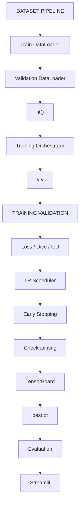

The package contains the training loop, validation loop, checkpointing, TensorBoard logging, and mixed-precision training components. fileciteturn12file3L1-L14

---

## 2. Training Package Structure

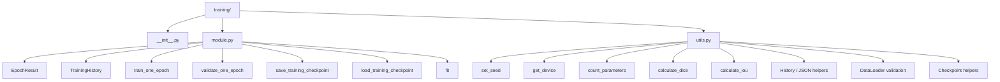

---

## 3. Complete Training Flow

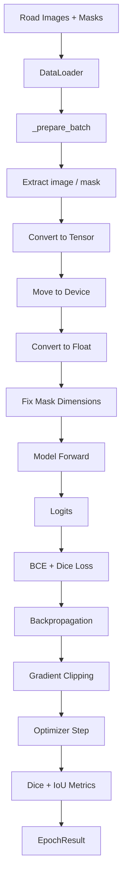

---

## 4. Configuration Validation

`fit()` validates the main training configuration before starting the run.

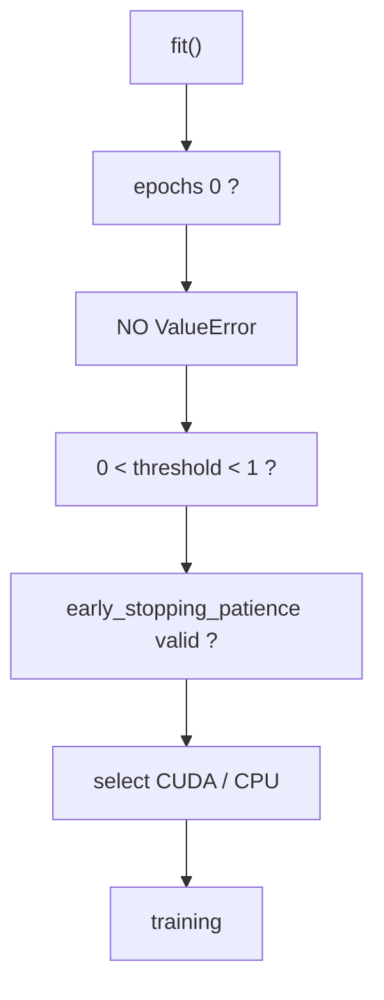

The implementation requires `epochs > 0`, requires the threshold to be strictly between 0 and 1, and validates the supplied early-stopping patience. fileciteturn12file5L1-L39

---

## 5. Batch Preparation

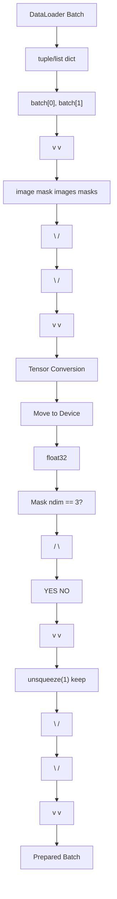

Supported inputs are:
- tuple/list containing image and mask
- dictionary with `image` + `mask`
- dictionary with `images` + `masks`

Images and masks are transferred with `non_blocking=True` and converted to floating-point tensors. A 3D mask receives a channel dimension. fileciteturn12file8L1-L68

---

## 6. Training Epoch

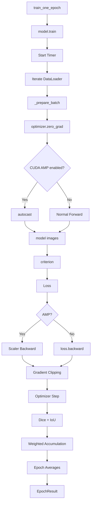

The training implementation uses `model.train()`, records elapsed time, accumulates loss/Dice/IoU by sample count, protects against an empty DataLoader, and returns an `EpochResult`. fileciteturn12file18L1-L73

---

## 7. Mixed-Precision Training

AMP is conditional:

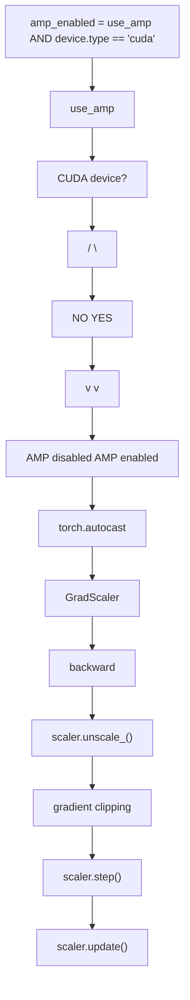

On CUDA, the training loop uses autocasting and a gradient scaler. On CPU, it falls back to normal training. Gradient clipping is performed after unscaling when AMP is active. fileciteturn12file18L65-L73

---

## 8. Validation Epoch

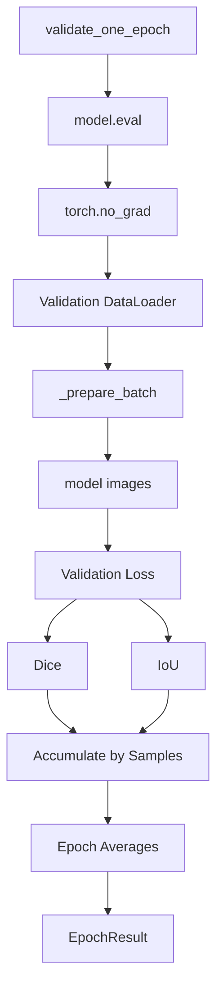

Validation is measurement-only. It does not perform backpropagation, optimizer updates, or gradient-based training.

---

## 9. Dice Metric

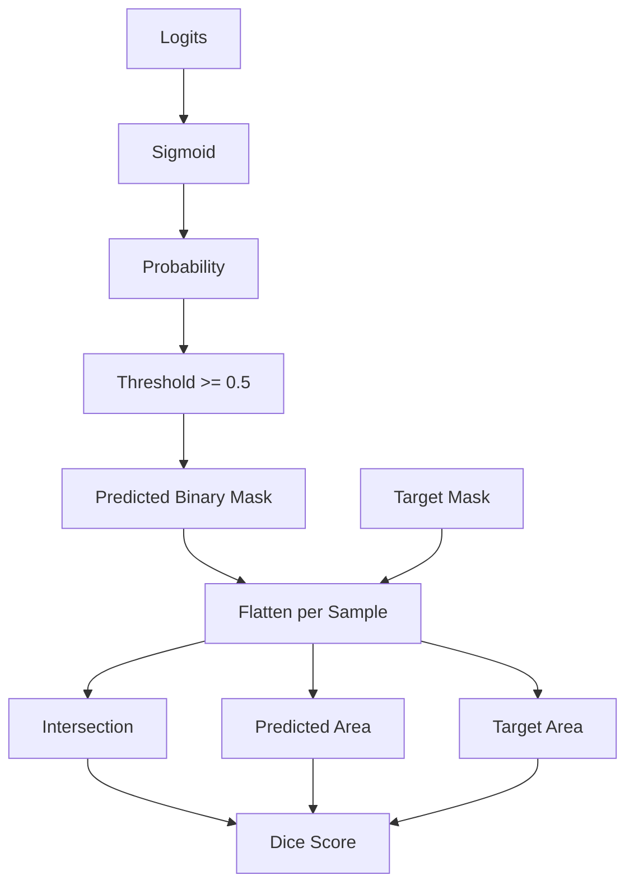

The implemented formula is:

```text
Dice =
(2 * Intersection + smooth)
--------------------------------
(Prediction Area + Target Area + smooth)
```

with default `smooth = 1e-7` and default threshold `0.5`. The utility implementation also applies sigmoid to logits before thresholding. fileciteturn12file6L42-L90

---

## 10. IoU Metric

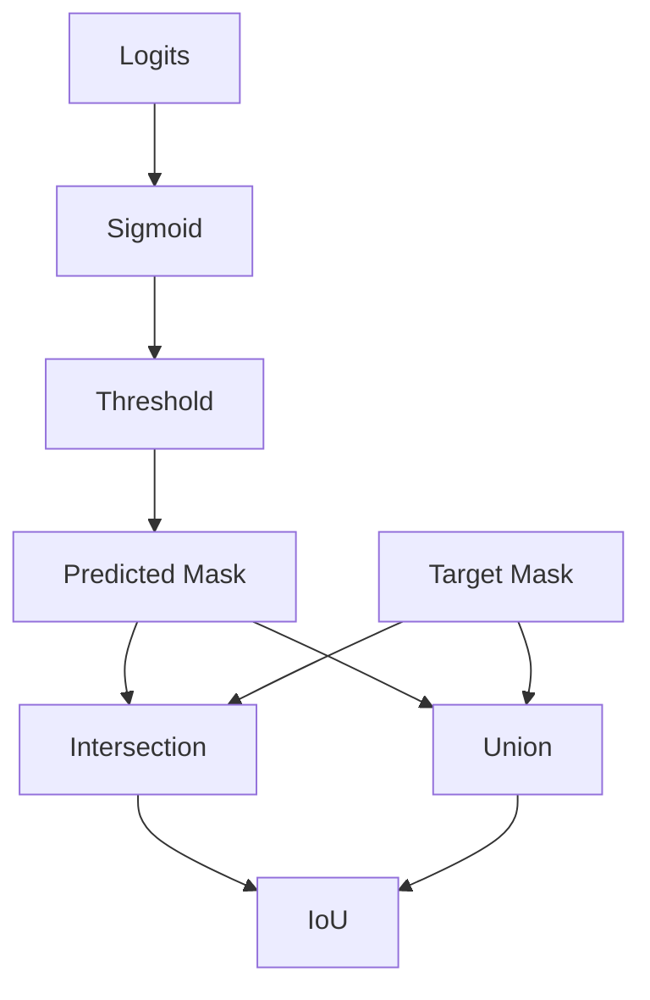

The implemented union is:

```text
Union = Prediction + Target - Intersection
```

and:

```text
IoU =
(Intersection + smooth)
-----------------------
(Union + smooth)
```

The default threshold is `0.5` and the default smoothing value is `1e-7`. fileciteturn12file17L69-L105

---

## 11. EpochResult

Each training or validation epoch returns:

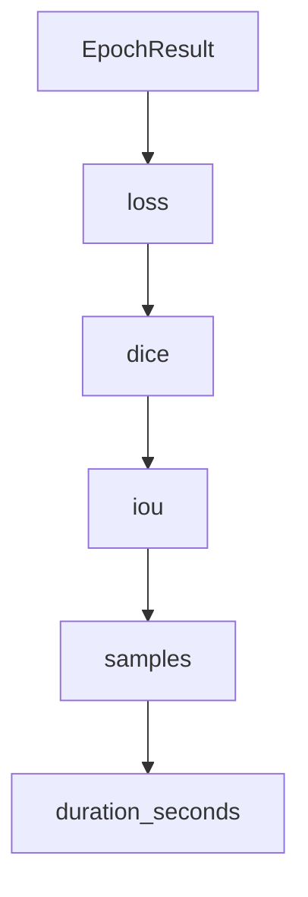

This gives the training orchestrator a consistent representation of epoch-level results. fileciteturn12file8L16-L38

---

## 12. TrainingHistory

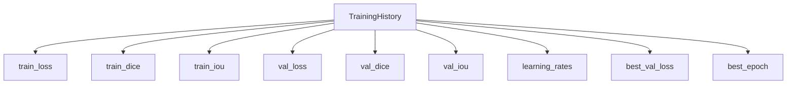

The history object stores the complete training trajectory and identifies the epoch associated with the lowest validation loss. fileciteturn12file8L28-L45

---

## 13. Epoch-Level Orchestration

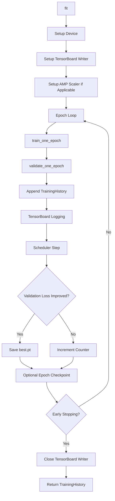

The implementation logs training and validation metrics, records the learning rate, saves `best.pt` when validation loss improves, optionally saves every epoch, and stops when the configured patience is reached. fileciteturn12file9L1-L61

---

## 14. Learning-Rate Scheduling

The CNN module supplies a `ReduceLROnPlateau` scheduler based on validation loss.

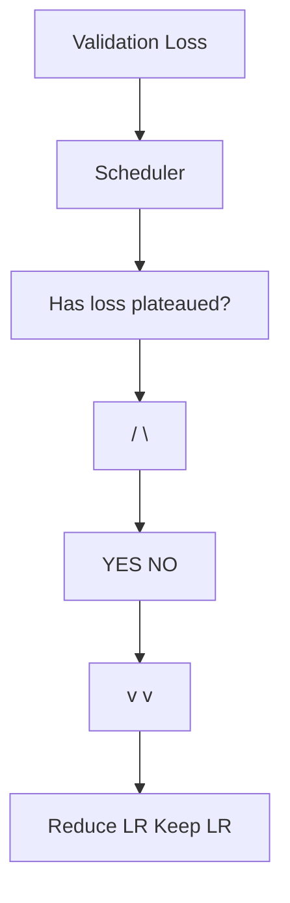

The scheduler builder uses:
- factor: `0.5`
- patience: `3`
- minimum learning rate: `1e-6`

The training loop supports both `ReduceLROnPlateau` and other scheduler APIs. For `ReduceLROnPlateau`, validation loss is passed to `scheduler.step()`. fileciteturn12file14L57-L91 fileciteturn12file5L1-L25

---

## 15. Checkpoint Selection

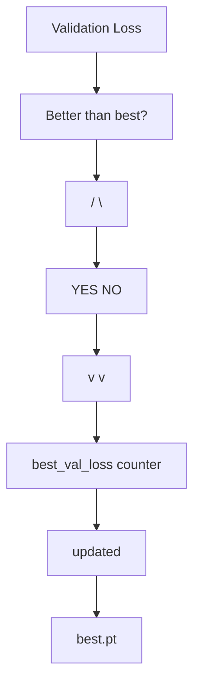

The best checkpoint is selected using **minimum validation loss**, not maximum Dice or IoU. fileciteturn12file9L15-L34

---

## 16. Checkpoint Contents

The checkpoint loader expects `model_state_dict` and can restore the available training state.

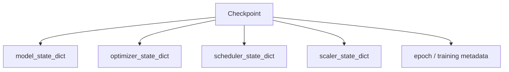

The loader:
1. verifies that the checkpoint file exists
2. loads it with the selected device as `map_location`
3. requires `model_state_dict`
4. restores optimizer, scheduler, and scaler state when both the object and corresponding state are available. fileciteturn12file5L1-L25

---

## 17. Checkpoint Modes

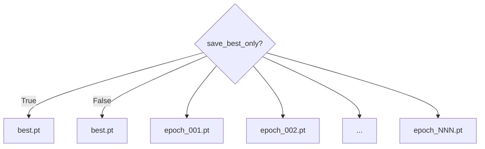

With `save_best_only=True`, only the best checkpoint is saved by the epoch-level checkpoint logic.

With `save_best_only=False`, the implementation additionally saves a checkpoint after each epoch. fileciteturn12file9L27-L42

---

## 18. Reproducibility

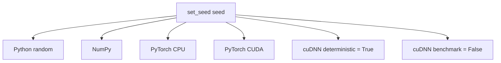

The default seed is `42`. The utility configures deterministic cuDNN behavior to prioritize reproducibility. fileciteturn12file6L1-L39

---

## 19. Training Utilities

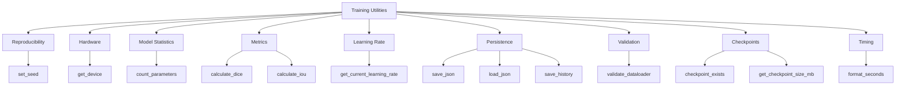

These utilities support experiment tracking, validation, reproducibility, model accounting, and checkpoint inspection. fileciteturn12file2L1-L29

---

## 20. Model, Loss, Optimizer and Scheduler

The training pipeline receives the model, loss, optimizer, and optional scheduler from the CNN model package.

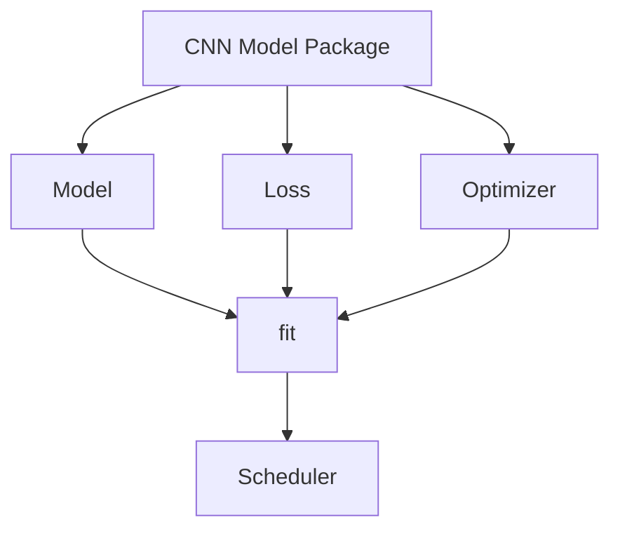

Current CNN builders include:

```text
build_model()
build_loss()
build_optimizer()
build_scheduler()
```

The implemented defaults are:
- U-Net-style binary segmentation model
- BCE + Dice loss with equal default weights
- AdamW with learning rate `1e-3`
- AdamW weight decay `1e-4`
- ReduceLROnPlateau scheduler. fileciteturn12file14L1-L91

---

## 21. Parameter Accounting

```mermaid
flowchart TD
    A[PyTorch Model] --> B[All Parameters]
    A --> C[Trainable Parameters]
    B --> D[Total Count]
    C --> E[Trainable Count]
    D --> F[Non-trainable = Total - Trainable]
```

`count_parameters()` reports:

```text
total
trainable
non_trainable
```

This provides a model-complexity summary. fileciteturn12file6L25-L39

---

## 22. Public Training API

| Component | Purpose |
|---|---|
| `EpochResult` | Stores one epoch's metrics |
| `TrainingHistory` | Stores complete run history |
| `train_one_epoch()` | Trains for one epoch |
| `validate_one_epoch()` | Validates for one epoch |
| `save_training_checkpoint()` | Saves training state |
| `load_training_checkpoint()` | Restores training state |
| `fit()` | Runs the complete training process |

These are the public training components exported by the training module. fileciteturn12file9L45-L61

---

## 23. RoadXAI Integration

```mermaid
flowchart TD
    N0["Dataset Pipeline"]
    N1["Train / Val Loaders"]
    N2["Training Pipeline"]
    N3["fit()"]
    N4["v           v                v"]
    N5["best.pt    History         TensorBoard"]
    N6["v        v        v"]
    N7["Evaluation  Streamlit  Inference"]
    N8["Engineering"]
    N9["XAI"]
    N10["3D"]
    N11["Reports"]
    N0 --> N1
    N1 --> N2
    N2 --> N3
    N3 --> N4
    N4 --> N5
    N5 --> N6
    N6 --> N7
    N7 --> N8
    N8 --> N9
    N9 --> N10
    N10 --> N11
```

The training pipeline is the bridge from dataset DataLoaders to the trained segmentation checkpoint used by downstream RoadXAI components.

---

## 24. Technical Configuration

| Parameter | `fit()` Default |
|---|---:|
| Epochs | `10` |
| Probability threshold | `0.5` |
| Early-stopping patience | `5` |
| AMP | `True` |
| Gradient clipping max norm | `1.0` |
| Checkpoint directory | `checkpoints` |
| TensorBoard directory | `runs/roadxai` |
| Save best only | `True` |
| Device | CUDA if available, otherwise CPU |

These values come directly from the `fit()` signature. fileciteturn12file5L25-L39

---

## 25. Actual Training Objective

The CNN package uses a combined BCE + Dice loss:

```mermaid
flowchart TD
    N0["Total Loss"]
    N1["v                  v"]
    N2["BCE Loss          Dice Loss"]
    N3["0.5 x              0.5 x"]
    N4["\                  /"]
    N5["\                /"]
    N6["Training Loss"]
    N0 --> N1
    N1 --> N2
    N2 --> N3
    N3 --> N4
    N4 --> N5
    N5 --> N6
```

The default loss weights are:

```text
BCE weight  = 0.5
Dice weight = 0.5
```

The combined loss operates on model logits and target masks. fileciteturn12file14L1-L29

---

## 26. What the Pipeline Produces

```mermaid
flowchart TD
    N0["Training Run"]
    N1["Epoch metrics"]
    N2["Train Loss"]
    N3["Train Dice"]
    N4["Train IoU"]
    N5["Val Loss"]
    N6["Val Dice"]
    N7["Val IoU"]
    N8["Learning Rate"]
    N9["TrainingHistory"]
    N10["TensorBoard logs"]
    N11["best.pt"]
    N12["optional epoch_NNN.pt"]
    N0 --> N1
    N1 --> N2
    N2 --> N3
    N3 --> N4
    N4 --> N5
    N5 --> N6
    N6 --> N7
    N7 --> N8
    N8 --> N9
    N9 --> N10
    N10 --> N11
    N11 --> N12
```

The outputs are intended to support model selection, experiment analysis, checkpoint restoration, and downstream inference.

---

## 27. Scientific / Engineering Limitations

### Segmentation metrics

Dice and IoU measure mask overlap. They do not directly establish physical road-condition correctness.

### Checkpoint criterion

The selected `best.pt` is based on minimum validation loss. It is not necessarily the epoch with the highest validation Dice or IoU.

### Dataset dependence

Training performance depends on the quality, diversity, and annotation consistency of the supplied DataLoaders.

### Physical measurements

The training pipeline learns segmentation masks. It does not itself establish physical dimensions in meters or millimeters.

### Reproducibility

Seed and deterministic settings improve reproducibility, but exact results can still depend on the software, hardware, and execution environment.

---

## 28. Final Training Architecture

```mermaid
flowchart TD
    A[Dataset Pipeline] --> B[Train / Validation DataLoaders]
    B --> C[fit]
    C --> D[train_one_epoch]
    C --> E[validate_one_epoch]

    D --> D1[model.train]
    D1 --> D2[Forward + Loss]
    D2 --> D3[Backward]
    D3 --> D4[Gradient Clipping]
    D4 --> D5[Optimizer Step]
    D5 --> F[Epoch Metrics]

    E --> E1[model.eval]
    E1 --> E2[Forward + Loss]
    E2 --> E3[Dice / IoU]
    E3 --> F

    F --> G[LR Scheduler]
    F --> H[Best Checkpoint]
    F --> I[Early Stop]
    H --> J[best.pt]

    J --> K[Evaluation]
    J --> L[Streamlit]
    J --> M[Deployment]

    L --> N[Engineering]
    L --> O[XAI]
    L --> P[3D]
    L --> Q[Reports]
```

**Training Pipeline role:** optimize the segmentation model, measure training and validation performance, preserve the best model state, and provide training artifacts for the rest of RoadXAI.
