# RoadXAI Training Pipeline


## 1. One View

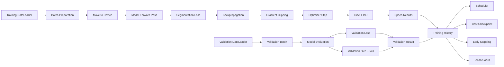

The training pipeline trains the RoadXAI CNN segmentation model, validates it after every epoch, tracks loss/Dice/IoU, updates the learning-rate scheduler, saves checkpoints, logs to TensorBoard, and optionally stops early when validation loss stops improving.

---

## 2. Complete Training Workflow

```mermaid
flowchart TD
    A[fit()] --> B[Validate Configuration]
    B --> C[Select CUDA or CPU]
    C --> D[Move Model to Device]
    D --> E[Create Checkpoint Directory]
    E --> F[Create TensorBoard SummaryWriter]
    F --> G[Enable AMP on CUDA]
    G --> H[Initialize TrainingHistory]

    H --> I[Epoch Loop]

    I --> J[train_one_epoch()]
    J --> K[validate_one_epoch()]
    K --> L[Read Learning Rate]
    L --> M[Step Scheduler]

    M --> N[Append Epoch Metrics]
    N --> O[TensorBoard Logging]
    O --> P{Validation Loss Improved?}

    P -->|Yes| Q[Update Best Loss/Epoch]
    Q --> R[Save best.pt]
    P -->|No| S[Increment No-Improvement Counter]

    R --> T{Early Stopping?}
    S --> T

    T -->|No| I
    T -->|Yes| U[Stop Training]

    I -->|All Epochs Finished| V[Close TensorBoard Writer]
    U --> V
    V --> W[Return TrainingHistory]
```

---

## 3. Configuration Validation

```mermaid
flowchart TD
    A[fit()] --> B{epochs > 0?}
    B -->|No| C[Raise ValueError]
    B -->|Yes| D{threshold between 0 and 1?}
    D -->|No| C
    D -->|Yes| E{patience valid?}
    E -->|No| C
    E -->|Yes| F[Select Device]
    F --> G[Continue Training]
```

The pipeline validates:
- `epochs > 0`
- `0 < threshold < 1`
- `early_stopping_patience` is non-negative when supplied

The device is automatically selected as CUDA when available, otherwise CPU.

---

## 4. Batch Preparation

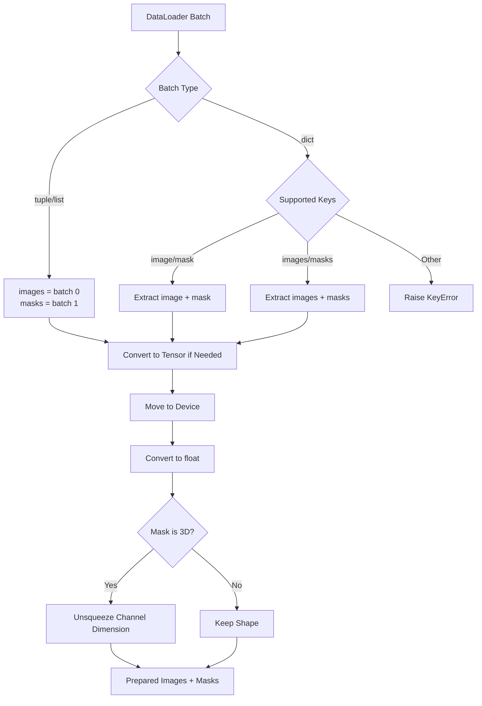

Supported batch formats:

```text
(images, masks)
(image, mask)
(images, masks)
```

For dictionary batches, the accepted key pairs are:
- `image` + `mask`
- `images` + `masks`

Images and masks are moved using non-blocking device transfers and converted to floating point tensors.

---

## 5. Training Epoch

```mermaid
flowchart TD
    A[train_one_epoch()] --> B[model.train()]
    B --> C[Start Timer]
    C --> D[Initialize Metric Accumulators]
    D --> E[Iterate DataLoader]

    E --> F[Prepare Batch]
    F --> G[optimizer.zero_grad]
    G --> H[Autocast if CUDA AMP Enabled]
    H --> I[Model(images)]
    I --> J[Criterion(logits, masks)]
    J --> K{AMP Scaler Active?}

    K -->|Yes| L[Scaler Backward]
    L --> M[Unscale]
    M --> N[Clip Gradients]
    N --> O[Scaler Step + Update]

    K -->|No| P[Loss Backward]
    P --> Q[Clip Gradients]
    Q --> R[Optimizer Step]

    O --> S[Calculate Batch Dice]
    R --> S
    S --> T[Calculate Batch IoU]
    T --> U[Accumulate Loss + Metrics]
    U --> E

    E -->|Finished| V[Calculate Epoch Averages]
    V --> W[Return EpochResult]
```

### Training features

| Feature | Implementation |
|---|---|
| Training mode | `model.train()` |
| Loss | User-provided segmentation criterion |
| Optimizer | User-provided PyTorch optimizer |
| AMP | Enabled only when requested and CUDA is available |
| Gradient clipping | Default maximum norm `1.0` |
| Dice threshold | Default `0.5` |
| IoU threshold | Default `0.5` |
| Timing | `time.perf_counter()` |
| Empty loader protection | Raises `ValueError` |

---

## 6. Mixed Precision

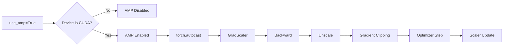

Automatic mixed precision is conditional:

```text
amp_enabled = use_amp and device.type == "cuda"
```

On CUDA, `torch.autocast` and `torch.amp.GradScaler` are used.

On CPU, the scaler is not created and standard training is used.

---

## 7. Validation Epoch

```mermaid
flowchart TD
    A[validate_one_epoch()] --> B[model.eval()]
    B --> C[@torch.no_grad]
    C --> D[Iterate Validation DataLoader]
    D --> E[Prepare Batch]
    E --> F[Autocast if CUDA AMP Enabled]
    F --> G[Model Forward Pass]
    G --> H[Validation Loss]
    H --> I[Batch Dice]
    I --> J[Batch IoU]
    J --> K[Accumulate Metrics]
    K --> D
    D -->|Finished| L[Calculate Averages]
    L --> M[Return EpochResult]
```

Validation does not perform:
- Backpropagation
- Gradient updates
- Optimizer steps

It uses `model.eval()` and `@torch.no_grad()`.

---

## 8. Dice Metric

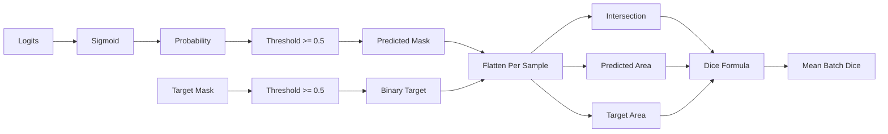

The implemented metric is:

```text
Dice = (2 × Intersection + smooth)
       / (Prediction Area + Target Area + smooth)
```

The default smoothing value is `1e-7`.

---

## 9. IoU Metric

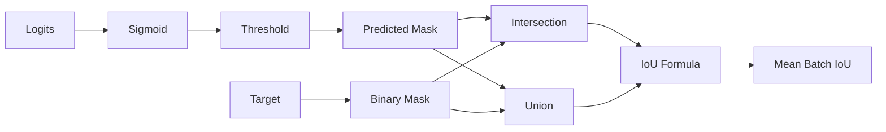

The implemented metric is:

```text
IoU = (Intersection + smooth)
      / (Union + smooth)
```

where:

```text
Union = Prediction + Target - Intersection
```

---

## 10. EpochResult

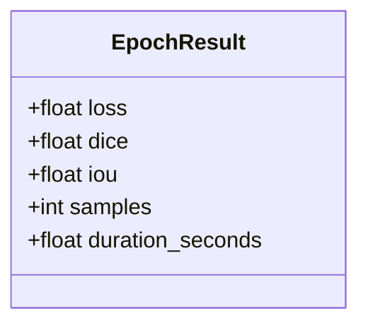

Each training and validation epoch returns:
- loss
- Dice
- IoU
- number of processed samples
- epoch duration

---

## 11. TrainingHistory

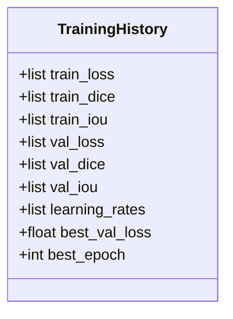

The history stores the complete metric trajectory of the training run.

Initial state:

```text
best_val_loss = infinity
best_epoch = -1
```

---

## 12. Learning-Rate Scheduling

```mermaid
flowchart TD
    A[Validation Epoch Complete] --> B[Read Validation Loss]
    B --> C{Scheduler Type}
    C -->|ReduceLROnPlateau| D[scheduler.step(val_loss)]
    C -->|Other Scheduler| E[scheduler.step()]
    D --> F[Next Epoch]
    E --> F
```

The pipeline supports both:
- `ReduceLROnPlateau`, stepped using validation loss
- Other PyTorch schedulers, stepped without arguments

The learning rate from the first optimizer parameter group is stored in `TrainingHistory`.

---

## 13. Best Checkpoint Selection

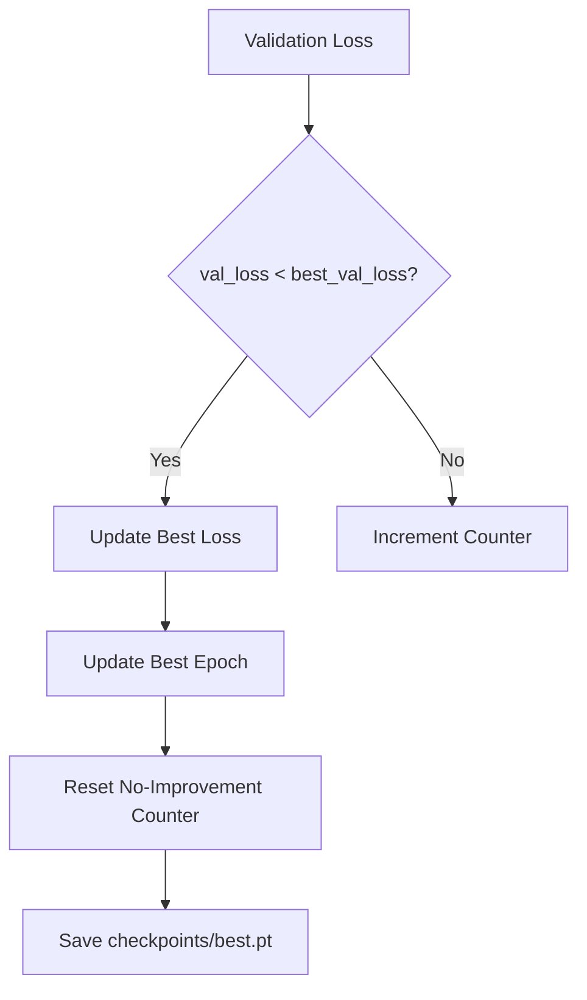

The best model is selected using **minimum validation loss**, not maximum Dice or IoU.

The best checkpoint contains:

```text
epoch
model_state_dict
optimizer_state_dict
train_loss
train_dice
train_iou
val_loss
val_dice
val_iou
```

When available, it also stores:
- scheduler state
- AMP scaler state
- training history

---

## 14. Early Stopping

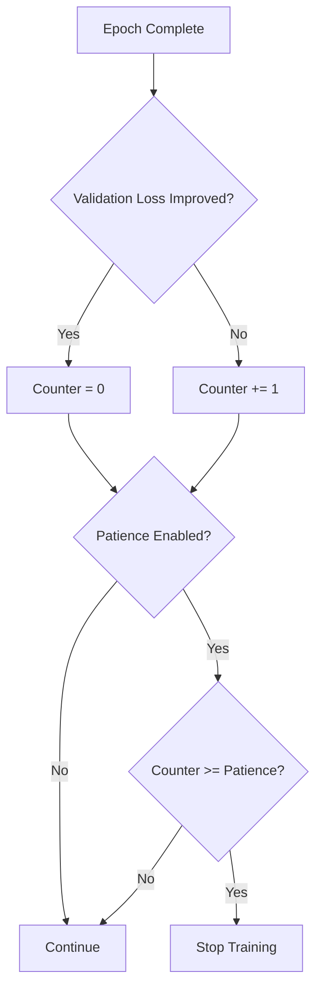

Default:

```text
early_stopping_patience = 5
```

Setting:

```text
early_stopping_patience = None
```

disables early stopping.

---

## 15. TensorBoard Logging

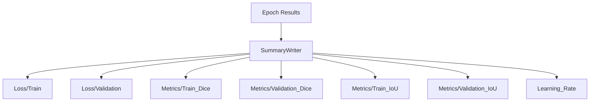

The default log directory is:

```text
runs/roadxai
```

Logged quantities per epoch:

```text
Loss/Train
Loss/Validation
Metrics/Train_Dice
Metrics/Validation_Dice
Metrics/Train_IoU
Metrics/Validation_IoU
Learning_Rate
```

The `SummaryWriter` is closed in a `finally` block, including when training exits because of an exception.

---

## 16. Checkpoint Loading

```mermaid
flowchart TD
    A[load_training_checkpoint()] --> B[Check File]
    B -->|Missing| C[FileNotFoundError]
    B -->|Exists| D[torch.load]
    D --> E{model_state_dict Present?}
    E -->|No| F[KeyError]
    E -->|Yes| G[Load Model State]

    G --> H{Optimizer Supplied?}
    H -->|Yes + State Exists| I[Load Optimizer]
    H -->|No| J[Skip]

    I --> K{Scheduler Supplied?}
    J --> K
    K -->|Yes + State Exists| L[Load Scheduler]
    K -->|No| M[Skip]

    L --> N{Scaler Supplied?}
    M --> N
    N -->|Yes + State Exists| O[Load Scaler]
    N -->|No| P[Return Checkpoint]

    O --> P
```

Checkpoint loading supports resuming:
- model weights
- optimizer state
- scheduler state
- AMP scaler state

The checkpoint is loaded with the selected device as `map_location`.

---

## 17. Checkpoint Modes

```mermaid
flowchart TD
    A[fit()] --> B{save_best_only?}
    B -->|True| C[Save only best.pt]
    B -->|False| D[Save best.pt]
    D --> E[Save epoch_001.pt]
    D --> F[Save epoch_002.pt]
    D --> G[...]
    D --> H[Save epoch_NNN.pt]
```

Default:

```text
save_best_only = True
```

When disabled, a checkpoint is also saved after every epoch:

```text
epoch_001.pt
epoch_002.pt
...
epoch_NNN.pt
```

---

## 18. Reproducibility Utilities

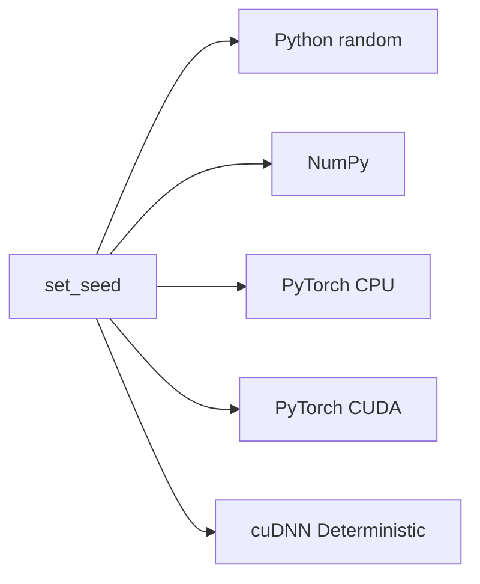

`set_seed()` controls:
- Python random seed
- NumPy seed
- PyTorch CPU seed
- CUDA seeds when available

cuDNN is configured as:

```text
deterministic = True
benchmark = False
```

This prioritizes reproducibility over cuDNN benchmarking performance.

---

## 19. Training Utilities

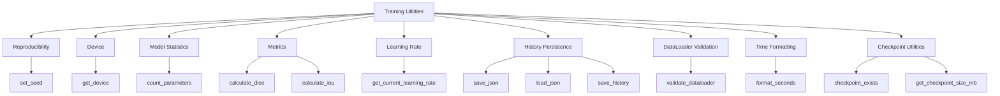

Utility functions also provide:
- parameter counting
- learning-rate inspection
- JSON persistence
- training-history persistence
- DataLoader validation
- elapsed-time formatting
- checkpoint existence checks
- checkpoint size inspection

---

## 20. Parameter Accounting

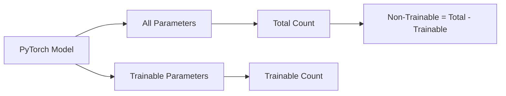

`count_parameters()` returns:

```text
total
trainable
non_trainable
```

This provides a direct model-complexity summary.

---

## 21. Training Pipeline API

```mermaid
flowchart TD
    A[fit] --> B[train_one_epoch]
    A --> C[validate_one_epoch]
    A --> D[save_training_checkpoint]
    A --> E[Scheduler]
    A --> F[TensorBoard]
    A --> G[TrainingHistory]

    H[load_training_checkpoint] --> I[Model]
    H --> J[Optimizer]
    H --> K[Scheduler]
    H --> L[Scaler]
```

Main public components:

| Component | Role |
|---|---|
| `EpochResult` | Stores one epoch's metrics |
| `TrainingHistory` | Stores complete training history |
| `train_one_epoch()` | Runs model training for one epoch |
| `validate_one_epoch()` | Runs validation for one epoch |
| `save_training_checkpoint()` | Saves training state |
| `load_training_checkpoint()` | Restores training state |
| `fit()` | Orchestrates the complete training pipeline |

---

## 22. Integration with RoadXAI

```mermaid
flowchart LR
    A[Dataset Pipeline] --> B[Train DataLoader]
    A --> C[Validation DataLoader]

    B --> D[RoadXAI Training Pipeline]
    C --> D

    D --> E[CNN Segmentation Model]
    D --> F[Best Checkpoint]
    D --> G[Training History]
    D --> H[TensorBoard Logs]

    F --> I[Evaluation]
    F --> J[Streamlit Application]
    F --> K[XAI]
    F --> L[Engineering Analysis]
```

The training pipeline is the bridge between the dataset pipeline and downstream RoadXAI inference/evaluation.

The resulting `best.pt` checkpoint can be consumed by the later application and analysis stages.

---

## 23. End-to-End Research View

```mermaid
flowchart LR
    A[Road Images + Masks]
    --> B[Dataset Pipeline]
    --> C[DataLoaders]
    --> D[U-Net Segmentation Model]
    --> E[Training Pipeline]

    E --> F[Validation]
    E --> G[Best Checkpoint]
    E --> H[Training History]
    E --> I[TensorBoard]

    G --> J[Evaluation]
    G --> K[Streamlit Inference]
    K --> L[Engineering Analysis]
    K --> M[Grad-CAM XAI]
    K --> N[3D Visualization]
    K --> O[Report Generation]
```

---

## 24. Technical Configuration

| Parameter | Default |
|---|---:|
| Epochs | `10` |
| Probability threshold | `0.5` |
| Early stopping patience | `5` |
| AMP | `True` |
| Gradient clipping max norm | `1.0` |
| Checkpoint directory | `checkpoints` |
| TensorBoard directory | `runs/roadxai` |
| Save best only | `True` |
| Device | CUDA if available, otherwise CPU |

---

## 25. Scientific / Engineering Limitations

### Metric limitation

Dice and IoU are calculated from thresholded binary masks at the configured threshold. They therefore evaluate segmentation overlap rather than physical road-condition correctness.

### Checkpoint criterion

The implementation chooses the best checkpoint using validation loss. A model with the best Dice or IoU is not necessarily selected if its validation loss is not the minimum.

### Dataset dependence

Training quality depends on the quality, diversity, and annotation consistency of the DataLoaders supplied by the dataset pipeline.

### Physical measurement limitation

The training pipeline learns segmentation masks. It does not itself establish physical dimensions such as meters or millimeters.

### Reproducibility

The pipeline explicitly configures random seeds and cuDNN deterministic behavior, but exact reproducibility can still depend on the hardware and software execution environment.

---

## 26. Final RoadXAI Training Architecture

```mermaid
flowchart TD
    A[Dataset Pipeline] --> B[Train / Validation DataLoaders]

    B --> C[fit]

    C --> D[Batch Preparation]
    D --> E[Model Forward]
    E --> F[Segmentation Loss]
    F --> G[Backward]
    G --> H[Gradient Clipping]
    H --> I[Optimizer]

    I --> J[Train Dice / IoU]
    E --> K[Validation]
    K --> L[Validation Loss / Dice / IoU]

    L --> M[Learning-Rate Scheduler]
    L --> N{Best Validation Loss?}

    N -->|Yes| O[best.pt]
    N -->|No| P[Early-Stopping Counter]

    C --> Q[TrainingHistory]
    C --> R[TensorBoard]

    O --> S[RoadXAI Evaluation]
    O --> T[Streamlit Inference]
    T --> U[Engineering]
    T --> V[XAI]
    T --> W[3D]
    T --> X[Reports]
```

**Training Pipeline role:** optimize the segmentation model, measure training/validation performance, preserve the best model state, and provide reproducible training artifacts for the rest of RoadXAI.
